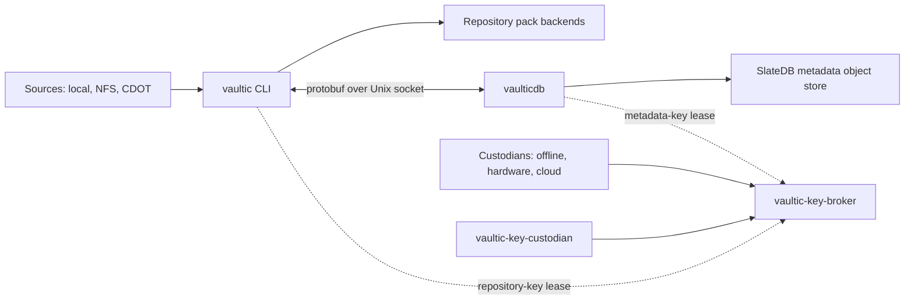

[](https://github.com/otuschhoff/vaultic/actions?query=workflow%3Atest)

# Vaultic

Vaultic is an encrypted, deduplicating backup system for Linux and macOS. It
keeps the Restic/Rustic repository format available as an independent recovery
path while adding large-repository metadata, selective NAS crawling,
multi-backend placement, and quorum-controlled key access.

## Objectives

- Keep backup and restore simple, fast, verifiable, and independent of a
   proprietary recovery service.
- Preserve Restic/Rustic interoperability through compatible repository data
   and deterministic legacy metadata projections.
- Scale metadata independently with SlateDB without putting the Rust database
   engine in every CLI process.
- Make durability explicit across local, warm offsite, and deep-archive
   backends.
- Separate encrypted data from key custody and support offline, hardware, and
   cloud-backed multi-custodian unlock policies.

The [architecture overview](doc/vaultic/02-architecture/00-overview.md),
[design principles](doc/design.rst), and
[roadmap](doc/vaultic/04-roadmap/00-overview.md) describe the detailed model
and current implementation status.

## Service topology



- `vaultic` crawls sources, encrypts and deduplicates data, writes repository
   packs, and performs backup, restore, retention, and repair workflows.
- `vaulticdb` is the optional Rust metadata service. It owns SlateDB handles,
   caching, transactions, and metadata durability; it does not crawl NFS or
   interpret backup policy.
- `vaultic-key-broker` starts locked and is the only long-lived holder of
   recovered metadata and repository keys. It grants narrow, expiring leases to
   authenticated local clients after the configured policy is satisfied.
- `vaultic-key-custodian` isolates FIDO2, YubiKey, and macOS Secure Enclave
   operations from the broker and CLI.
- Repository backends hold encrypted pack data. The SlateDB object store holds
   operational metadata and may itself be replicated independently.

The normal transport is an owner-only Unix socket. Broker and host restarts end
the unlock epoch and require a new ceremony; an authenticated `vaultic` or
`vaulticdb` restart can reacquire a lease while the same broker epoch remains
active. See the
[vaulticdb service architecture](doc/vaultic/02-architecture/01-vaulticdb-service.md)
and [quorum broker architecture](doc/vaultic/02-architecture/08-quorum-key-broker.md).

## Install and releases

See [installation](doc/020_installation.rst) for source and packaged setup.
Tagged builds are published on the
[GitHub Releases](https://github.com/otuschhoff/vaultic/releases) page with a
`SHA256SUMS` file.

| Archive | Contents |
| --- | --- |
| `linux-amd64` | Statically linked `vaultic`, `vaulticdb`, key broker, and key custodian |
| `linux-arm64` | Statically linked `vaultic`, `vaulticdb`, key broker, and key custodian |
| `macos-arm64` | `vaultic` and the native, signed `vaulticdb` service suite |
| `windows-amd64` | Best-effort, self-contained `vaultic.exe` CLI |

Linux artifacts do not require distribution libraries. macOS uses Apple system
libraries. Windows is an optional legacy-compatible CLI target; the service
suite currently requires Unix sockets and Unix peer credentials.

## Start a repository on NFS

Mount the NFS export using the host's normal controls, then initialize Vaultic
at that path. Start with a protected offline password while validating backup
and restore operations:

```console
$ mount nfs01.example:/vaultic /mnt/vaultic
$ vaultic init --repo /mnt/vaultic/finance
$ vaultic --repo /mnt/vaultic/finance backup /srv/finance
$ vaultic --repo /mnt/vaultic/finance snapshots
$ vaultic --repo /mnt/vaultic/finance restore latest --target /tmp/restore-test
```

For automation, use `VAULTIC_REPOSITORY`, `--repository-file`,
`--password-file`, or `--password-command`; avoid placing passwords directly
in process arguments. The complete backend list and credential options are in
[preparing a new repository](doc/030_preparing_a_new_repo.rst), with backup and
restore details in [backup](doc/040_backup.rst) and
[restore](doc/050_restore.rst).

Supported repository backends include local or mounted filesystems, SFTP,
REST, Amazon S3 and compatible services, OpenStack Swift, Backblaze B2, Azure
Blob Storage, Google Cloud Storage, and services exposed through rclone.

## Adopt a Restic or Rustic repository

Vaultic reads compatible Restic/Rustic repositories directly. Before mixing
writers, review [in-repository configuration](doc/048_in_repo_config.rst):
Vaultic extensions are additive, but another tool rewriting the config can
remove fields it does not preserve. Take a repository copy and run `check`
before changing production workflows.

For a reversible migration, create a separate destination with the source's
chunker parameters, then copy snapshots. This preserves cross-repository
deduplication and leaves the source untouched:

```console
$ vaultic -r /mnt/vaultic/finance-vaultic init \
      --from-repo /mnt/restic/finance --copy-chunker-params
$ vaultic -r /mnt/vaultic/finance-vaultic copy \
      --from-repo /mnt/restic/finance --verbose
$ vaultic -r /mnt/vaultic/finance-vaultic check
```

The destination uses its own encryption keys, so copying reads and rewrites the
snapshot data. Interrupted copies are resumable. See
[copying snapshots between repositories](doc/045_working_with_repos.rst) and
the [interop design](doc/vaultic/02-architecture/03-legacy-interop-and-crawl.md).
For repositories with tens or hundreds of terabytes of packs, follow the
[large Rustic repository takeover guide](doc/054_takeover_rustic_repository.rst)
to adopt the repository without copying packs and stage VaulticDB authority
safely.

## Accelerate a CDOT source

For a large NetApp ONTAP (CDOT) tree mounted at `/mnt/finance`, enable the
parallel cwalk scanner:

```console
$ vaultic -r /mnt/vaultic/finance backup --use-cwalk \
      --cwalk-concurrency 32 /mnt/finance
```

Selective reuse additionally requires an upstream pathdiff service and an
exact source-to-LIF/SVM/volume map. For example, save this as
`/etc/vaultic/finance-svm-map.json`:

```json
{
   "version": 1,
   "sources": [
      {
         "target": "/mnt/finance",
         "remote_path": "/vol/finance/dept-a",
         "lif": "192.0.2.10",
         "svm_id": "7f66f7de-6f2c-11ef-a3bd-00a098012345",
         "svm": "svm-finance",
         "volume_msid": "2163258291",
         "volume": "finance"
      }
   ]
}
```

```console
$ vaultic -r /mnt/vaultic/finance backup --use-cwalk \
      --cwalk-concurrency 32 --use-pathdiff \
      --pathdiff-endpoint /run/pathdiff/control.sock \
      --pathdiff-svm-map /etc/vaultic/finance-svm-map.json \
      /mnt/finance
```

The map supplies topology, not proof that the pathdiff service observed every
change. Vaultic falls back to a full cwalk when coverage cannot be proven. Add
`--pathdiff-require-coverage` when automation must fail instead. See the
[backup crawl guide](doc/040_backup.rst) and
[crawl architecture](doc/vaultic/02-architecture/03-legacy-interop-and-crawl.md).

## Add warm and archive backends

An NFS repository can remain the primary ingest location while a warm offsite
copy and deep archive are added later. A SlateDB-authoritative repository can
declare this placement configuration; credentials stay in the environment or
provider credential chain, never in repository configuration:

```json
{
   "placement_backends": [
      {
         "id": "nfs-primary",
         "role": "primary",
         "failure_domain": "datacenter-a"
      },
      {
         "id": "warm",
         "location": "s3:s3.example/vaultic-warm",
         "role": "primary",
         "offsite": true,
         "failure_domain": "cloud-a",
         "retrieval_class": "standard",
         "max_bandwidth_bytes": 104857600,
         "max_requests_per_second": 20
      },
      {
         "id": "archive",
         "location": "s3:s3.example/vaultic-archive",
         "role": "archival",
         "offsite": true,
         "failure_domain": "cloud-b",
         "retrieval_class": "deep-archive",
         "min_retention_seconds": 15552000,
         "target_pack_size_bytes": 536870912
      }
   ],
   "placement_policy": {
      "min_copies": 2,
      "min_domains": 2,
      "min_offsite": 1,
      "offsite_deadline_seconds": 14400,
      "promotion_crossover_seconds": 691200
   }
}
```

The primary entry omits `location`, so it reuses the NFS repository supplied
with `--repo`. Recent packs go to NFS and warm storage. Packs are promoted to
deep archive only after they survive the crossover interval, avoiding minimum
retention charges for short-lived data.

```console
$ vaultic index placement --unsatisfied --json
$ vaultic index placement --overdue --json
$ vaultic index placement --pending-promotion --json
$ vaultic index placement --execute --max-requests 100
```

See [working with repositories](doc/045_working_with_repos.rst),
[storage placement](doc/vaultic/02-architecture/05-storage-placement.md), and
[cold storage](doc/051_cold_storage.rst).

## Progress from offline keys to Azure quorum

Repository pack encryption and SlateDB metadata encryption are separate.
Vaultic can wrap both keys into an immutable recovery capsule whose policy is
evaluated by the local key broker. Start with offline custody, prove recovery,
then introduce cloud or hardware providers while the broker is unlocked.

The names `ceo`, `cfo`, `it-manager`, and `it-admin-*` below are illustrative
governance assignments, not built-in Vaultic roles. Cloud seats are
`principal-verified` only when each uses a distinct immutable Entra principal
and a separately scoped, versioned Azure key. Offline seats remain
`custody-assumed`; organizational procedure must keep their credentials apart.

### 1. Establish an offline 2-of-3 policy

After the temporary bootstrap route has unlocked the broker, replace it with a
2-of-3 policy whose credentials are held in separate failure domains:

```console
$ vaultic index keys quorum create-group offline-recovery \
      --capsule /secure/capsules/00000000000000000001.json \
      --capsule-directory /secure/capsules --threshold 2 \
      --member ceo=offline-argon2id:/secure/ceo.passphrase \
      --member cfo=offline-keyfile:/media/cfo/member.key \
      --member it-manager=offline-keyfile:/media/it-manager/member.key
```

Activation relocks the broker. Test all intended two-person combinations and
verify that one member cannot unlock it before destroying the bootstrap
credential.

### 2. Enroll distinct Azure custodians

Create one mode-`0600` external-member definition per stakeholder. Each Entra
identity receives `wrapKey` and `unwrapKey` only on its own Key Vault or
Managed HSM key; the broker identity receives no cloud unwrap permission:

```json
{
   "member_id": "ceo",
   "provider": "azure-key-vault",
   "key_reference": "https://example.vault.azure.net/keys/vaultic-ceo/KEY-VERSION",
   "principal": {
      "authority": "entra",
      "tenant_account_or_project": "TENANT-ID",
      "immutable_principal_id": "CEO-OBJECT-ID"
   },
   "bearer_token_file": "/secure/ceo.azure-token"
}
```

Create equivalent files for the CFO, IT manager, and other authorized IT
administrators, each with a different principal and key. Inspect provider IAM
and exercise both allowed and denied principals before activation.

### 3. Publish normal and break-glass alternatives

Use a protected `--policy-file` to define `any_of` two threshold groups:

```json
{
   "type": "any_of",
   "policies": [
      {
         "type": "threshold",
         "group_id": "azure-operations",
         "required": 2,
         "members": ["ceo", "cfo", "it-manager", "it-admin-1", "it-admin-2"]
      },
      {
         "type": "threshold",
         "group_id": "offline-break-glass",
         "required": 2,
         "members": ["offline-ceo", "offline-cfo", "offline-it-manager"]
      }
   ]
}
```

Supply the complete policy plus all resulting Azure external-member files and
offline member credentials to `vaultic index keys quorum create-group`.
Vaultic requires the full resulting member set for every mutation. Break-glass
is therefore another explicit 2-of-3 policy branch, not a single recovery key
or a quorum bypass. A policy that retains any 1-of-1 bootstrap, ordinary
password key, direct master-key export, or standalone escrow is reported as
non-compliant.

```console
$ vaultic index keys quorum create-group azure-operations \
   --repository-id REPOSITORY-UUID \
   --capsule /secure/capsules/00000000000000000002.json \
   --capsule-directory /secure/capsules \
   --policy-file /secure/quorum-policy.json \
   --external-member /secure/azure-ceo.json \
   --external-member /secure/azure-cfo.json \
   --external-member /secure/azure-it-manager.json \
   --external-member /secure/azure-it-admin-1.json \
   --external-member /secure/azure-it-admin-2.json \
   --member offline-ceo=offline-argon2id:/secure/offline-ceo.passphrase \
   --member offline-cfo=offline-keyfile:/media/offline-cfo/member.key \
   --member offline-it-manager=offline-keyfile:/media/offline-it-manager/member.key
```

This quorum is cryptographic authorization to recover repository keys. It does
not replace interactive MFA for operating-system or cloud login; those controls
remain the responsibility of the host identity and cloud identity providers.

### 4. Run an unlock ceremony

One operator creates a signed, expiring session. Custodians verify its
fingerprint over an independent channel, then contribute their own share:

```console
$ vaultic index unlock contribute --prepare \
      --broker-socket /run/vaultic/key-broker.sock \
      --capsule /secure/capsules/00000000000000000003.json \
      --session-file /secure/session.json

$ vaultic index unlock contribute \
      --broker-socket /run/vaultic/key-broker.sock \
      --capsule /secure/capsules/00000000000000000003.json \
      --session-file /secure/session.json --member ceo \
      --azure-token-file /secure/ceo.azure-token \
      --generation-anchor /secure/ceo.generation \
      --confirm-fingerprint XXXX-XXXX-XXXX-XXXX-XXXX-XXXX-XXXX-XXXX
```

After the second valid contribution, the broker authenticates both capsule
payloads and opens an unlock epoch. Lock it explicitly when work is complete:

```console
$ vaultic index unlock lock \
      --broker-socket /run/vaultic/key-broker.sock --confirm
```

The complete setup includes broker identity generation, signed client release
manifests, protected service configuration, migration from key-in-DB, policy
verification, and periodic recovery exercises. Follow the
[encryption and quorum runbook](doc/070_encryption.rst) rather than treating
this overview as a production ceremony checklist.

## Documentation

- [Documentation index](doc/index.rst)
- [Installation](doc/020_installation.rst)
- [Preparing a repository](doc/030_preparing_a_new_repo.rst)
- [Backup](doc/040_backup.rst) and [restore](doc/050_restore.rst)
- [Profiles and automation](doc/052_profiles_automation.rst)
- [Troubleshooting](doc/077_troubleshooting.rst)
- [Vaultic architecture and roadmap](doc/vaultic/README.md)
- [Developer information](doc/developer_information.rst)

## License

Vaultic is licensed under the [BSD 2-Clause License](LICENSE).
