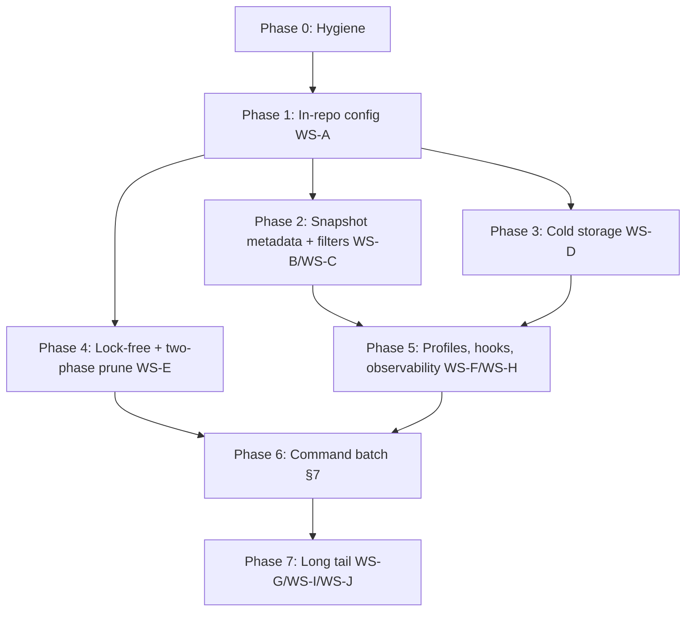

# Vaultic ↔ Rustic Feature-Parity Refactoring Roadmap

| | |
|---|---|
| Status | Draft — basis for implementation |
| Audience | vaultic maintainers and contributors |
| Source comparison | rustic 0.11.3 vs restic 0.19.0 (https://rustic.cli.rs/docs/comparison-restic.html), rustic user docs |
| Last updated | 2026-08-26 |

---

## 1. Purpose

Vaultic (formerly restic) aims to reach feature parity with [rustic](https://github.com/rustic-rs/rustic)
while keeping its own strengths (maturity, test coverage, mount/FUSE, `recover`,
`repair packs`, `stats`, sparse restore, `--overwrite` modes, TLS client certs,
`--cacert`, `--key-hint`, `--files-from*`, `cache` command).

This document is the **single source of truth** for:

1. **What** is missing — a complete gap inventory (Section 5).
2. **How** to implement each feature — architecture workstreams with concrete
   code touchpoints in this repository (Section 6) and per-command work items
   (Section 7).
3. **When** — a phased roadmap with dependencies and exit criteria (Section 8).

Every implementation PR must reference a work item in this document and follow
the conventions in Section 12.

## 2. Scope and non-goals

**In scope**

- All features listed in the rustic↔restic comparison where restic 0.19.0
  (≙ current vaultic) is marked ❌ or (✅) partial.
- Rustic's architectural capabilities: in-repo config, hot/cold repositories,
  lock-free operations, config profiles, hooks, telemetry.
- Keeping **repository-format compatibility** with both restic and rustic:
  a repo written by vaultic must remain readable by restic and rustic, and
  vice versa.

**Non-goals**

- Copying rustic CLI spelling verbatim where vaultic already has an equivalent
  (e.g. rustic's `--glob` ≙ vaultic's `--exclude`). We add rustic-style aliases
  only where it aids migration; native vaultic flags stay canonical.
- Re-implementing rustic internals in Rust; all work is Go.
- Removing vaultic-only features to match rustic.

## 3. Guiding principles

1. **Format compatibility first.** New on-disk data uses additive JSON fields
   (`omitempty`), which Go decoders in restic silently ignore. Nothing may be
   written that makes restic or rustic reject a repository.
2. **Feature-flag everything risky.** All behavior-changing work lands behind
   flags in [internal/feature/features.go](../internal/feature/features.go)
   (`Alpha` → `Beta` → `Stable`), mirroring how `S3Restore` was introduced.
3. **Library-first.** New logic goes into `internal/*` packages with the CLI in
   [cmd/vaultic](../cmd/vaultic) as a thin layer, so vaultic can later expose a
   supported Go API comparable to `rustic_core`.
4. **Config wins over flags.** Following rustic, durable settings (compression,
   pack sizes, warm-up) move into the in-repo config so users stop repeating
   flags on every call.
5. **Small, reviewable steps.** Each work item in Section 7 is sized to be one
   PR (or a short PR series) with integration tests.

## 4. Current state

### 4.1 Codebase map (relevant to this roadmap)

| Area | Location | Notes for this roadmap |
|---|---|---|
| Repo config (JSON) | [internal/vaultic/config.go](../internal/vaultic/config.go), [config_ext.go](../internal/vaultic/config_ext.go) | flat additive rustic-compatible config extensions; foreign config rewrites can strip vaultic-only keys |
| Snapshot model | [internal/data/snapshot.go](../internal/data/snapshot.go) | label, description, delete protection, merge provenance, and summaries implemented |
| Snapshot find/filter | [internal/data/snapshot_find.go](../internal/data/snapshot_find.go), [cmd/vaultic/filter_flags.go](../cmd/vaultic/filter_flags.go) | rich filters and `latest~N`; jq and file-level resolution remain missing |
| Warm-up plumbing | [internal/warmup](../internal/warmup), [internal/backend/warmupcmd](../internal/backend/warmupcmd) | warm-up command, batching, wait protocol, and hot/cold integration implemented |
| Locking | [internal/repository/lock.go](../internal/repository/lock.go), [cmd/vaultic/lock.go](../cmd/vaultic/lock.go) | typed `None`/`Shared`/`Exclusive` policy; lock-free reads Alpha; minimal-lock prune/forget with external graduation gates pending |
| Prune | [internal/repository/prune.go](../internal/repository/prune.go), [prune_plan.go](../internal/repository/prune_plan.go) | durable/revalidated minimal-lock plan phases; S3/MinIO and mixed-client graduation pending |
| Packer / pack size | [internal/repository/packer_manager.go](../internal/repository/packer_manager.go) | tree/data target sizing and limits; dynamic growfactor is stored but unused |
| Global options | [internal/global/global.go](../internal/global/global.go), [internal/configfile](../internal/configfile) | TOML profiles, environment fallback, log/progress/telemetry options implemented |
| Backends | [internal/backend](../internal/backend) | local, sftp, rest, s3, swift, b2, azure, gs, rclone |
| Feature flags | [internal/feature](../internal/feature) | alpha/beta/stable registry, env-driven |
| CLI | [cmd/vaultic](../cmd/vaultic) | cobra commands, one file per command |

### 4.2 Rustic features vaultic already has (no action)

- Backend-level warm-up for cold storage (S3 restore) in restore/check/repack
  (partial; CLI and hot/cold split missing — see WS-D).
- `rewrite`, `repair index/packs/snapshots`, `recover`, `copy`, `tag`,
  `self-update`, `generate` (completions/manpages), `--dry-run`,
  `--pack-size` (fixed), `--read-data-subset`, in-place restore, resumable
  restore, `latest` filtering for restore/ls/find/dump.

### 4.3 Vaultic features rustic lacks (retain, do not regress)

`mount` (all OSes; rustic: Linux only), `recover`, `repair packs`, `stats`,
`cache`, `--files-from*`, `--exclude-caches` header parsing, `--overwrite`,
`--sparse`, `--verify`, `--cacert`, `--insecure-tls`, `--tls-client-cert`,
`--key-hint`, `--repository-file`, `--retry-lock`, `--read-concurrency`,
`find --blob/--tree/--pack`, `--compact` output, `--human-readable`.

## 5. Gap analysis matrix

Legend — **Priority**: P0 = parity-critical / blocks other work, P1 = high user
value, P2 = nice to have, P3 = experimental/long-tail.
**Effort**: S < 1 wk, M = 1–2 wk, L = 2–6 wk, XL > 6 wk.

### 5.1 Repository & storage format

| # | Feature | Rustic behavior | Priority | Effort | Workstream | Status |
|---|---|---|---|---|---|---|
| F1 | In-repo config | `config` command edits compression, pack sizes, chunker, append-only inside repo config JSON | P0 | L | WS-A | ✅ |
| F2 | `show-config` command | prints repo config incl. extensions | P0 | S | WS-A | ✅ |
| F3 | Custom chunker config | min/max/avg chunk size, fixed-size chunker, stored in repo | P2 | M | WS-A | ✅ |
| F4 | Per-type pack sizing | `treepack_*`/`datapack_*` size, grow factor, limits; packs up to 4 GiB | P1 | M | WS-A | ⚠️ partial: size+limit work; dynamic growfactor is stored but unused |
| F5 | Append-only repo mode | `append_only` in-repo flag blocks delete/overwrite | P1 | M | WS-A | ✅ |
| F6 | Extra-verify persist | `extra_verify` in-repo instead of per-call `--no-extra-verify` | P2 | S | WS-A | ✅ |
| F7 | Open repo via master key | `--key`, `--key-file`, `--key-command` bypass password keys | P2 | M | WS-A | ✅ |

### 5.2 Snapshot metadata & selection

| # | Feature | Rustic behavior | Priority | Effort | Workstream | Status |
|---|---|---|---|---|---|---|
| F8 | Snapshot label | `--label`, grouping/filtering by label | P0 | S | WS-B | ✅ |
| F9 | Snapshot description | `--description`, `--description-from` | P1 | S | WS-B | ✅ |
| F10 | Delete protection | `--delete-never`, `--delete-after`; forget/prune respect it | P1 | M | WS-B | ✅ |
| F11 | Rich snapshot filters | `--filter-host/label/paths/paths-exact/tags/tags-exact/before/after/size/size-added/jq/last` on all snapshot-taking commands | P1 | M | WS-C | ⚠️ partial: all listed filters except `--filter-jq` |
| F12 | `latest~N` syntax | resolve N-th latest snapshot | P2 | S | WS-C | ✅ |
| F13 | `<snap>:<path>/file` | sub-path file selection in restore/diff/dump | P2 | S | WS-C | ⏳ deferred: dump tree paths work; restore/diff file-level resolver missing |

### 5.3 Cold storage

| # | Feature | Rustic behavior | Priority | Effort | Workstream | Status |
|---|---|---|---|---|---|---|
| F14 | Hot/cold split repo | `--repo-hot`; metadata in hot repo, data packs in cold repo; cold repo is a complete repo | P1 | XL | WS-D | ✅ |
| F15 | Warm-up command | user-supplied program, `%id/%path/%ids/%paths`, batch size, JSON-lines `pack-progress` protocol | P1 | L | WS-D | ✅ |
| F16 | `init --hot-only` | convert normal repo → hot/cold | P2 | M | WS-D | ✅ |
| F17 | check hot/cold integrity | cross-check hot vs cold metadata | P2 | M | WS-D | ✅ (`check --check-hot-cold`) |

### 5.4 Concurrency & prune

| # | Feature | Rustic behavior | Priority | Effort | Workstream |
|---|---|---|---|---|---|
| F18 | Lock-free operations | no lock files; safe concurrent clients; additive index writes | P1 | XL | WS-E | ⚠️ partial: lock-free reads and tested local/cross-process gates; append writes retain shared locks; MinIO/S3/mixed-client gates pending |
| F19 | Two-phase prune | repack+upload first, delete later; prune parallel to backups | P1 | L | WS-E | ⚠️ partial: minimal-lock local implementation complete; eventual-consistency, destructive cross-process, and mixed-client gates pending |
| F20 | Prune extras | `--fast-repack`, `--keep-pack`, `--max-repack` (size/%/unlimited), `--repack-all`, `--early-delete-index` | P2 | M | WS-E | ⚠️ partial: all except `--keep-pack`; backend `FileInfo` has no modification time |

### 5.5 UX, configuration & observability

| # | Feature | Rustic behavior | Priority | Effort | Workstream |
|---|---|---|---|---|---|
| F21 | TOML config profiles | `vaultic.toml`, search paths, `-P profile`, `use-profiles` inheritance, env overrides; `[repository] [forget] [backup] [[backup.snapshots]]` | P0 | L | WS-F | ✅ |
| F22 | Hooks | run-before/after/failed/finally at global/repo/backup/snapshot scope, env context, on-failure policy | P1 | M | WS-F | ✅ |
| F23 | Log to file + log levels | `--log-file`, `--log-level(-*)` | P1 | S | WS-H | ⚠️ partial: log file works; `--log-level` validates but does not route/filter logger output |
| F24 | Progress control | `--no-progress`, `--progress-interval` as real flags (env exists today) | P2 | S | WS-H | ✅ |
| F25 | Telemetry | `--prometheus(+user/pass)` push metrics, `--opentelemetry` tracing (backup first) | P2 | M | WS-H | ⚠️ partial: Pushgateway/Influx backup metrics work; OTel is command-span skeleton only |
| F26 | Interactive TUI | integrated terminal UI (stats live, selection) | P3 | XL | WS-J |

### 5.6 Backends & sources

| # | Feature | Rustic behavior | Priority | Effort | Workstream |
|---|---|---|---|---|---|
| F27 | New backends | dropbox, ftp, gdrive, onedrive, pcloud (rustic: via opendal; WebDAV excluded) | P2 | L | WS-G |
| F28 | Remote backup sources | back up *from* S3/cloud storage | P3 | XL | WS-I |
| F29 | Built-in sftp (no ssh binary) | rustic uses opendal sftp; vaultic shells out to ssh | P3 | M | WS-G |

### 5.7 Commands

| # | Feature | Rustic behavior | Priority | Effort | Workstream |
|---|---|---|---|---|---|
| F30 | `merge` command | merge snapshots | P1 | M | §7 | ✅ |
| F31 | `webdav` command | serve repo over WebDAV for browsing/restore | P2 | L | §7 | Deferred — explicitly out of scope |
| F32 | `repoinfo` command | repo statistics summary | P2 | S | §7 | ✅ |
| F33–F60 | Command enhancements | see per-command tables in Section 7 | mixed | mixed | §7 |

## 6. Foundation workstreams

Workstreams are ordered by dependency. Each lists: goal, rustic reference
behavior, vaultic design, code touchpoints, format impact, testing.

### WS-A — In-repo configuration (`config`, `show-config`)

**Goal.** Persist operational settings in the repository config file so they
are set once at `init --set-*` or via a new `config` command, instead of
repeating flags (`--compression`, `--pack-size`, …) on every invocation.

**Design.**

1. Extend `Config` in [internal/restic/config.go](../internal/restic/config.go)
   with an additive, optional extension block:

   ```go
   type Config struct {
       Version           uint          `json:"version"`
       ID                string        `json:"id"`
       ChunkerPolynomial chunker.Pol   `json:"chunker_polynomial"`
       // vaultic extensions (unknown fields are ignored by restic/rustic)
       Compression       *int          `json:"compression,omitempty"`        // -7..22, nil = auto
       AppendOnly        bool          `json:"append_only,omitempty"`
       ExtraVerify       *bool         `json:"extra_verify,omitempty"`
       Chunker           *ChunkerConfig `json:"chunker,omitempty"`           // F3
       TreePack          PackConfig    `json:"treepack,omitempty"`          // F4
       DataPack          PackConfig    `json:"datapack,omitempty"`          // F4
   }

   type PackConfig struct {
       Size        uint64 `json:"size,omitempty"`         // target bytes
       GrowFactor  uint32 `json:"growfactor,omitempty"`   // dynamic sizing
       SizeLimit   uint64 `json:"size_limit,omitempty"`   // hard cap, up to 4 GiB
   }
   ```

   > ⚠️ Compatibility check before writing: confirm rustic ignores unknown
   > config fields (serde `deny_unknown_fields` must not be set in
   > rustic_core's config struct — verify against rustic 0.11.x). If rustic
   > rejects unknown fields, nest all extensions under a single
   > `vaultic`/`x-vaultic` object which rustic already tolerates for
   > forward-compat (to be verified by interop test, Section 9).

2. Pack-size application: thread `PackConfig` into the packer manager in
   [internal/repository/packer_manager.go](../internal/repository/packer_manager.go);
   today a single target size is used — split into tree vs data packers.
   Raise the internal pack-size limit from 128 MiB to 4 GiB
   (verify uploader and backend `Save` paths for >128 MiB blobs).
3. New `config` command (new file `cmd_config.go` in [cmd/vaultic](../cmd/vaultic)):
   `vaultic config [--set-compression N] [--set-append-only] ...`
   reads-modifies-writes the config file (requires lock; refuse on v1 repos
   for chunker changes).
4. `show-config` command: prints effective config (repo config merged with
   profile/CLI overrides once WS-F lands).
5. `init --set-*` flags map onto the same struct ([cmd/vaultic/cmd_init.go](../cmd/vaultic/cmd_init.go)).
6. Compression: keep existing `--compression` CLI as override; resolution
   order CLI > repo config > default. Centralize in
   [internal/global/global.go](../internal/global/global.go).
7. F5 append-only: enforce in `backend.Backend` wrapper
   (new `internal/backend/appendonly`) that rejects `Remove`/`Save`-overwrite
   when enabled; checked early in forget/prune with a clear error.
8. F7 master-key open: add `--key`, `--key-file`, `--key-command` global
   options that load a master key directly and unwrap the repository without a
   password-based key file. Touchpoint: key search in
   [internal/repository/key.go](../internal/repository/key.go) — add
   `OpenWithMasterKey` path.

**Format impact:** additive JSON only; v2 repos remain v2.
**Flags:** `in-repo-config` (Alpha → Beta).
**Tests:** config round-trip unit tests; interop: repo written by vaultic must
`rustic show-config` / `restic cat config` cleanly.
**Effort:** L. **Depends on:** none. **Blocks:** F4–F6, WS-D (per-repo warm-up
settings), WS-F (config layering).

### WS-B — Snapshot metadata extensions

**Goal.** Support rustic's extra snapshot fields: `label`, `description`,
and delete protection.

**Design.**

1. Extend `Snapshot` in [internal/data/snapshot.go](../internal/data/snapshot.go):

   ```go
   Label       string     `json:"label,omitempty"`
   Description string     `json:"description,omitempty"`
   DeleteNever bool       `json:"delete_never,omitempty"`
   DeleteAfter *time.Time `json:"delete_after,omitempty"`
   ```

   (Names must match rustic's JSON exactly for cross-tool visibility — verify
   against rustic_core's `SnapshotFile` serde field names before merge.)

2. `backup`: `--label`, `--description`, `--description-from file`,
   `--delete-never`, `--delete-after <time>` in
   [cmd/vaultic/cmd_backup.go](../cmd/vaultic/cmd_backup.go).
3. `forget`: refuse to delete snapshots with `delete_never` or
   `delete_after > now` unless a new `--override-delete-protection` is given
   ([cmd/vaultic/cmd_forget.go](../cmd/vaultic/cmd_forget.go)).
4. `snapshots`/`ls`/`find`: display label; `--group-by` gains `label`.
5. `tag` command: add `--set-description`, `--set-label` editing.

**Format impact:** additive snapshot JSON; restic/rustic ignore unknown fields
on read. **Flags:** not needed (additive metadata). **Effort:** S–M.

### WS-C — Snapshot filtering & ID-resolution framework

**Goal.** One shared implementation of rustic's filter set, usable by every
command that selects snapshots (snapshots, forget, restore, ls, find, diff,
dump, copy, tag, stats, check).

**Design.**

1. New package `internal/data/snapshotfilter` (or extend
   [internal/data/snapshot_find.go](../internal/data/snapshot_find.go)):
   a `Filter` struct evaluated against `*data.Snapshot`:

   ```go
   type Filter struct {
       Hosts, Labels []string
       Paths, Tags   []string        // match-any (current semantics)
       PathsExact, TagsExact []string // full-list equality
       Before, After *time.Time
       SizeMin, SizeMax         uint64 // from Summary.TotalBytesProcessed
       SizeAddedMin, SizeAddedMax uint64
       Last    int                   // n latest per group
       JQ      string                // jq expression on snapshot JSON (P2; embed a Go jq impl, e.g. itchyny/gojq)
   }
   ```

2. Wire flag registration as a reusable pflag set (like today's
   `initMultiSnapshotFilterFlags` in [cmd/vaultic/find.go](../cmd/vaultic/find.go))
   so all commands expose identical `--filter-*` flags while keeping the legacy
   `--host/--paths/--tags` as aliases.
3. ID resolution: extend the snapshot ID parser
   ([internal/data/snapshot_find.go](../internal/data/snapshot_find.go)) with
   `latest~N` and `<id>:<sub/path>` **including file-level paths**; make the
   parser shared by restore/diff/dump/ls/cat.
4. Replace per-command ad-hoc filtering (cmd_forget, cmd_snapshots, …) with
   the shared filter; keep CLI behavior identical (regression tests exist in
   `cmd_*_integration_test.go`).

**Format impact:** none. **Effort:** M. **Depends on:** WS-B (label).

### WS-D — Hot/cold repositories & warm-up protocol

**Goal.** Full rustic-style cold storage: split hot/cold repositories and a
user-defined warm-up program. Builds on the existing `Warmup` backend API
([internal/backend/backend.go](../internal/backend/backend.go)) and
`feature.S3Restore` work.

**Design.**

1. **Warm-up command runner** (new `internal/warmup` package):
   - Global options `--warm-up-command`, `--warm-up-wait`,
     `--warm-up-batch N`, `--warm-up-wait-command`
     ([internal/global/global.go](../internal/global/global.go)).
   - Variable expansion `%id`, `%path`, `%ids`, `%paths`; batch semantics:
     batch size N, `%ids/%paths` expand inline, `%id/%path` spawn N parallel
     invocations.
   - JSON-lines progress protocol: parse `{"type":"pack-progress","warm":n}`
     from the command's stdout, drive a progress bar; non-JSON lines logged at
     info level with `[warmup]` prefix. Full spec in Appendix A.
   - Integrate into the restorer path
     ([internal/restorer/filerestorer.go](../internal/restorer/filerestorer.go))
     and checker ([internal/repository/checker.go](../internal/repository/checker.go))
     as an alternative to backend-native `Warmup` when a warm-up command is
     configured.
2. **Hot/cold split repository** (`--repo-hot`):
   - New composite backend `internal/backend/hotcold` implementing
     `backend.Backend` over two child backends. Routing by file type:
     config/key/snapshot/index + tree packs → hot (and mirrored to cold at
     write time so the cold repo stays complete); data packs → cold only.
     Reads: try hot first for metadata; data packs from cold.
   - Repository open resolves both locations
     ([internal/global/secondary_repo.go](../internal/global/secondary_repo.go)
     shows the existing pattern for a second repo).
   - `init` gains `--hot-only` (F16): creates the hot side from an existing
     repo by copying metadata only.
   - `check` gains hot/cold cross-verification mode (F17).
   - `prune`: default keeps cold packs until the last blob is unused
     (no repack of cold packs); `--repack-cacheable-only` extended to opt in;
     `--keep-pack <duration>` honors provider minimum-holding periods.
3. Promote `feature.S3Restore` semantics into this workstream; graduate flag
   when warm-up command + hot/cold are stable.

**Format impact:** none on the repo format itself (the cold repo *is* a
standard repo; hot repo is metadata-only and not standalone-valid — same as
rustic).
**Effort:** XL overall (warm-up runner L, hot/cold XL). **Depends on:** WS-A
(persist warm-up settings), existing S3Restore plumbing.

### WS-E — Lock-free operations & two-phase prune

**Goal.** Rustic-grade concurrency: normal operations (backup, forget
metadata writes, copy) run without lock files; prune becomes two-phase so it
can run concurrently with backups.

**Design.**

1. **Lock-free mode** (`--no-lock` today is an unsafe opt-out; make it safe
   and the default behind a flag):
   - Index writes become purely additive: index save in
     [internal/repository/index](../internal/repository/index) already writes
     new index files; ensure no operation *requires* removing indexes except
     prune (`--early-delete-index` stays prune-only).
   - Snapshot upload is already atomic single-file `Save`.
   - Audit every writer for read-modify-write sequences on shared files:
     key add/passwd/remove (keep requiring locks — rustic still serializes key
     management), prune (see two-phase), `repair index` (requires exclusive).
   - Locking layer: [internal/repository/lock.go](../internal/repository/lock.go)
     and [cmd/vaultic/lock.go](../cmd/vaultic/lock.go) — introduce
     `LockPolicy{None, Shared, Exclusive}` per command; restic/rustic clients
     holding classic lock files are tolerated (we ignore foreign locks in
     lock-free mode; document the mixed-client semantics).
2. **Two-phase prune** in [internal/repository/prune.go](../internal/repository/prune.go):
   - Phase 1 (no exclusive lock): compute plan, repack, upload new packs and
     new index; write a *prune plan marker* file.
   - Phase 2 (short shared window): delete superseded packs/indexes —
     `--instant-delete` (today's behavior) vs deferred delete honoring
     `--keep-delete`/`--keep-pack <duration>`.
   - Concurrency rule: prune must never delete files it didn't see in its
     plan; unknown/new files are left alone (this is what makes it
     backup-safe).
3. Prune extras (F20): `--fast-repack` (skip re-reading pack headers where
   index suffices), `--max-repack` accepting size/%/`unlimited` (superset of
   `--max-repack-size`), `--repack-all`, `--early-delete-index` (alias of
   `--unsafe-recover-no-free-space` semantics; keep old flag as hidden alias).

**Format impact:** new optional `prune-plan-*` files must be ignored by older
clients (use a new `backend.FileType` only if restic tolerates unknown
top-level dirs — verify; otherwise reuse `index/` namespace or a `lock`-like
type). **Flags:** `lock-free` (Alpha), `two-phase-prune` (Alpha).
**Effort:** XL + L. **Depends on:** WS-A. **Risk:** highest in this roadmap —
see Section 11.

#### Locking parity roadmap (remaining work)

**Current safe baseline (implemented).** The Alpha ``lock-free`` feature skips
lock-file creation for read-only commands only (restore, snapshots, ls, find,
dump, repoinfo, etc.). Append writers (backup, copy destination, merge, key
add) retain a non-exclusive lock; destructive/coherent-view commands (prune,
forget, repair, recover, config, tag, key mutation, rewrite, migrate, check)
retain an exclusive lock. ``--no-lock`` remains an explicit operator override
for non-exclusive operations, not a blanket safe concurrency guarantee.

The command wrapper also has a process-wide reader/writer guard: append
operations share it and exclusive operations serialize through it. This closes
same-process goroutine races; backend lock files remain the cross-process
guard. Deferred-delete prune (``--keep-delete``) is implemented, but its
planning, repack, and new-index phase still holds an exclusive lock.

**Why append writers are not lock-free yet.** Index files and snapshot files
are additive, but a prune planned before an unlocked backup can select and
delete an old pack/index that the backup still needs. Removing the append lock
without deletion revalidation caused a real backup ∥ prune corruption in the
race soak. Therefore the following stages are mandatory before widening the
feature flag.

1. **✅ Explicit command lock policies (implemented).** Replaced overloaded
   ``dryRun``/``noLock`` booleans in
   [cmd/vaultic/lock.go](../cmd/vaultic/lock.go) with
   ``LockPolicy{None, Shared, Exclusive}``:

   | Policy | Commands | Initial behavior |
   |---|---|---|
   | ``None`` | restore, snapshots, ls, find, dump, stats, repoinfo, cat | Alpha lock-free reads |
  | ``Shared`` | backup, copy destination, merge | classic non-exclusive backend lock; process RW read lock |
  | ``Exclusive`` | prune, forget, repair, recover, config, tag, key add/remove/passwd, rewrite, migrate, check | backend exclusive lock; process RW write lock |

   Preserve ``--no-lock`` only as an explicit override of ``None``/``Shared``;
   never let it silently install a dry-run backend. Keep command-specific
  validation for dangerous combinations (for example destructive prune).
  ``openWithReadLock``, ``openWithAppendLock``, and
  ``openWithExclusiveLock`` now map to these typed policies; policy unit tests
  and runtime lock-file tests enforce the mapping.

2. **✅ Prove append-only writer safety (implemented).** Audited backup, copy
  destination, merge, and key add. Backup/copy/merge now receive a restricted
  ``AppendRepository`` transaction capability that exposes blob loads,
  pack/index upload, and snapshot save but deliberately omits removal APIs.
  Their repository mutations are additive and ordered as:
   packs/tree blobs uploaded -> additive index written -> snapshot written.
  ``key add`` remains exclusive because validation can remove a newly-created
  broken key. Concurrent ``backup ∥ backup ∥ merge`` and
  ``backup ∥ copy-to-destination`` race tests pass with a final ``check``.
  Append writers still retain a shared lock while prune is classic; this stage
  does **not** authorize feature-driven lock-free append writes.

3. **✅ Persist and validate prune plans (implemented).** A durable encrypted
  ``prune_plan`` config extension now records the observed index IDs, exact
  candidate old pack/index IDs, replacement index IDs captured from successful
  index writes, immutable plan ID, and creation timestamp. Config extensions
  are verified to be ignored by restic/rustic; config replacement is required
  to be atomic, so unsupported backends refuse durable plans rather than risk
  a missing singleton config. Before every deferred deletion, vaultic loads
  one fresh current index view and proves:

   - the candidate was in the original plan;
   - the candidate is still obsolete in the current index view;
   - no index/snapshot written after plan creation references it;
   - unknown/new objects are never deleted.

  Immediate ``--instant-delete`` persists the marker before cleanup and
  revalidates using rewrite-captured replacement index IDs without a second
  backend index list. ``--keep-delete`` retains the marker; a later normal
  ``prune`` finalizes that marker as its own one-list invocation. Unit tests
  reject missing replacement indexes and referenced packs, and integration
  tests verify marker persistence after phase A and clearing after phase B.

4. **✅ Make prune genuinely minimal-lock (implemented).** A short exclusive
  claim writes a pending durable marker, then phase A runs under ``LockShared``:
  read the planning view, repack, upload replacement packs and additive
  indexes, and atomically promote the marker to ready. The shared lock is
  released before phase B takes a short exclusive lock to reload/revalidate
  candidates, delete only marker-listed obsolete objects, and retire the
  completed marker. A blocked-index integration test proves an append backup
  can finish while phase A is active. ``--instant-delete`` runs A then B;
  ``--keep-delete`` runs A and retains the ready plan for a later B.
  ``--keep-pack`` remains dependent on backend file mtimes.

5. **✅ Revalidated minimal-lock forget (implemented).** Forget now evaluates
  policy and delete protection under a shared/read phase, releases that lock,
  then re-lists/re-evaluates under a short exclusive delete phase. It deletes
  only snapshot IDs selected by both observations, so snapshots created,
  protected, or retained after phase A are never deleted by phase B. The
  existing ``forget --prune`` flow remains within that exclusive delete phase
  to retain its snapshot-to-prune handoff semantics. An integration test
  pauses phase A, completes a backup, and proves the new snapshot survives
  revalidation before a final prune/check.

6. **⚠️ Graduation test gates (local/cross-process subset implemented).**
   Completed gates:

   - lock-free read tests prove no new repository lock is written;
   - append tests cover backup ∥ backup ∥ merge and backup ∥ copy, followed
     by ``check --read-data``;
   - repeated ``-race`` tests cover backup during minimal-lock prune phase A
     and backup during minimal-lock forget phase A;
   - pending prune-plan recovery proves an interrupted phase-A claim clears
     without deleting a pack;
   - separate OS-process CLI tests cover concurrent append backups and backup
     versus retrying minimal-lock prune, followed by a clean ``check``.

   Remaining mandatory graduation gates before promoting Alpha behavior:

   - MinIO/S3 tests for backup ∥ ``prune --instant-delete`` and backup ∥
     ``prune --keep-delete`` under eventual-consistency/listing behavior;
   - destructive cross-process tests: prune ∥ forget, prune ∥ repair, then
     cancellation/crash at every prune phase boundary and
     restic/rustic/vaultic reopen + check;
   - mixed-client lock behavior tests against restic/rustic writers;
   - repeated long-running ``-race`` soaks with durable-snapshot assertions.

**Graduation policy.** Keep lock-free reads Alpha until cross-process and
eventual-consistency tests pass. Promote append concurrency separately, then
minimal-lock prune, then destructive forget. Do not make append writes
lock-free or enable lock-free by default until the prune revalidation protocol
and crash/MinIO test gates are complete.

### WS-F — Local config profiles (TOML) & hooks

**Goal.** `vaultic backup` / `vaultic forget` with zero flags, driven by TOML
profiles; hooks for automation.

**Design.**

1. **Profile loading** (new `internal/configfile` package):
   - Search order: `/etc/vaultic`, `$XDG_CONFIG_HOME/vaultic`
     (`~/.config/vaultic`), cwd; file `<profile>.toml`, default
     `vaultic.toml`; `-P/--use-profile` repeatable; `use-profiles` key for
     recursive includes (cycle detection).
   - Merge precedence: CLI flags > env vars > later `-P` profiles > earlier
     profiles > `use-profiles` includes > built-in defaults.
   - Schema (Appendix B): `[global]`, `[repository]`, `[forget]`, `[backup]`,
     `[[backup.snapshots]]` (named snapshot jobs with `sources`), per-command
     sections mapping 1:1 onto existing option structs
     ([internal/global/global.go](../internal/global/global.go),
     `ForgetOptions`, `BackupOptions`…). Use struct tags + a small reflection
     mapper; TOML lib: `github.com/BurntSushi/toml`.
   - Env var prefix: `VAULTIC_*` primary, `RESTIC_*` fallback (rename policy,
     Phase 0).
2. **Multiple snapshots per run** (F33): `vaultic backup` without args runs
   all `[[backup.snapshots]]`; `--name x` selects one. Each snapshot job gets
   its own hooks and label.
3. **Hooks** (`internal/hooks` package):
   - `run-before`, `run-after`, `run-failed`, `run-finally` at scopes:
     global, repository, backup, per-snapshot job.
   - Hook entry: `{ command = "...", args = [...], on-failure = "error|warn|ignore" }`;
     plain strings also accepted (split via existing
     [internal/backend/shell_split.go](../internal/backend/shell_split.go)).
   - Env context: `VAULTIC_HOOK_TYPE`, `VAULTIC_ACTION`,
     `VAULTIC_BACKUP_LABEL`, `VAULTIC_BACKUP_SOURCES`, `VAULTIC_BACKUP_TAGS`
     (plus `RUSTIC_*` aliases for script portability).
   - Execution: no shell by default (documented escape hatch: `sh -c`).
4. `backup --init` (init repo if missing), `backup --ls` (list created
   snapshot like `ls` output) — small additions in
   [cmd/vaultic/cmd_backup.go](../cmd/vaultic/cmd_backup.go).

**Format impact:** none (client-side only). **Effort:** L (profiles) + M (hooks).
**Depends on:** WS-A (profile must merge with in-repo config), WS-B (label).

### WS-G — Backend expansion

**Goal.** Close the backend gap: webdav, dropbox, ftp, gdrive, onedrive,
pcloud (rustic gets these from opendal).

**Design.**

1. Tier 1 (native Go, do first): **webdav** — small protocol, several
   maintained Go clients (or minimal custom client on `net/http` with
   `PROPFIND/MKCOL`). Skeleton: copy [internal/backend/rest](../internal/backend/rest)
   structure. Register scheme in
   [internal/backend/location](../internal/backend/location).
2. Tier 2 (native Go SDKs exist): dropbox, gdrive (Google Drive API client
   already in go.mod for `gs`? — check reuse), onedrive (Graph API), ftp
   (`jlaffaye/ftp`), pcloud.
3. Tier 3 (documented alternative): everything else → existing `rclone`
   backend; consider adding an **rclone-serve mode** (rclone serving REST
   locally, like rustic does over localhost HTTP) to get retries/caching for
   free.
4. All new backends must implement the full interface including
   `Warmup`/`WarmupWait` stubs and pass `internal/backend/test` suite.

**Format impact:** none. **Effort:** L total. **Priority:** P2 — rclone already
covers these services, so this is UX/perf, not capability.

### WS-H — Observability (logging, progress, telemetry)

1. `--log-file` + `--log-level(-*)`: route the `debug`/log plumbing
   ([internal/debug](../internal/debug), [internal/ui](../internal/ui)) into a
   leveled logger writing to file and/or stderr. S.
2. `--no-progress`, `--progress-interval` as first-class flags (today env
   only), profile-settable via WS-F. S.
3. `--prometheus`, `--prometheus-user`, `--prometheus-pass`: push backup
   summary metrics (`SnapshotSummary` in
   [internal/data/snapshot.go](../internal/data/snapshot.go)) to a
   pushgateway after successful backup; start in
   [cmd/vaultic/cmd_backup.go](../cmd/vaultic/cmd_backup.go). M.
4. `--opentelemetry`: trace spans around repository operations
   (backend Save/Load, index, packer). Use OTel Go SDK, no-op unless
   configured. M.

### WS-I — Remote backup sources (P3, XL)

Back up *from* cloud storage (rustic: any opendal service as source).
Design: implement an `fs.FS`-compatible read-only filesystem backed by the
REST/rclone backend listing ([internal/fs](../internal/fs) has the local FS;
the archiver consumes `fs.FS` already — verify abstraction seams in
[internal/archiver](../internal/archiver)). Start with S3 sources via the
existing S3 client. Defer until WS-G stabilizes.

### WS-J — Interactive TUI (P3, XL)

Rustic ships a ratatui TUI. Vaultic equivalent: bubbletea-based UI embedding
`snapshots`/`restore`/`stats` browsing with live progress from
[internal/ui](../internal/ui) progress interfaces. Purely additive
(`vaultic tui` command). Defer; revisit after Phase 5.

## 7. Command work items

Effort assumes the relevant workstreams are done. "Aliases" = accept rustic
flag spelling as hidden aliases (migration aid only).

### 7.1 `init` ([cmd_init.go](../cmd/vaultic/cmd_init.go))

| Item | Effort | Notes |
|---|---|---|
| `--set-*` for all in-repo config keys | M | via WS-A |
| `--hostname`, `--username`, `--with-created` | S | control config/snapshot identity metadata |
| `--hot-only` | M | WS-D |
| keep `--copy-chunker-params`, `--from-*` (rustic solves via `copy --init`) | — | no action |

### 7.2 `backup` ([cmd_backup.go](../cmd/vaultic/cmd_backup.go))

| Item | Effort | Notes |
|---|---|---|
| Multiple snapshots per run from config `[[backup.snapshots]]` | M | ✅ WS-F; `backup --name` selects named jobs |
| `--label`, `--description`, `--description-from` | S | WS-B |
| `--delete-never`, `--delete-after` | S | WS-B |
| `--as-path` (store relative/custom path) | S | Deferred — needs archiver root-path override |
| `--git-ignore`, `--no-require-git`, `--custom-ignorefile` | M | Deferred — needs gitignore matcher and per-root discovery |
| `--exclude-if-xattr` | S | Deferred — needs portable xattr predicate |
| `--set-atime/--set-ctime/--set-devid/--set-xattr/--set-blockdev` | M | Deferred — synthetic metadata/block-device semantics |
| `--stdin-from-command` | — | already present ([cmd_backup.go](../cmd/vaultic/cmd_backup.go#L117)) — no action |
| `--init` | S | ✅ auto-init missing repo |
| `--ls` | S | ✅ list contents of the created snapshot |
| Multiple `--parent` | M | Deferred — needs multi-tree change-detection semantics |
| Hooks + telemetry integration | S | ✅ WS-F/WS-H |

### 7.3 `restore` ([cmd_restore.go](../cmd/vaultic/cmd_restore.go))

| Item | Effort | Notes |
|---|---|---|
| `<snap>:<path>/file` syntax | S | WS-C resolver |
| `--no-ownership`, `--numeric-id` | S | Deferred — restorer metadata API lacks ownership-disable control; numeric IDs are current default |
| warm-up command integration | M | WS-D |
| keep `--overwrite`, `--sparse`, `--verify` (rustic lacks) | — | no action |

### 7.4 `forget` ([cmd_forget.go](../cmd/vaultic/cmd_forget.go))

| Item | Effort | Notes |
|---|---|---|
| `--keep-minutely`, `--keep-quarter-yearly`, `--keep-half-yearly` (+ `--keep-within-*` variants) | M | ✅ |
| `--keep-none` (≙ `--unsafe-allow-remove-all`; keep both) | S | ✅ alias |
| `--delete-unchanged` | M | Deferred — requires parent/tree identity retention pass |
| Respect delete protection | S | WS-B |
| `--group-by` gains `label` | S | WS-B |
| Retention from config profile `[forget]` | S | WS-F |

### 7.5 `prune` ([cmd_prune.go](../cmd/vaultic/cmd_prune.go))

Covered by WS-E: two-phase, `--fast-repack`, `--keep-delete`,
`--instant-delete`, `--max-repack` (size/%/unlimited), `--repack-all`,
`--early-delete-index`, tree/data pack sizing from repo config (WS-A),
cold-pack handling (WS-D). Deferred: ``--keep-pack`` needs generic backend
mtime support; keep `min_packsize_tolerate_percent` /
`max_packsize_tolerate_percent` configurable in-repo (today hardcoded /
`--repack-smaller-than` in [internal/repository/prune.go](../internal/repository/prune.go)).

### 7.6 `check` ([cmd_check.go](../cmd/vaultic/cmd_check.go))

| Item | Effort | Notes |
|---|---|---|
| `--trust-cache` (verify cached data integrity, then trust it) | M | Deferred — checker/cache trust state is not present |
| Hot/cold integrity mode | M | WS-D |
| `--read-data-subset` friendly names (`last-week`, `month-2026-01`, …) | S | Deferred — subset currently intentionally pack-based only |
| Use existing cache by default | S | verify current behavior matches; roadmap item from upstream already landed — confirm |

### 7.7 `snapshots` ([cmd_snapshots.go](../cmd/vaultic/cmd_snapshots.go))

`--all` (no grouping collapse), `--long`, and identical-snapshot summaries are
deferred. `--group-by label` and `--filter-*` are ✅ via WS-B/C.

### 7.8 `ls` ([cmd_ls.go](../cmd/vaultic/cmd_ls.go))

`--glob/--iglob(--file)` aliases, `--numeric-uid-gid`, `--summary`, and local
path listing are deferred — they need a shared glob/local-FS listing layer.

### 7.9 `find` ([cmd_find.go](../cmd/vaultic/cmd_find.go))

`--path <full-path>`, result summarization, `--show-misses`, `--group-by`, and
`--numeric-uid-gid` are deferred — they need a history/index walk redesign.
Keep vaultic-only `--blob/--tree/--pack`.

### 7.10 `diff` ([cmd_diff.go](../cmd/vaultic/cmd_diff.go))

✅ `latest`/`latest~N` resolve in diff. Snapshot-vs-local, glob filters,
`--no-content`, and file-level sub-paths are deferred — they need a local
metadata comparison engine.

### 7.11 `dump` ([cmd_dump.go](../cmd/vaultic/cmd_dump.go))

✅ `--archive tar.gz` and `--archive auto` based on `--target` extension.
File-level sub-paths are already supported by the existing dump tree resolver.

### 7.12 `copy` ([cmd_copy.go](../cmd/vaultic/cmd_copy.go))

`--init`, verify-chunker-params, and multiple targets are deferred — target
initialization needs a non-interactive destination-password/config flow.

### 7.13 New commands

| Command | Effort | Notes |
|---|---|---|
| `merge` (new command) | M | ✅ append-only merge: recursive tree union, newest source wins conflicts, source IDs saved in additive `merged_snapshots` metadata; uses an append lock only |
| `repoinfo` (new) | S | ✅ lock-free read aggregation: per-file-type object counts and stored sizes, JSON/text |
| `webdav` (new) | L | Explicitly out of scope for Phase 6; not implemented |
| `config` / `show-config` (new) | M/S | WS-A |
| `completions` alias of `generate` | S | ✅ rustic naming alias, keep `generate` |

### 7.14 `key`, `tag`, `unlock`, `version`, `self-update`

- `key`: no gaps (master-key open is WS-A/F7, not key mgmt).
- `tag`: `--set-label/--set-description` (WS-B); keep existing.
- `unlock`: keep; becomes mostly obsolete under lock-free (WS-E) — document.
- `self-update`/`version`: no gap.

## 8. Phased roadmap



### Phase 0 — Hygiene & interop harness (prereq, S–M) — ✅ done (branch `rustic-parity`, 2026-08-26)

- ~~Complete the vaultic rename~~ — **done**: module path
  `github.com/otuschhoff/vaultic`, binary `vaultic`, `cmd/vaultic`,
  `internal/vaultic`, docs, docker, release helpers. Environment variables
  are read as `VAULTIC_*` with transparent `RESTIC_*` fallback
  (see [internal/env](../internal/env)).
- ~~Stand up an **interop test harness**~~ — **done**:
  [helpers/interop](../helpers/interop/interop.sh) runs a 3×3 writer×reader
  matrix (vaultic × restic 0.19.1 × rustic 0.11.4) covering
  init/backup/snapshots/ls/restore/check/forget/prune; 107/107 steps pass.
  CI: `.github/workflows/interop.yml` (workflow_dispatch, continue-on-error
  until Phase 1 lands).
- Exit criteria met: `go build ./...`, `go vet ./...` clean; unit tests green
  except pre-existing, environment-dependent failures also present on
  upstream master (mount needs FUSE, rclone needs a new-enough rclone,
  fs xattr quirks). Interop smoke test verified locally and runnable on
  demand in CI.

### Phase 1 — In-repo config (WS-A; F1–F7) — ⚠️ substantially complete (branch `rustic-parity`, 2026-08-26)

- Deliverables (all landed): extended flat `Config` in
  [internal/vaultic/config_ext.go](../internal/vaultic/config_ext.go) +
  [config.go](../internal/vaultic/config.go), new `config` and `show-config`
  commands ([cmd_config.go](../cmd/vaultic/cmd_config.go),
  [cmd_show_config.go](../cmd/vaultic/cmd_show_config.go)), `init --set-*`,
  per-type pack sizing with 4 GiB cap
  ([internal/repository/repository.go](../internal/repository/repository.go)),
  append-only enforcement via [internal/backend/appendonly](../internal/backend/appendonly),
  extra_verify persistence, master-key open (`--key/--key-file/--key-command`,
  `repository.UseMasterKey`).
- Precedence implemented: CLI flag > env (`VAULTIC_*`/`RESTIC_*`) > repo
  config > default (see `applyRepoConfig` in
  [internal/global/global.go](../internal/global/global.go)).
- **Interop findings (validated against restic 0.19.1 / rustic 0.11.4):**
  - rustic's `ConfigFile` has **no `deny_unknown_fields`** → unknown keys are
    ignored, so flat additive fields are safe.
  - The config **must** use rustic's exact *flat* layout: `chunker` is a
    plain string with serde variant names `Rabin`/`FixedSize` (NOT an object,
    NOT lowercase `fixed_size`), and pack/chunk settings are top-level keys
    (`chunk_size`, `treepack_size`, …). An early draft nested them and rustic
    failed to deserialize. Both tools verified reading a configured repo.
  - ⚠️ Caveat: restic/rustic `cat config` (or a config rewrite by those
    tools) re-serializes and **drops** vaultic's extension keys. Extensions
    survive normal reads, but a foreign client rewriting the config would
    strip them. This is an accepted Phase-1 limitation; revisit if/when
    restic merges a shared in-repo config spec.
- Exit criteria met: config-driven repo behaves like flag-driven operation;
  interop verified both directions; integration tests added
  ([cmd_config_integration_test.go](../cmd/vaultic/cmd_config_integration_test.go)).
  Remaining parity gap: dynamic pack-size growth (growfactor is stored +
  validated but target sizing is not repo-size dependent).

### Phase 2 — Snapshot metadata & filtering (WS-B, WS-C; F8–F13) — ⚠️ substantially complete (branch `rustic-parity`, 2026-08-26)

- Deliverables (all landed): label/description/delete-protection end-to-end
  (backup flags → archiver `SnapshotOptions` → snapshot JSON; `snapshots`
  Label column + `--group-by label`; `tag --set-label/-set-description/-set-delete`;
  `forget` respects protection + `--override-delete-protection`), shared
  `--filter-*` flags on every snapshot-selecting command via
  `initExtendedSnapshotFilter` ([filter_flags.go](../cmd/vaultic/filter_flags.go)),
  and `latest~N` resolution in
  [internal/data/snapshot_find.go](../internal/data/snapshot_find.go).
- **Interop findings (validated against rustic 0.11.4 / restic 0.19.1):**
  - Snapshot `label` is a plain string, `description` optional; both read
    cross-tool.
  - `delete` is a serde **externally-tagged enum**: `"Never"` (bare string) or
    `{"After": "<jiff Zoned>"}`. The After timestamp **requires** the
    `[IANA/Zone]` suffix (jiff Zoned) — plain RFC3339 is rejected by rustic.
    [internal/data/delete_option.go](../internal/data/delete_option.go) writes
    the jiff format and reads both. Verified: rustic reads vaultic-written
    `Never` and `After` snapshots; restic ignores the unknown keys.
- Exit criteria met: `forget` keeps delete-protected snapshots (integration
  test), filters behave identically across commands (single shared flag set).
  Remaining parity gaps: `--filter-jq` (needs a jq engine) and file-level
  `snap:path/file` resolution for restore/diff (dump tree paths already work).

### Phase 3 — Cold storage completion (WS-D; F14–F17) — ✅ done (branch `rustic-parity`, 2026-08-26)

- Deliverables (all landed):
  - **Warm-up command runner** ([internal/warmup](../internal/warmup)): user-supplied
    program with `%id/%path/%ids/%paths` substitution, `--warm-up-batch N`
    (batch or parallel), the JSON-lines `{"type":"pack-progress","warm":n}`
    protocol, and `--warm-up-wait`/`--warm-up-wait-command`. Global options
    `--repo-hot` + `--warm-up-*` (env `VAULTIC_REPO_HOT`/`VAULTIC_WARM_UP_*`).
    Routed via [internal/backend/warmupcmd](../internal/backend/warmupcmd) and run
    from restore/check/repack (new `warmup-command` feature flag, Beta).
  - **Hot/cold split repository** ([internal/backend/hotcold](../internal/backend/hotcold)):
    metadata (config/keys/snapshots/indexes) + tree packs live on the hot part
    (mirrored to cold); data packs only on cold; locks on cold; hot reads fall
    back to cold for pre-split files. Opened via `--repo-hot`
    ([internal/global](../internal/global/global.go)).
  - **`init --hot-only`**: creates the hot part sharing the cold repo's identity
    AND master key (`repository.InitWithConfigAndKey`), marks config `is_hot`,
    mirrors keys (both directions)/snapshots/indexes/tree packs
    (`repository.CopyMetadata`).
  - **Check hot/cold integrity**: `check --check-hot-cold` via
    `checker.CheckHotCold` (metadata present on both, identical content).
- **Interop verified (restic 0.19.1 / rustic 0.11.4):** the **cold** part is a
  complete standalone repo both tools read; the **hot** part (config `is_hot`)
  is correctly *refused* by rustic ("hot repository! use --repo-hot") and
  tolerated by restic.
- Deferred: `prune --keep-pack <duration>` (cold minimum-holding period) needs
  pack mtimes, i.e. a `FileInfo`/backend interface change — moved to Phase 6.
  Dynamic pack-size growth (growfactor) still pending (from Phase 1).

### Phase 4 — Lock-free & two-phase prune (WS-E; F18–F20) — ⚠️ substantially complete, external gates pending (branch `rustic-parity`, 2026-08-26)

- Deliverables: `LockPolicy` per command, additive index discipline,
  two-phase prune with `--keep-delete`/`--instant-delete`, prune extras.
- Exit criteria: chaos test — concurrent backup + prune + forget on one repo,
  `check` clean afterwards; graduation plan for `lock-free` flag.

**Implemented (commits `WS-E/F18`, `WS-E/F19`, `WS-E/F20`):**

- **F18 lock-free reads** — new `lock-free` feature flag
  ([internal/feature/registry.go](../internal/feature/registry.go)). When
  enabled, read-only commands skip lock files
  ([cmd/vaultic/lock.go](../cmd/vaultic/lock.go)); append writers retain their
  non-exclusive lock and destructive commands always lock exclusively. This is
  intentionally conservative: an unlocked append backup racing a prune can
  lose packs selected before the backup completed. **It is opt-in Alpha**;
  explicit ``--no-lock`` remains an operator override. Verified with a
  lock-free read no-lock-file regression, writable append/no-lock regressions,
  an append-lock-presence regression, and a race-enabled backup ∥ prune ∥
  dry-run forget soak.
- **F19 minimal-lock deferred-delete prune** — `PrunePlan.Execute` splits storage lifecycle
  into phase 1 (repack +
  write new index) and phase 2 (delete superseded packs + old index files)
  behind the `two-phase-prune` Alpha flag. `--keep-delete` runs only phase 1
  and defers deletion (leftover files are unreferenced; a later default prune
  removes them); `--instant-delete` (default) keeps today's single-phase
  behavior. A short exclusive claim precedes phase A, which then runs under a
  shared append lock; phase B reacquires exclusive only to revalidate and
  delete exact marker candidates. New
  `MasterIndexRewriteOpts.SkipObsoleteDelete`/`ObsoleteIndexFunc`
  defers superseded-index deletion to the caller
  ([internal/repository/index/master_index.go](../internal/repository/index/master_index.go),
  [internal/repository/repair_index.go](../internal/repository/repair_index.go)).
  The phase-1 intermediate state intentionally leaves duplicate index entries
  (non-critical per `check`), resolved by phase 2.
  Phase 3 adds a durable encrypted ``prune_plan`` config marker and exact
  index/pack revalidation before deletion; plan persistence requires atomic
  config replacement and refuses unsupported backends rather than weakening
  crash safety.
- **F20 prune extras** ([cmd/vaultic/cmd_prune.go](../cmd/vaultic/cmd_prune.go),
  [internal/repository/prune.go](../internal/repository/prune.go)):
  `--max-repack` accepts an absolute size, a percentage of the repo size
  (resolved against `stats.Size.Total` in `PlanPrune`) or `unlimited`;
  `--repack-all` repacks every pack; `--fast-repack` is accepted (vaultic
  already plans purely from the index, so it documents index-trusted intent);
  `--early-delete-index` deletes superseded index files right after the new
  index is written, before pack removal, to free index space earlier.
  `--keep-pack` remains deferred: the generic backend ``FileInfo`` contract
  carries only name/size, not modification time.
- **Concurrency soak** — `TestPruneConcurrencySoak`
  ([cmd/vaultic/cmd_prune_integration_test.go](../cmd/vaultic/cmd_prune_integration_test.go))
  runs append backup concurrently with destructive prune and dry-run forget
  under `-race`, then requires a clean `check`. Repeated race runs cover
  lock-free reads, writable append/no-lock behavior, and append/prune safety.
  The detailed remaining stages are specified in
  [WS-E's locking parity roadmap](#locking-parity-roadmap-remaining-work).

### Phase 5 — Profiles, hooks, observability (WS-F, WS-H; F21–F25) — ⚠️ substantially complete (branch `rustic-parity`, 2026-08-26)

- **F21 profiles** — new [internal/configfile](../internal/configfile) parses
  TOML with repeatable ``-P/--use-profile``, recursive ``use-profiles``
  includes with cycle detection, requested search paths, and deterministic
  precedence. ``[global]``, ``[repository]``, and command sections apply to
  unchanged flags. ``[[backup.snapshots]]`` supports named no-argument backup
  jobs; ``backup --name`` selects jobs and ``backup --init`` initializes a
  missing repository. Rustic deployment aliases are accepted: ``repository``,
  ``set-compression``, ``packsize-default``, ``packsize-tree``, global
  ``group-by``, and backup/job ``globs`` (``!`` exclusions). The provided NAS
  profile schema is covered by an automated parser test and a CLI smoke run.
- **F22 hooks** — [internal/hooks](../internal/hooks) implements
  ``run-before``, ``run-after``, ``run-failed``, and ``run-finally`` across
  global, repository, command, and per-snapshot-job scopes. Hooks run without
  an implicit shell, honor ``error|warn|ignore``, and export VAULTIC_ plus
  RUSTIC_ context variables.
- **F23/F24 controls** — ``--log-file``, validated (but not yet filtering)
  ``--log-level``,
  ``--no-progress``, and ``--progress-interval`` are global, environment-aware,
  and profile-settable. The progress override is shared by every existing
  progress reporter.
- **F25 telemetry** — successful backups publish Pushgateway metrics via
  ``--prometheus``/credentials or InfluxDB v2-compatible line protocol via
  ``--influxdb-url``, token, org, and bucket. Telemetry failures warn but do
  not invalidate durable snapshots. ``--opentelemetry`` currently emits
  command spans only through the configured global provider; backend/index/
  pack spans remain deferred. InfluxDB support uses direct HTTP to avoid a
  version-bound client SDK.
- **Tests/verification** — profile include/precedence/cycle tests, hook
  context/failure-policy tests, a real-backup Influx v2 HTTP test, auto-init
  coverage, and a CLI smoke test for a profile job, hook, label, no-progress,
  and log file. See [052_profiles_automation.rst](052_profiles_automation.rst).

### Phase 6 — Command parity batch (§7; F30–F32 + enhancements) — ⚠️ selected high-value work complete (branch `rustic-parity`, 2026-08-26)

- **F30 merge** — `merge` recursively unions snapshot trees, resolving
  conflicts in favor of the newest source node. It creates one new snapshot,
  records source IDs in additive ``merged_snapshots`` metadata, and uses an
  append lock only: it never rewrites or deletes source repository objects.
- **F32 repoinfo** — `repoinfo` is a read-only, lock-free-feature-compatible
  aggregate of data/key/snapshot/index object counts and stored sizes, with
  JSON and text output.
- **Enhancements delivered** — `backup --ls`/`--init`, minutely,
  quarterly-yearly, half-yearly and matching ``keep-within-*`` retention,
  ``--keep-none``, dump ``tar.gz`` plus target-extension ``auto``, diff
  ``latest``/``latest~N``, and the `completions` alias.
- **WebDAV removed from scope** — per project direction, no WebDAV server was
  implemented. The remaining large §7 work remains explicitly deferred to a
  later command batch rather than receiving partial or unsafe implementations.

### Phase 7 — Long tail (WS-G, WS-I, WS-J; F26–F29)

- Remaining cloud backends (excluding WebDAV, which is out of scope), remote
  sources, and TUI.
- Exit criteria: parity matrix re-issued with remaining deltas documented as
  intentional (e.g. features covered via rclone).

## 9. Compatibility & interop strategy

1. **Read compat:** vaultic must read any repo written by restic ≥ 0.16 and
   rustic ≥ 0.7 (both directions of each feature: label snapshots, in-repo
   config, hot/cold layouts).
2. **Write compat:** everything vaultic writes must be accepted by restic
   0.19/rustic 0.11. Additive JSON only; no new mandatory fields; no repo
   version bump without a `migrate` entry
   ([internal/migrations](../internal/migrations)).
3. **Interop CI job** (`helpers/interop/`): matrix of {vaultic, restic,
   rustic} × {init/backup/restore/check/forget/prune} on shared local and
   minio-S3 repos. Allowed-to-fail until Phase 1 exit, then required.
4. **Mixed-client locking:** lock-free **reads** ignore classic lock files;
  append and destructive vaultic commands still honor backend locks. Do not
  mix future lock-free append/minimal-lock prune modes with classic restic or
  rustic writers until their cross-client revalidation behavior is explicitly
  tested and documented.
5. Env var compatibility: accept `RESTIC_*` for every new `VAULTIC_*` var.

## 10. Testing strategy

- **Unit:** per-package, mirroring existing `*_test.go` conventions; config
  parsing fuzz test (pattern: [internal/repository/fuzz_test.go](../internal/repository/fuzz_test.go)).
- **Integration:** every §7 item gets a `cmd_<x>_integration_test.go` case;
  reuse harness in [cmd/vaultic/integration_helpers_test.go](../cmd/vaultic/integration_helpers_test.go).
- **Backend suite:** new backends must pass
  [internal/backend/test](../internal/backend/test).
- **Cold-storage fake backend:** test double delaying `Load` until `Warmup`
  (extend [internal/backend/mock](../internal/backend/mock)).
- **Concurrency soak:** `go test -race` scenario tests for Phase 4
  (backup∥prune∥forget).
- **Interop:** Section 9 harness; golden snapshot JSON fixtures with
  label/description captured from real rustic output.

## 11. Risks & mitigations

| Risk | Impact | Mitigation |
|---|---|---|
| Unknown JSON fields rejected by rustic (config/snapshot) | breaks write-compat goal | Phase 0 spike: verify serde behavior; fall back to nested extension object |
| Two-phase prune data-loss bug | catastrophic | feature-flagged; chaos tests; keep classic prune path until Stable; require `--instant-delete` default = current semantics initially |
| Lock-free mixed-client confusion | index bloat, failed prune | docs + `check` detection of foreign locks; conservative defaults |
| Scope creep (60+ items) | roadmap stalls | phases are independently shippable; P2/P3 items may be deferred without blocking releases |
| Module-path rename churn | merge conflicts | do once, early (Phase 0), mechanical |
| jq filter dependency weight | binary size | make `--filter-jq` a build tag or accept size; gojq is pure Go |
| WebDAV server security surface | exposure | read-only by default, explicit auth flags, localhost default bind |

## 12. Implementation conventions (for every PR)

1. Reference the work item ID (F#/WS-#/§7.x) in the PR description and
   changelog entry ([changelog/unreleased](../changelog/unreleased)).
2. New behavior behind a feature flag unless purely additive metadata.
3. Update docs: relevant page in [doc](../doc) (RST) + this roadmap's status.
4. Add/extend integration tests; run `go test ./...` and the backend suite
   when touching [internal/backend](../internal/backend).
5. Keep `restic` CLI spellings working; rustic spellings may be added as
   aliases but are never the only way.
6. JSON output stability: new fields are additive; do not rename/remove.
7. Mark completion in Section 5/7 tables (✅ + version) as items land.

## Appendix A — Warm-up command protocol (normative)

- Invocation: `<warm-up-command>` with variables substituted:
  `%id` / `%path` → one pack per invocation (N parallel invocations at batch
  size N); `%ids` / `%paths` → N packs inline per invocation.
- `%path` is the backend-native path (e.g. S3 key); `%id` the restic pack ID.
- Exit code 0 = packs (expected to become) ready; non-zero = abort with error.
- `--warm-up-wait <dur>`: max wait when the command returns before data is
  ready; retrieval is attempted after the command exits.
- Progress: stdout parsed as JSON Lines; `{"type":"pack-progress","warm":n}`
  where `warm` is monotonically non-decreasing within one invocation; other
  lines are logged at info level prefixed `[warmup]`.
- Config-file keys (WS-F): `warm-up-command`, `warm-up-time`,
  `warm-up-batch`, `warm-up-wait`, `warm-up-wait-command`.

## Appendix B — Config profile TOML schema (sketch)

```toml
[global]
use-profiles = ["retention"]       # recursive includes
log-level = "info"
log-file = "/var/log/vaultic.log"
no-progress = false

[global.hooks]
run-before = []
run-after = []
run-failed = []
run-finally = []

[repository]
repository = "s3:https://s3.example.com/bucket/repo"
repo-hot = "s3:https://s3.example.com/bucket-hot/repo"   # WS-D
password-file = "/etc/vaultic/pass"
no-cache = false
warm-up-command = "aws s3api restore-object ... %path"    # WS-D
warm-up-batch = 25

[repository.options]      # backend-specific options (replaces -o)
# region = "eu-central-1"
[repository.options-hot]  # hot-part overrides
[repository.options-cold] # cold-part overrides

[forget]
keep-daily = 14
keep-weekly = 5

[backup]
glob-file = ["/etc/vaultic/excludes.glob"]
git-ignore = true

[[backup.snapshots]]
name = "home"
label = "home"          # WS-B
sources = ["/home"]

[[backup.snapshots]]
name = "etc"
sources = ["/etc"]
```

Search order: `-P name` → `{cwd, ~/.config/vaultic, /etc/vaultic}/name.toml`;
default profile name `vaultic`. Precedence: CLI > env > profiles (later wins)
> includes > defaults.

## Appendix C — In-repo config JSON (sketch)

```jsonc
{
  "version": 2,
  "id": "…",
  "chunker_polynomial": "…",
  // --- vaultic extension fields (all optional; ignored by restic/rustic pending verification) ---
  "compression": 10,                 // -7..22
  "append_only": false,
  "extra_verify": true,
  "chunker": { "type": "cdc", "chunk-size": 1048576,
               "chunk-min-size": 524288, "chunk-max-size": 8388608 },
  "treepack":  { "size": 4194304,  "growfactor": 32, "size_limit": 134217728 },
  "datapack":  { "size": 16777216, "growfactor": 32, "size_limit": 536870912 },
  "min_packsize_tolerate_percent": 80,
  "max_packsize_tolerate_percent": 0
}
```

Changing chunker parameters after init affects dedup for new data only;
`copy` between repos requires matching chunker config (enforced by §7.12).
