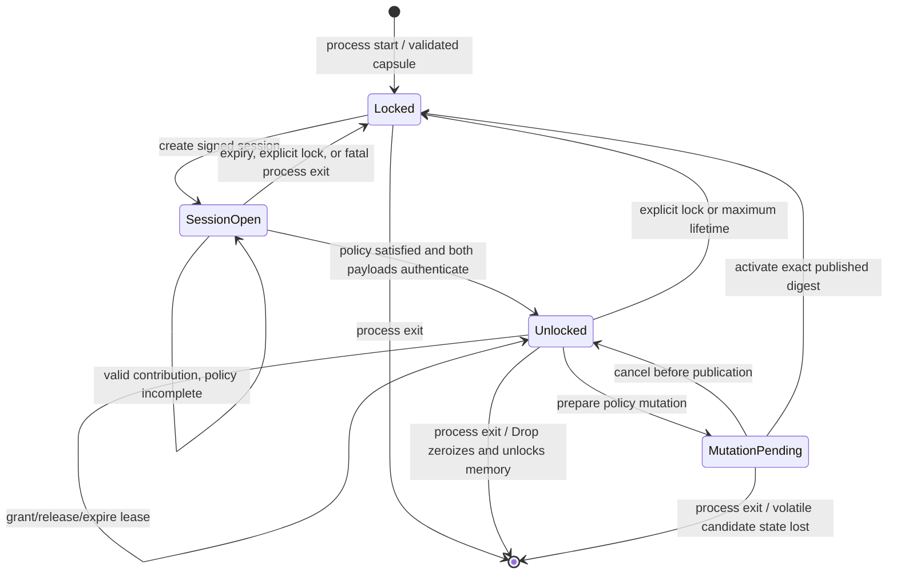
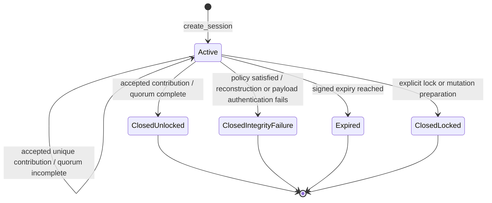
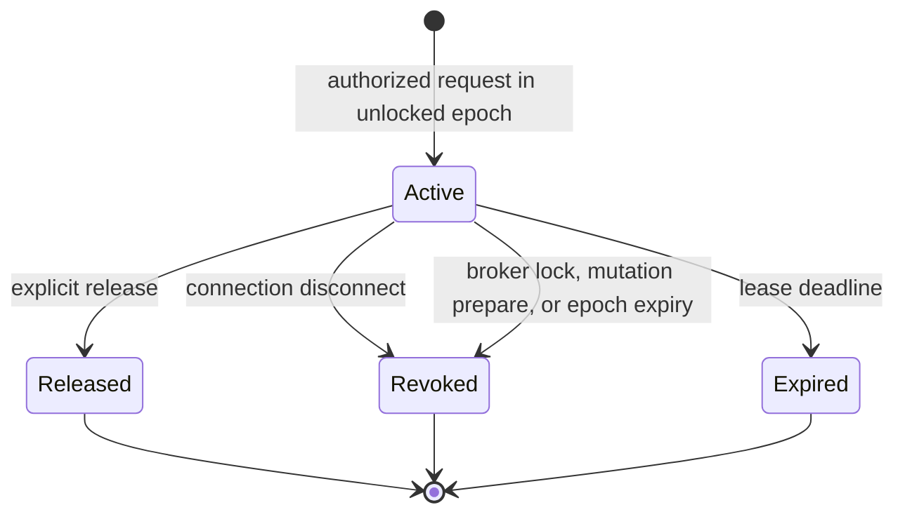
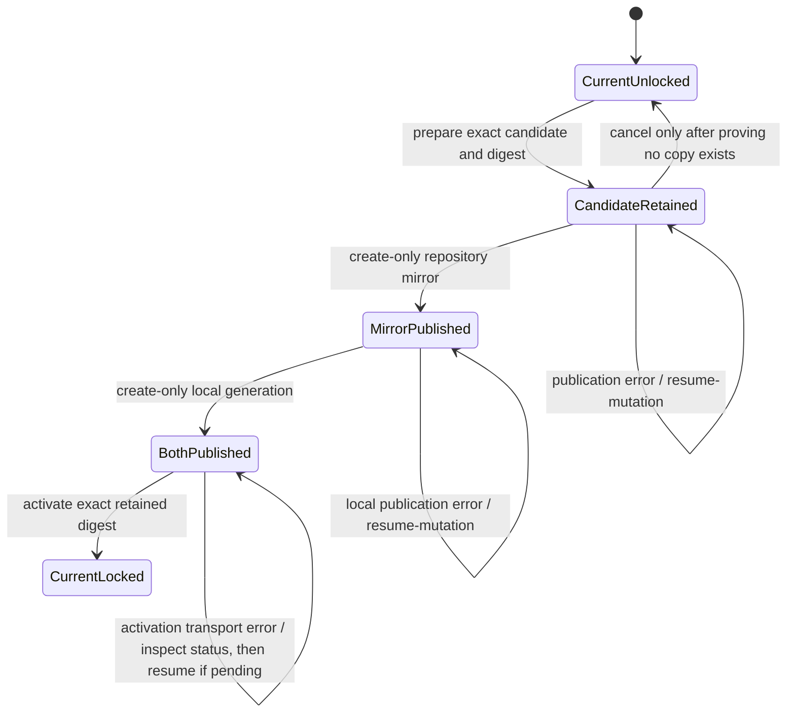
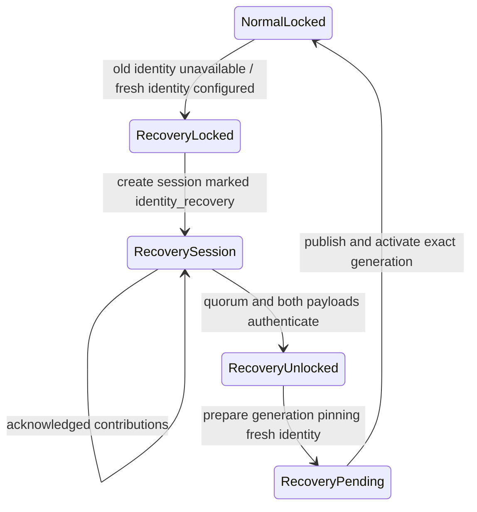
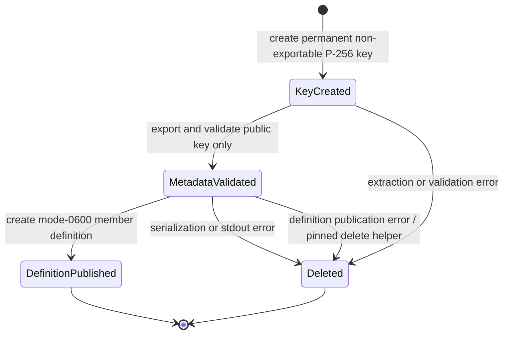

# Quorum Key Broker Implementation and State Machines

[← Architecture overview](00-overview.md) · [Phase 20 roadmap](../04-roadmap/phase-20-quorum-based-encryption-unlock.md)

This document describes the implemented Phase 20 control flow. It is the
maintainer reference for failure handling, transition ordering, and operator
recovery. The operator-facing commands and custody procedures remain in
[`doc/070_encryption.rst`](../../070_encryption.rst).

## Components and ownership

| Component | Implementation | Responsibility |
|---|---|---|
| Recovery capsule | `vaulticdb/src/encryption/recovery_capsule.rs` | Validate immutable capsule generations, evaluate policies, wrap member shares, reconstruct the root secret, and authenticate both recovered payloads. |
| Provider codecs | `vaulticdb/src/encryption/envelope/providers.rs` | Bind provider operations to repository, slot, key version, key reference, and purpose. |
| Broker core | `vaulticdb/src/broker.rs` | Own unlock sessions, recovered keys, epochs, leases, policy candidates, and authorization decisions. |
| Broker service | `vaulticdb/src/bin/vaultic-key-broker.rs` | Load the pre-database capsule, inspect peers, negotiate the protocol, dispatch bounded requests, and emit allowlisted security events. |
| Hardware custodian | `vaulticdb/src/bin/vaultic-key-custodian.rs` | Perform YubiKey, FIDO2, and macOS Secure Enclave operations outside the broker process. |
| Go broker client | `internal/index/broker/` | Verify signed sessions, construct HPKE contributions, enforce provider identity, and maintain lease connections. |
| Operator CLI | `cmd/vaultic/cmd_index_unlock.go`, `cmd/vaultic/cmd_index_keys.go` | Run ceremonies, persist generation anchors, publish mutations, and drive migration and recovery workflows. |
| VaulticDB publication | `vaulticdb/src/main.rs` | Publish immutable repository and local capsule copies in the required order. |

The broker is intentionally the only long-lived owner of recovered metadata and
repository keys. Provider credentials and plaintext member shares never enter
its command line or environment. Clients receive capability-specific,
connection-bound leases rather than capsule access.

## State dimensions

The implementation does not encode one monolithic enum. Its externally visible
state is the product of five independent dimensions:

- **Broker key state:** locked or unlocked with one epoch.
- **Unlock sessions:** zero or more active, expiring sessions while locked.
- **Leases:** zero or more connection-bound leases while unlocked.
- **Policy mutation:** absent or one retained candidate awaiting publication.
- **Identity mode:** normal or identity recovery until a replacement key is
  pinned by an activated generation.

`status` reports these dimensions independently. Operators must not infer an
unlocked broker merely from an active session, or an active capsule merely from
a published candidate.

## Broker and epoch state machine

Invariants:

1. Process startup is always locked. No key or epoch state is persisted.
2. Unlock is committed only after the policy reconstructs and both capsule
   payloads authenticate.
3. Unlock closes every contribution session.
4. Preparing a mutation closes sessions and leases, retains the existing epoch,
   and blocks new leases.
5. Cancelling a still-unpublished candidate returns to the existing unlocked
   epoch. Activation swaps the exact digest and then locks.
6. Explicit lock, automatic lock, disconnect, and process destruction revoke
   the applicable leases and zeroize owned key material.

## Unlock-session state machine

A session transcript binds protocol, session ID, repository, capsule generation,
endpoint, nonce, expiry, HPKE public key, and identity-recovery mode. The broker
identity signs that transcript. Contribution ciphertext additionally binds the
member and custodian generation assertion.

Contribution handling is transactional: decryption, member lookup, share-index
matching, rollback checks, principal/duplicate checks, and structural Shamir
share validation complete before the session's accepted-member sets are
changed. A rejected contribution therefore cannot poison a corrected retry.
Once accepted, the member, group/share index, and immutable principal are
consumed exactly once in that session. If adding an accepted share satisfies
the policy but reconstruction or either payload authentication fails, the
broker closes the entire session and returns an error; it never reports that
terminal integrity failure as an incomplete quorum.

Expiry is signed and checked by both client and broker. Broker restart discards
all sessions and private HPKE keys, so ciphertext from a previous process cannot
be accepted by a newly created session even if an attacker reuses its public
session ID.

## Lease state machine

A lease is bound to capability, epoch, connection, expiry, key version, and
capsule generation. `metadata-dek`, `repository-master-key`, and
`metadata-loss-recovery` are separate capabilities. Policy mutation is an
authorized operation, not a key-returning lease. A broker restart creates no
replacement epoch; clients must complete a new quorum ceremony.

## Policy mutation and publication

The ordering is deliberate:

1. The unlocked broker creates a fresh root secret and complete candidate while
   preserving both underlying keys.
2. It retains the candidate and SHA-256 digest in memory, closes sessions and
   leases, and blocks new leases.
3. VaulticDB writes the repository mirror with create-only semantics.
4. VaulticDB writes the deterministic local generation with create-only
   semantics and syncs it.
5. The CLI asks the broker to activate exactly the retained digest.
6. Activation swaps the capsule, exits identity-recovery mode when applicable,
   and locks the broker.

All publication operations are idempotent only when existing bytes match
exactly. A conflicting generation or digest fails closed. If publication or
activation returns an error, do not begin a different mutation. Use broker
status and `resume-mutation` while the original broker still reports the pending
digest.

The pending candidate is intentionally not warm-restart material and is not
persisted by the broker. If that broker process is lost mid-publication:

- If the local generation exists, startup discovery selects the highest valid
  local generation and starts locked from it. Verify its digest and repository
  mirror before continuing.
- If only the repository mirror exists, retain it as recovery evidence, restore
  or publish its exact bytes to the deterministic local generation under the
  documented recovery procedure, and restart locked from that generation.
- If neither immutable copy exists, restart from the previous local generation,
  unlock again, and prepare a new generation.
- Never use `cancel-mutation` after either immutable copy may have been
  published. Cancellation cannot retract immutable external bytes.

## Identity-recovery state machine

Identity-recovery sessions require each contributor to pass
`--unverified-session` and compare the fingerprint out of band. Recovery mode
grants no key leases. Its only usable unlocked transition is a policy mutation
that publishes the replacement public identity. Activation clears recovery mode
and locks, after which ordinary signed sessions can begin.

## Key-in-DB migration state machine

```mermaid
stateDiagram-v2
    Legacy --> Prepared: migrate-prepare
    Prepared --> Prepared: interruption or failed proof / retry exact state digest
    Prepared --> FinalizedCleanupPending: capsule and pack proof; remove DB key
    FinalizedCleanupPending --> FinalizedCleanupPending: managed bypass cleanup error
    FinalizedCleanupPending --> Retired: retry cleanup
    Retired --> [*]
```

`migrate-prepare` publishes and authenticates a capsule while retaining the
legacy database key. Its protected state file binds repository, generation,
digest, local path, and mirror path. `migrate-finalize` opens the repository with
a `metadata-loss-recovery` lease, authenticates at least one pack when packs
exist, and sends a domain-separated HMAC proof to VaulticDB. Only the exact
pending digest may remove the database key. Managed password keys and escrow
records are retired afterward; cleanup failure is reported as retryable and may
be rerun against the durable finalized digest.

## Secure Enclave enrollment transaction

The native helper deletes a newly created key on every error before successful
metadata delivery. After delivery, the Go CLI owns rollback until the protected
member definition is created. Rollback runs with a bounded context independent
of parent cancellation and deletes only the key matching both the random
application tag and enrolled public key. If rollback also fails, the returned
error preserves both the original publication failure and cleanup failure; the
operator must treat the key as possibly present and remove it using the same
signed custodian and pinned reference.

## Error-handling contract

The implementation follows these rules:

- Validate before mutation. Rejected session input does not consume uniqueness
  state; malformed candidates do not replace active state.
- Authenticate before release. Neither recovered key is leaseable unless both
  capsule payloads authenticate.
- Persist observation before one-time submission. A custodian generation anchor
  is advanced after local session/capsule verification but before its broker
  contribution is consumed. Broker rejection does not make observing that
  generation untrue.
- Preserve exact retry identity. Migration and mutation retries use the original
  capsule digest, never a regenerated approximation.
- Fail closed on uncertainty. Unknown sessions, stale generations, mismatched
  identities, conflicting immutable bytes, expired leases, and ambiguous
  hardware keys are errors.
- Keep cleanup bounded and visible. Security cleanup is attempted independently
  of caller cancellation and cleanup failures are retained alongside the primary
  error. Telemetry remains best effort and never changes the cryptographic
  result.
- Keep secrets out of diagnostics. Errors may include operation, provider,
  repository, generation, and stable reason; they must not include tokens, PINs,
  credentials, shares, plaintext keys, or wrapped-share ciphertext.

## Operator recovery matrix

| Observed failure | Durable state | Required action |
|---|---|---|
| Contribution rejected | Session remains active unless expired; rejected identity was not consumed | Correct the local cause and retry the same member before expiry. |
| Policy is satisfied but reconstruction or payload authentication fails | Broker closes the poisoned session without creating an epoch | Preserve diagnostics, investigate share/capsule integrity, and create a fresh session only after correcting the cause. |
| Session file could not be written | Broker session expires automatically; no share was accepted | Fix protected storage and create a new session. |
| Generation anchor cannot be persisted | No contribution was submitted | Fix the anchor path, then retry. |
| Broker submission result is unknown | Contribution may have been consumed | Query status. If still locked, use another valid member or create a fresh session rather than replaying blindly. |
| Mutation publication failed | Exact candidate remains pending while broker lives | Run `resume-mutation`; do not prepare another mutation. |
| Activation response was lost | Both copies exist; broker may already be locked on new generation | Query status and compare generation/digest. Resume only if the original digest remains pending. |
| Broker died during mutation | Pending memory is gone; immutable copies determine recovery | Reconcile mirror and local generation as described above, then restart locked. |
| Secure Enclave definition write failed | Key deletion was attempted independently | If the joined error reports rollback failure, treat the key as present and remediate with the pinned reference. |
| Legacy-route cleanup failed after finalization | Database key is already removed; finalized digest is durable | Rerun `migrate-finalize` to finish idempotent cleanup. |
| Broker process exits or host reboots | No epoch, sessions, or leases survive | Start locked and perform a new quorum ceremony. |

## Validation boundaries

Deterministic tests cover capsule authentication, policy reconstruction,
transactional contribution bookkeeping, replay/expiry rejection, mutation
retention and exact activation, migration proof, process restart, provider
failure, subprocess isolation, and Secure Enclave codec and rollback behavior.
Physical hardware ceremonies, live cloud IAM behavior, production code signing,
platform sandboxing, and collector retention remain deployment gates listed in
the Phase 20 roadmap.
