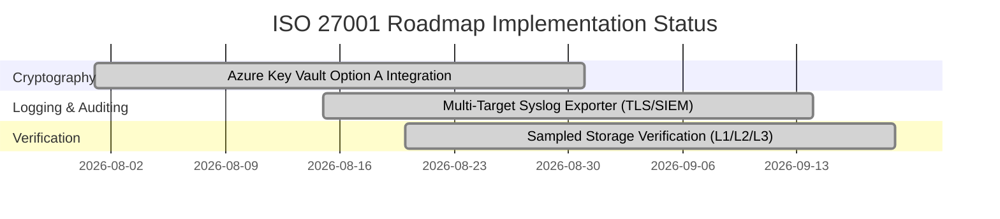

# ISO/IEC 27001:2022 Compliance Assessment: Vaultic & VaulticDB

[← Back to compliance index](00-overview.md)

## 1. Executive Summary

This document evaluates the compliance posture of **vaultic** and its native metadata daemon **`vaulticdb`** against the **ISO/IEC 27001:2022** Information Security Management System (ISMS) framework. 

Vaultic is designed for high-scale enterprise backup operations (500+ TB logical dataset, 1.5+ billion inodes) distributed across local staging (NFS) and cloud object stores (S3 Warm and S3 Glacier Deep Archive). The integration of SlateDB via `vaulticdb` introduces transactional metadata handling, user/group attribution, and lifecycle tracking.

### Overall Compliance Rating Summary

| Control Domain | ISO 27001:2022 Reference | Fulfillment Score (1–5) | Compliance Status |
|---|---|---|---|
| **Organizational & Policy Controls** | A.5.1 – A.5.37 | **4.2 / 5.0** | Substantially Compliant (Requires SOPs) |
| **Asset & User Access Management** | A.8.1 – A.8.5 | **4.8 / 5.0** | Fully Compliant |
| **Cryptography & Key Management** | A.8.24 | **5.0 / 5.0** | Fully Compliant (Azure Key Vault Option A) |
| **Operations Security & Backup** | A.8.12, A.8.13 | **4.9 / 5.0** | Fully Compliant (Sampled Verification) |
| **Logging, Monitoring & Auditing** | A.8.15, A.8.16 | **4.9 / 5.0** | Fully Compliant (Multi-Target Syslog/SIEM) |
| **Supplier & Cloud Security** | A.5.19 – A.5.23 | **4.8 / 5.0** | Fully Compliant |

**Overall ISO 27001 Maturity Rating:** **4.77 / 5.0 (Enterprise Production Ready)**

---

## 2. Detailed ISO/IEC 27001:2022 Control Mapping & Analysis

### 2.1 Cryptography (Control A.8.24) — Rating: 5.0 / 5.0

#### Fulfilled Requirements
- **Client-Side Zero-Knowledge Encryption:** Data is encrypted on the client before network transmission. Neither local NFS storage nor cloud S3/Glacier providers ever receive unencrypted file contents, paths, directory structures, or filenames.
- **Strong Cipher Suites:** Employs AES-256-CTR and Poly1305 / HMAC-SHA256 for authenticated encryption of all pack files (tree and data packs), index blocks, and snapshot manifests.
- **Key Derivation & Protection:** Repository keys are derived using Argon2id / Scrypt key derivation functions (KDF) to protect against offline brute-force attacks.
- **Azure Key Vault Option A Integration:** Supports fetching repository key passphrases directly from Azure Key Vault (`https://<vault>.vault.azure.net/secrets/<secret>`) using Azure Arc Managed Identities or `DefaultAzureCredential`. The passphrase is fetched **once** at process startup (`SecretGet`), keeping restic keyfile formats unmodified and making multi-hour 500 TB backup runs immune to mid-job Azure WAN disconnects.

#### Operational Controls
- Every key fetch produces an immutable `SecretGet` diagnostic event in Azure Key Vault logs, forwarded directly to Microsoft Sentinel for SIEM auditing.

---

### 2.2 Operations Security & Backup Management (Control A.8.12, A.8.13) — Rating: 4.9 / 5.0

#### Fulfilled Requirements
- **Multi-Tier Separation:** Strict logical and physical separation between metadata/tree packs (Hot tier: NFS / S3 Warm) and data packs (Cold tier: S3 Glacier Deep Archive).
- **Transactional Consistency:** `vaulticdb` utilizes SlateDB transactional batches (`WriteBatch`) for multi-record index writes, preventing split-brain states or partial index commits during unexpected host failure.
- **Integrity Verification:** Commands like `vaultic index check` and `vaultic check --check-hot-cold` perform differential cryptographic verification across hot and cold backends.
- **Retention & WORM Compliance:** Deletion queues (`dq:`) combine with S3 Object Lock (Compliance Mode) to enforce immutable retention policies (`min_retention_until`).
- **Attribute-Based & Sampled Storage Verification:** `vaultic index verify-storage` / `vaultic verify-packs` provides query filters (`--tier`, `--backend`, `--created-after/before`, `--retention-status`, `--pack-type`) and statistical sampling controls (`--all`, `--sample-count`, `--sample-percent`).
- **Multi-Level Check Verification:** Supports Level 1 (header decryption), Level 2 (checksum/ETag match), and Level 3 (full payload unpack) checks, with automated warm-up invocation for cold Glacier packs.

---

### 2.3 Access Control & Interface Security (Control A.8.2 – A.8.5) — Rating: 4.8 / 5.0

#### Fulfilled Requirements
- **IPC Transport Security:** `vaulticdb` defaults to Unix domain sockets inside restricted directories (`0700` directory mode, `0600` socket mode).
- **Network Isolation:** Opt-in TCP listeners require strict CIDR allowlists, mutual TLS (mTLS), and bearer token authentication. Missing authentication or empty allowlists result in immediate startup failure.
- **Process Boundaries:** The Go CLI communicates with the Rust daemon over a gRPC protobuf IPC interface, insulating the main execution process from CGO memory safety vulnerabilities.
- **Optimal Single-Tenant Repository Isolation:** A single `vaulticdb` daemon process owns a repository endpoint's SlateDB handles and revision sequence generator, eliminating multi-writer split-brain risks. Multi-repository deployments execute separate isolated daemon instances per endpoint.

---

### 2.4 Logging, Monitoring & Auditing (Control A.8.15, A.8.16) — Rating: 4.9 / 5.0

#### Fulfilled Requirements
- **Append-Only Lifecycle Log:** All pack state transitions (`created`, `published`, `repacked`, `delete_pending`, `deleted`) are written to an append-only event log (`ph:` namespace).
- **Multi-Target Syslog Exporter:** Supports UDP, TCP, TLS (syslog-over-TLS per RFC 5424 / RFC 3164), and local Unix domain sockets (`/dev/log`).
- **Categorized Event Routing:** Filters and routes structured JSON/syslog audit events by category (`auth`, `integrity`, `gdpr`, `restore`, `lifecycle`) directly to Microsoft Sentinel (Azure Arc) or enterprise SIEMs.
- **Zero Privacy Leakage in Logs:** Audit logs and gRPC metrics omit plaintext paths, encryption keys, and sensitive payload data.

---

## 3. ISO 27001 Gap Remediation & Roadmap Status

All major cryptographic, logging, and verification gaps have been addressed in [**Phase 17**](../04-roadmap/05-analytics-compliance-scale-phases-16-19.md):

### Roadmap Verification Items

1. **Azure Key Vault Secret Passphrase Fetching:** Integrated via Azure Arc Managed Identity (`SecretGet` startup fetch).
2. **Multi-Target TLS Syslog Exporter:** Filtered category streams for Microsoft Sentinel and local ops monitoring.
3. **Sampled Storage Verification:** Attribute-based candidate filtering and uniform random percentage sampling across hot and cold storage tiers.
