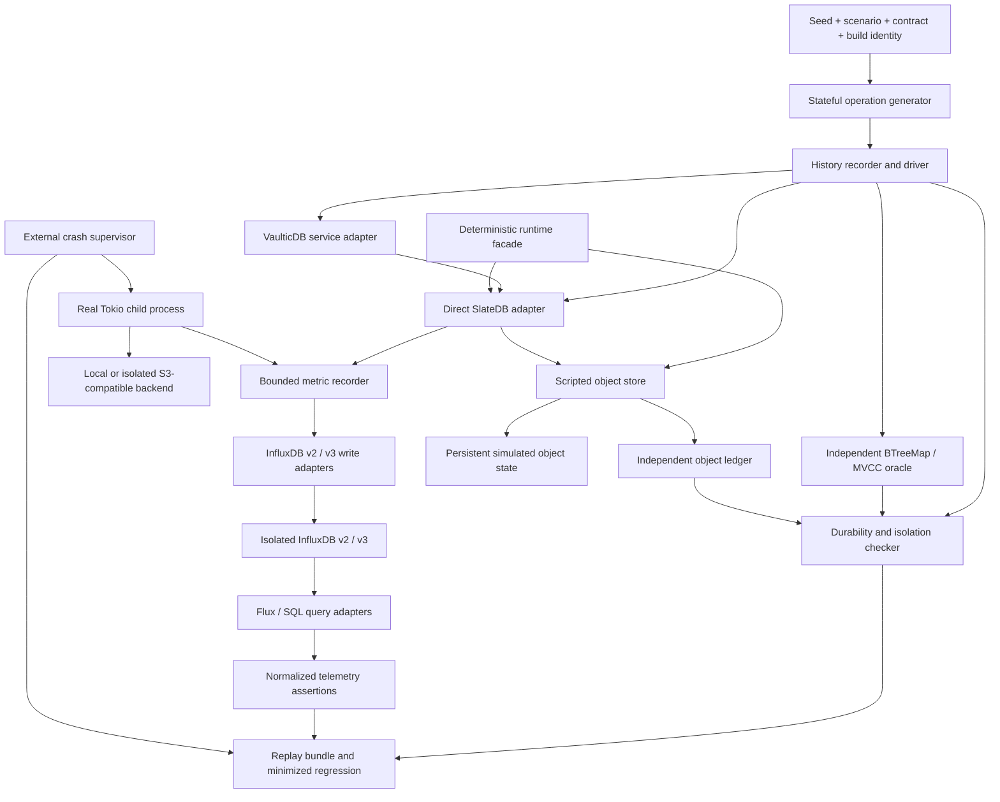

# VaulticDB Reliability Testing Architecture

**Status:** proposed engineering specification; the harnesses and gates below are not yet implemented.

**Objective:** pursue FoundationDB-level reliability through executable state models, controlled schedules, crash recovery, corruption testing, and sustained performance verification. This is an engineering target, not a claim of equivalent reliability. Finite testing cannot prove freedom from data loss or all concurrency defects.

**Normative language:** MUST and MUST NOT identify acceptance requirements. SHOULD identifies a default that requires a documented exception.

Related documents: [testing strategy](01-testing-strategy.md), [operational telemetry](phase-34-operational-monitoring-and-metrics-export.md).

## 1. Scope and Current Integration Points

The system under test (SUT) is both the SlateDB engine and VaulticDB's storage/service integration. Engine tests do not establish RPC retry safety, writer fencing, encryption integrity, or service-level durability. Conversely, service tests cannot establish coverage of internal engine scheduling.

The current [dependency manifest](../../../vaulticdb/Cargo.toml) pins SlateDB to Git revision `ae07acd4498068d1b9ba799cc9f6c9824e6f6251`, uses Tokio, and enables a `test-failpoints` feature. The current [storage implementation](../../../vaulticdb/src/storage.rs) uses `Db`, `DbReader`, `DbTransaction`, separate optional WAL object stores, and feature-gated failure points. Those failure points return errors; they do not by themselves stop execution at every WAL/SST publication boundary or simulate a process crash.

The storage implementation imports the `slatedb::object_store` re-export while the package also directly depends on `object_store`. Test adapters MUST implement the exact trait used by the pinned engine; do not assume two dependency versions have identical types. Record resolved versions from `Cargo.lock` and `cargo tree -d` when implementing adapters.

InfluxDB v2 export is proposed in the operational telemetry specification. This specification extends that design with required InfluxDB v2 and v3 compatibility profiles; it does not assume the Phase 34 exporter is already implemented. `kv_flush_latency` is a contract to implement and verify here, not an assertion that the current code already exports this metric.

### 1.1 Required Contract Inventory

Before enabling correctness gates, check in a versioned capability manifest, reviewed against the pinned source and exercised by small contract tests:

| Capability | Required recorded behavior |
| --- | --- |
| Writes and batches | Atomicity, duplicate-key ordering, maximum sizes, accepted versus durable acknowledgment |
| Transactions | Supported isolation levels, snapshot acquisition point, conflict rules, read-your-writes, abort/timeout behavior |
| Reads and ranges | Writer versus follower visibility, byte ordering, endpoint inclusivity, pagination and snapshot lifetime |
| Durability | WAL destination, acknowledgment boundary, local versus remote survival domain, recovery ordering |
| Maintenance | WAL flush versus memtable flush, compaction trigger/completion hooks, checkpoint/GC retention rules |
| Object store | Conditional create/update, version/ETag semantics, atomic publication, listing and read consistency |
| Runtime | Spawn, timer, clock, randomness, blocking work, filesystem, and synchronization injection surfaces |

Unsupported guarantees MUST be marked unsupported. In particular, snapshot isolation MUST NOT be tested or advertised as serializability, and a local WAL acknowledgment MUST NOT imply survival of host/disk loss.

## 2. Architecture and Trust Boundaries



Use three execution modes sharing scenario serialization and the oracle: synchronous/sequential model testing; deterministic simulated concurrency; and real-process chaos/performance testing. Real cloud SDKs, real HTTP telemetry, and OS process killing MUST remain outside the deterministic scheduler. Their results complement, rather than prove, deterministic coverage.

Proposed modules under the Rust package are `tests/reliability/{model,history,scenario,store,runtime,metrics,artifacts}.rs`, integration-test entry points, a feature-gated crash-worker binary, a separate `fuzz/` package, and `benches/`. These are proposed paths, not existing interfaces. Because production storage lives in the daemon's module tree, first reuse its in-module test boundary or expose a narrow feature-gated test-support module; do not duplicate production write/recovery logic in the test adapter.

### 2.1 Rust Boundary Patterns

The following types specify project-owned interfaces, not purported APIs of SlateDB or a simulator. Supporting types such as `Command`, `Observation`, and `CaseError` are implemented by the harness. Adapters MUST normalize responses without hiding errors or repairing invalid storage.

```rust
use async_trait::async_trait;
use std::{collections::BTreeMap, sync::Arc, time::Duration};

#[derive(Clone, Copy, Debug, Eq, PartialEq, Ord, PartialOrd)]
struct OpId(u64);

#[derive(Clone, Debug)]
enum Mutation {
    Put { key: Vec<u8>, value: Vec<u8> },
    Delete { key: Vec<u8> },
}

#[derive(Clone, Debug, Default)]
struct ReferenceState {
    committed: BTreeMap<Vec<u8>, Vec<u8>>,
    commit_index: u64,
    durable_commits: Vec<u64>,
}

#[async_trait]
trait TestDatabase: Send + Sync {
    async fn execute(&self, id: OpId, command: Command)
        -> Result<Observation, CaseError>;
    async fn maintenance(&self, request: MaintenanceRequest)
        -> Result<MaintenanceReceipt, CaseError>;
    async fn inspect(&self) -> Result<EngineSnapshot, CaseError>;
}

#[async_trait]
trait TestClock: Send + Sync {
    fn now_tick(&self) -> u64;
    async fn sleep(&self, delay: Duration);
}

trait DeterministicEntropy: Send + Sync {
    fn draw(&self, stream: StreamId, event: u64) -> u64;
}

#[async_trait]
trait Lifecycle: Send + Sync {
    async fn graceful_reopen(&mut self) -> Result<(), CaseError>;
    async fn crash_and_recover(&mut self, cut: CrashCut)
        -> Result<RecoveryReceipt, CaseError>;
}
```

Separate lifecycle ownership from shared database handles so a crash invalidates every old handle, reader, transaction, and task. A restart MUST create a fresh runtime node and fresh engine caches while retaining only the selected durable state. `inspect` is a diagnostic hook, not the correctness oracle. Internal IDs used for hooks MUST NOT be exported as metric labels.

## 3. Stateful Property-Based Testing

### 3.1 Independent Reference Model

Start with a pure synchronous `BTreeMap<Vec<u8>, Vec<u8>>` and implement bytewise Put/Get/Delete and range bounds independently of SlateDB. Include empty values, missing keys, tombstones, overwrites, prefix-adjacent keys, `0x00`/`0xff` bytes, and all supported inclusive/exclusive endpoints. An invalid range is either a specified empty result or a specified error, never a harness panic.

For transactions, retain immutable committed versions indexed by logical commit ID; each transaction stores its snapshot ID, read set, range predicates where required, and buffered mutations. Reads overlay buffered writes on the snapshot. Commit applies all mutations atomically to a candidate model state. Aborts leave no committed effects. Retain history while snapshots require it, then reclaim it to keep soak-oracle memory bounded.

Conflict checking MUST match the configured isolation contract. Under snapshot isolation, test write/write conflicts and stable snapshots; permit write skew if the contract does. Under serializable isolation, reject histories with cycles including predicate/range dependencies and phantom anomalies. For conservative conflict detection, permit documented extra aborts, but assert liveness under fault-free, nonconflicting execution. Do not require every transaction to succeed.

Separate visibility from durability. Record each operation as not-applied, applied-but-not-known-durable, durable-acknowledged, or unknown-outcome. A timeout or failed durability wait can occur after application. Never classify all returned errors as an abort. For retries, preserve the same operation/idempotency identity and assert the actual service contract, including payload-mismatch rejection when supported.

### 3.2 Generation, Interleaving, and Shrinking

Use `proptest` initially with a serialized vector of symbolic commands and `proptest-state-machine` patterns (an explicit model state, transition strategy, preconditions, model transition, and SUT postcondition). Evaluate the optional `proptest-state-machine` crate against the pinned `proptest` version before adoption. Async execution belongs in the driver; the reference transition remains synchronous.

Define commands: `Put`, `Get`, `Delete`, `Range`, `Begin`, `TxnGet`, `TxnRange`, `TxnPut`, `TxnDelete`, `Commit`, `Abort`, `FlushWal`, `FlushMemtable`, `Compact`, `OpenReader`, `RefreshReader`, `CloseReader`, `GracefulRestart`, and `CrashRestart`. Include atomic batches as a distinct command. Add fault enable/disable events and cancellation after the basic model is established.

Default mix: 35% mutations, 25% reads/ranges, 25% transaction commands, and 15% lifecycle/maintenance/fault commands, adjusted to ensure transactions terminate. Use 1-8 logical clients, 70% access to a small hot-key domain, and 30% sparse/boundary keys. Generate values around block, batch, memtable, multipart, and configured size limits, with strict per-case memory budgets. Generate legal commands from model state instead of repeatedly rejecting cases with `prop_assume!`.

For a first implementation, select a logical client per command and execute it to completion, retaining open transactions across commands. Then generate bounded phases with multiple outstanding futures, explicit start barriers, cancellations, and scheduler choices. Record invocation and response events separately; response order is not commit order. Arbitrary `join!` calls with no history checker are insufficient.

```rust
use proptest::prelude::*;

proptest! {
    #![proptest_config(ProptestConfig::with_cases(256))]
    #[test]
    fn sequential_model_agrees(case in scenario_strategy()) {
        let result = run_sequential_case(case);
        prop_assert!(result.is_ok(), "{:?}", result.err());
    }
}
```

`run_sequential_case` owns a fresh bounded runtime and isolated store, executes transitions, and compares observations. It is a proposed synchronous bridge for this test, not a nested Tokio runtime. Use a simulator-specific entry point for concurrent simulation. Retain proptest regression seeds AND the expanded command stream: generator changes can invalidate seed-only reproduction.

Shrink in this order: unused clients/transactions, whole dependency-closed command groups, commands, keys/values, fault events, then scheduler choices. Preserve references to `Begin`, acknowledgment/crash ordering, and fault trigger identities. A minimized candidate MUST reproduce under the same compatible contract/build. Invalid traces are rejected as shrink candidates, not reported as passing tests. A shrinking timeout preserves the original failing artifact.

### 3.3 Concurrency and Recovery Oracles

For linearizable API operations, search for a legal sequential history respecting response-before-invocation edges, per-client ordering, returned values, and atomic batch/transaction boundaries. Use bounded histories (initially 12 overlapping operations) with state memoization and partial-order pruning. Larger runs use checked quiescent cuts plus bounded overlapping histories; report this as bounded coverage, not a proof of global linearizability. Checker budget exhaustion is inconclusive and MUST NOT count as a pass.

For snapshot transactions, use the MVCC oracle and isolation-specific dependency checking instead of pretending each read is an independent linearizable latest-value read. Follower readers use their documented snapshot/freshness contract. Force a refresh or wait on an explicit visibility barrier before expecting equality with the writer's latest state.

At a crash, construct possible committed histories consistent with acknowledgments, engine ordering, and the persistence journal. Every durable-acknowledged operation MUST occur in every admissible recovery history, but its value may legitimately have been overwritten by a later operation. Unknown-outcome operations may occur only atomically and in an allowed order. Never independently include/exclude every key of an uncertain transaction. Never impose a prefix of response order; enforce engine commit/WAL order only where that ordering is guaranteed.

Compare recovered state against admissible histories, not a permissive union of values. Bound unresolved operations to control search. No candidate means failure; resource exhaustion means inconclusive. At full quiescence with no uncertain operations, compare every generated user key and a complete ordered range against the exact model. Keep internal metadata outside the user-key comparison, and audit it separately for idempotency/fencing invariants.

### 3.4 Flush, Compaction, and Restart Checks

Maintenance receipts MUST identify the requested barrier, observed generation, and completion event. WAL flush, memtable-to-SST flush, and compaction publication are distinct barriers. Waiting a fixed wall-clock interval does not establish completion.

1. Take model and reader snapshots, then request a flush with pending puts, overwritten values, and tombstones across several tables.
2. Wait for explicit flush publication and durability completion, then compare point reads and complete ordered scans through fresh readers.
3. Force compaction with small test thresholds; verify an actual input/output generation transition occurred. Check every key/value, old snapshots, range boundaries, tombstone non-resurrection, and publication dependencies.
4. Repeat with a cold reopen and no reusable block cache. A simulation crash drops tasks without orderly close; a process crash uses the supervisor described below.
5. Hold a reader/checkpoint across compaction and GC. Assert referenced objects remain readable until release, then assert eventual collection of eligible orphans within the configured GC budget.

Object counts and file hashes alone cannot prove compaction correctness because physical layouts legitimately change. Compare logical contents and audit that every manifest reference resolves to a complete, valid object. If the pinned engine lacks a compaction-completion hook, adding an upstream hook or a narrowly maintained test patch is a prerequisite, not a reason to silently skip the assertion.

## 4. Deterministic Simulation Testing

### 4.1 Runtime Integration and Qualification

Use `madsim` as the preferred whole-async-stack simulator only after a compatibility spike. It is not a universally drop-in replacement for arbitrary Tokio code. Its Tokio-compatible facade/configuration must cover the pinned SlateDB transitive task creation, timers, network calls, synchronization, and blocking work. Inventory direct calls to `tokio::spawn`, `spawn_blocking`, `std::thread`, `Instant`, `SystemTime`, OS randomness, filesystem operations, and SDK networking. Wrap project-owned calls; use engine injection hooks or an explicitly pinned simulation patch for engine calls that bypass them.

If the full engine cannot be controlled, label the mode `adapter-simulation` and keep whole-engine DST as an unmet gate. Do not claim paused Tokio time makes scheduling deterministic. A single-thread Tokio runtime still leaves I/O, hash iteration, entropy, and external wakeups uncontrolled.

Use a project runtime facade for monotonic time, logical wall time, spawn/join/cancel, timers, entropy, and blocking computation. The concrete spawn API MUST preserve required `Send` and cancellation semantics; choose static generics or boxed futures based on the verified simulator API. Use stable logical task IDs, sorted iteration for scheduling-sensitive maps, and explicit tie-breaking for equal-time events. Production cryptographic entropy MUST remain cryptographically secure; deterministic entropy is restricted to isolated tests with synthetic keys.

Qualification: run at least 100 scenarios, each ten times on clean processes, and require identical canonical event traces and outcomes for identical build/seed/configuration. Exclude wall-clock diagnostic timestamps from canonical hashes. Virtual deadlines detect no-progress loops; a real external watchdog catches blocked native calls. Time advances only through the simulator, and crash cancellation must prevent old-node tasks from changing persistent state afterward.

Use `shuttle` for randomized or bounded schedule exploration of extracted concurrent components, such as write admission, cache coordination, and transaction-slot lifecycle. Instrument their threads, synchronization, atomics, and supported futures through Shuttle's APIs. Shuttle is not an automatic replacement for all Tokio and network behavior. Persist the scheduler replay record as well as the workload seed. Use `loom` separately for small custom atomic/lock-free algorithms, with Loom types and bounded permutations; do not run the whole SlateDB stack inside Loom.

### 4.2 Seed and Replay Contract

One root seed deterministically derives separate workload, scheduler, store-fault, maintenance, entropy, and crash streams using a versioned derivation algorithm. Derive draws from stable `(stream, logical actor, event ordinal, attempt)` identities so adding a metric observation cannot consume fault randomness. A mutex around a shared RNG does not remove schedule-dependent draw ordering.

Every failure bundle MUST contain source revision plus dirty-tree patch/hash, `Cargo.lock` hash, rustc/target, simulator version/configuration, seed and derivation version, expanded commands, scheduler replay choices, object fault script, history, contract version, and first divergent event. Seed-only replay is supported only for an identical build/environment; portable reproduction uses the serialized scenario and compatible schema. A future harness CLI MUST support record, replay, and minimize modes; these are not currently available commands.

### 4.3 Mock Object Store

Implement the exact `slatedb::object_store::ObjectStore` trait as a decorator over a deterministic durable object map, including all required methods. Intercept `put_opts`, multipart creation/parts/completion/abort, `get_opts` and streaming bodies, range reads, HEAD, list/list-with-delimiter and pagination, delete, copy, and conditional publication. A default trait method must not bypass fault accounting.

```rust
#[derive(Clone, Debug)]
enum FaultAction {
    Delay(Duration),
    RateLimit { retry_after: Duration },
    FailBeforePublish { kind: StoreErrorClass },
    PublishThenLoseResponse,
    InterruptUpload { after_bytes: usize },
    TruncateRead { after_bytes: usize },
    CorruptStoredBytes { offset: usize, xor_mask: u8 },
}

trait FaultPlan: Send + Sync {
    fn actions(&self, event: &StoreEvent) -> Vec<FaultAction>;
}

struct SimStore {
    clock: Arc<dyn TestClock>,
    faults: Arc<dyn FaultPlan>,
    objects: Arc<SimObjectState>,
    journal: Arc<ObjectJournal>,
}
```

`StoreEvent` identifies logical task/operation/attempt, backend role, object class, phase, byte count, and logical time. Object paths may appear only in protected test artifacts. `SimObjectState` holds committed immutable byte arrays plus separate staged uploads, versions, tombstones, and logical modification times. `ObjectJournal` independently records attempted/transferred/published bytes, checksums, conditional outcomes, and publication order. The reference KV model MUST NOT use the store's read implementation as its oracle.

Normal fault mode preserves the provider's contract:

- Seeded latency applies separately before request acceptance, between body chunks, before publication, and before response delivery. Use virtual token buckets for bandwidth and request-rate limits, with a specified burst size, refill rule, and tie-break order.
- A failed single-object PUT exposes either the previous full object or the newly published full object, never a prefix. An upload interrupted before publication leaves no new visible object. A response lost after publication produces an uncertain client outcome.
- Multipart parts remain staged until atomic completion. Abandoned parts consume accounted space until abort/expiry. Retry and cancellation must not accidentally complete an upload or publish mixed attempts.
- ETags/versions and conditional create/update are evaluated atomically at publication, preventing two concurrent conditional writers from both winning. This is essential for fencing and manifest tests.
- Rate-limit/provider error translation is tested both at the object trait boundary and, where HTTP retry headers are relevant, through a separate real SDK test server. The object trait does not necessarily expose HTTP `Retry-After` directly.
- LIST staleness and read-after-write behavior follow an explicitly selected provider profile. Do not silently weaken a strongly consistent backend to make a failure pass.

Adversarial corruption mode is separate: mutate/truncate a committed object, make a referenced object missing, or violate atomic publication deliberately. Such states test detection and recovery boundaries; they are not presented as normal S3 PUT behavior. Mark every fault mode in artifacts and coverage reports.

Calibrate the mock using a shared object-store contract suite against the in-memory implementation, local filesystem, and an isolated S3-compatible server. Include cancellation, conditional conflicts, range endpoints, version behavior, and retry error classes. Semantic differences become explicit profiles. The mock itself needs model/property tests before it is trusted to judge the engine.

## 5. Fault Injection and Corruption Resilience

### 5.1 Process/OS Chaos

Use a parent supervisor and a feature-gated child binary running the real Tokio/SlateDB stack. The parent owns a private backend namespace, operation ledger, persistent artifacts, and a separate control channel. For process-kill tests, the backend MUST outlive the child. Arm a named barrier, let the child notify arrival, record parent-observed acknowledgments, then send `SIGKILL` to the known child PID and wait for process exit before reopening. Never kill by process-name matching.

Required cut points include WAL upload/append start, partial transport body, WAL publication before acknowledgment, acknowledgment before memtable flush, SST creation, SST publication before manifest update, conditional manifest publication, compaction publication before input deletion, and GC deletion. Also exercise transaction commit before durability completion and service response loss after durable commit. Current error-return failpoints need barrier/event hooks to implement these cuts.

Avoid a handshake that stops all other tasks unless the scenario explicitly requires global quiescence. Include both controlled single-boundary cuts and seeded cuts with concurrent work. The parent records invocation before sending and acknowledgment after receiving a response. A child log saying "committed" does not prove the client observed success.

After restart, check the recovery oracle, full key scans, transaction atomicity, idempotent retries, writer fencing, reference integrity, and bounded recovery time. Repeat restart several times to catch destructive recovery. Recovery from damaged metadata MUST NOT silently create an empty database or discard acknowledged data; return a typed error and preserve evidence when safe recovery is impossible.

`SIGKILL` tests process failure, not power loss: kernel page-cache writes may survive. For local durable WAL claims, add a Linux VM/device tier with controlled reset and a block fault device such as `dm-flakey`, or an explicitly modeled durable/volatile file layer. Exercise torn writes, short writes, disk-full, `EIO`, and failed synchronization there. Tests requiring privileges run only on disposable isolated workers. A remote object WAL has different publication semantics; do not invent local `fsync` guarantees for it.

Each job MUST enforce namespace allowlists, byte/request quotas, deadlines, child cleanup, and protected artifact retention. Production endpoints and credentials are forbidden. Test failpoint capability checks stay in place, and release artifacts MUST exclude `test-failpoints`.

### 5.2 cargo-fuzz and Format-Aware Corruption

Create `cargo-fuzz`/libFuzzer targets for SST footer/index/block decoding, decompression, complete SST open/iteration, FlatBuffers manifest verification/decoding, and database initialization from a bounded object bundle. Confirm exact format entry points in the pinned SlateDB revision; add upstream/test-only exposure where private APIs block direct parser targets. Public database-open fuzzing complements, but does not replace, parser coverage.

Seed with valid empty/single/multi-block SSTs, tombstones, compressed values, and manifests from the pinned engine. Include supported historical versions and intentionally unsupported versions. Mutate/truncate headers, footers, checksums, offsets, lengths, object references, compression tags, FlatBuffers vtables, vectors, and schema version fields. Combine byte mutations with structure-aware mutation that repairs outer checksums to reach deeper validation. Use `arbitrary` for bounded object-bundle generation.

Every target MUST cap input bytes, decoded allocation, decompression expansion, object count, reference depth, I/O operations, and execution time. FlatBuffers use checked root/verifier entry points with explicit limits, never unchecked access to untrusted input. The initialization target uses an isolated in-memory store and read-only initialization when supported; otherwise capture every mutation and reject destructive fallback. Reset all state between iterations. Keep slow async initialization separate from high-throughput synchronous decoder targets.

Allowed outcomes are correct successful decoding/opening or a documented corruption/unsupported-format error. Panic, abort, sanitizer finding, timeout, deadlock, OOM, out-of-bounds access, silently wrong values, and destructive recovery are failures. Do not use `catch_unwind` to convert panics into successful fuzz results. Valid inputs MUST still open, and mutation outside integrity coverage may be valid; the expected outcome must reflect the actual encoding contract.

Run AddressSanitizer fuzzing on supported nightly/Linux targets; add selected UBSan/MSan or Miri checks where supported and useful. Track target coverage and corpus growth, retain minimized crashes as permanent regressions, and run them through both parser and open/recovery paths. Fuzz evidence strengthens graceful-error assurance but cannot guarantee all byte strings are safe. Checksums cannot detect every conceivable corruption; authenticated storage and independent expected-value comparison cover additional integrity risks.

## 6. Soak, Amplification, and Telemetry Testing

### 6.1 Continuous Seven-Day Campaign

Maintain at least one uninterrupted 168-hour soak of a single process after warm-up to expose leaks; parallel rolling-restart/fault campaigns MUST NOT replace it. Run repeatable seven-day cohorts on release candidates and a continuously rotating campaign on the main branch. Preserve hardware, dataset, seed, dependency, kernel, filesystem, and backend identities.

Use a dataset larger than cache and enough data for multiple compaction levels. Exercise overwrites/deletes, hot spots, long scans, short/long transactions, conflicting commits, readers pinned across compaction, burst ingestion, and changing value sizes. Calibrate sustainable load first, then alternate steady 60% load, near-saturation load, bounded overload, and recovery. A seven-day fault schedule includes latency, throttling, outages, cache pressure, and interrupted uploads with known fault-free comparison windows.

Measure at 10-second resolution: RSS, allocator live/resident bytes, allocation rate, task/thread/file-descriptor counts, cache occupancy, in-flight operations, oldest queue age, compaction backlog, pending/reclaimed bytes, oldest WAL/checkpoint age, throughput, error counts, and p50/p95/p99 latency. Distinguish intentional cache/dataset growth from memory leaks. Bound harness history too: keep checked windows, an independently stored operation log, and periodic oracle checkpoints; do not accumulate seven days of operations in RAM.

Run sampled point/range comparisons continuously, bounded history checks at each quiescent phase, and a complete model comparison plus independent stored-value digest audit at least daily and at completion. The digest algorithm MUST include length-delimited keys and values; use partitioned comparisons to localize failures. A digest is an acceleration mechanism, not the sole oracle. Audit cold reads and manifest references after each recovery phase.

Initial gates below are policy defaults to calibrate on dedicated runners, not universal SlateDB performance claims. Check in per-workload budgets before enforcing them; changes require review, never automatic rebaselining.

| Signal | Initial acceptance policy |
| --- | --- |
| Correctness | Zero oracle mismatches, lost durable acknowledgments, integrity violations, panics, or unclassified errors |
| Memory | After first 12 hours at fixed cardinality and warmed caches, robust live-byte slope <= 0.5% of steady baseline/day and end-window growth <= 5%; RSS and allocator retention investigated separately |
| Resource counts | No monotonic unexplained FD/task/thread growth across equivalent load windows; remain inside declared caps |
| Compaction/WAL lag | After a 10-minute injected backlog, return within 10% of baseline backlog within 30 minutes of fault removal at 60% calibrated load; never violate configured retention/space caps |
| Latency/throughput | In matched healthy windows, p99 <= 1.10 times reference and throughput >= 0.95 times reference, with sufficient samples and paired confidence intervals |
| Amplification | Healthy-window WA/RA/SA <= 1.10 times matched reference and below absolute workload budgets; intentional retention and fault retries reported separately |
| Telemetry overhead | <= 2% throughput loss and <= 5% p99 increase on matched runs; bounded queues/memory during a one-hour exporter outage |

Account for periodic autocorrelation when estimating trends; use block bootstrap confidence intervals or another justified time-series method. A campaign ends only after its recovery phase and final audit. Infrastructure failure is inconclusive and reruns from an identified checkpoint or restarts the uninterrupted campaign; it does not turn red into green.

### 6.2 Amplification Definitions

Maintain independent physical counters in the object-store adapter and logical counters at API admission/commit, with aligned window boundaries:

$$
WA_{storage} = \frac{B_{WAL,published} + B_{SST,published} + B_{manifest,published}}{B_{logical,committed}}
$$

$$
WA_{network} = \frac{B_{upload,attempted}}{B_{logical,committed}},\qquad
RA_{bytes} = \frac{B_{origin,downloaded}}{B_{logical,returned}},\qquad
SA = \frac{B_{physical,resident}}{B_{logical,live}}
$$

Define logical committed bytes as uncompressed key/value bytes plus a fixed versioned delete encoding for each committed mutation, including overwrites; failed/aborted attempts are excluded, uncertain commits reconciled. Define logical live bytes as current key/value bytes; report retained snapshot bytes separately. Physical published bytes count successful object generations even if a response is lost, while attempted upload bytes include retries, partial bodies, and replicas. Report base-engine and replicated/encrypted totals separately so compression, headers, and replication do not conceal regressions.

Track GET request amplification per logical read/scan and origin bytes for foreground versus compaction/GC separately. Empty reads/deletes and zero-byte denominators produce `not_applicable` plus raw counters, not infinity or zero. Space includes WAL, live/obsolete SSTs, manifests, pending multipart data, pinned checkpoints, and GC-eligible objects; report local caches separately. Reconcile counters against periodic inventory without listing the backend on every scrape.

### 6.3 InfluxDB v2 and v3 Assertions

Implement instrumentation through the Phase 34 bounded snapshot/exporter interface. Use a fast in-memory recorder with the virtual clock in DST and real isolated InfluxDB v2 and v3 instances for exporter integration/soaks. The real databases are never part of deterministic scheduling. Keep test identities in bucket/database selection and artifacts, not per-operation metric labels.

#### Backend Profiles and Query Adapters

Instrumentation and line-protocol schema MUST remain backend-independent. Configure an explicit profile rather than inferring the query API from a successful write: InfluxDB v3 can accept v2-compatible writes but does not support Flux or `/api/v2/query`.

| Profile | Write contract | Query contract |
| --- | --- | --- |
| `v2` | `POST /api/v2/write` with `org`, `bucket`, and `precision=ns`; v2 token authentication | `POST /api/v2/query` with organization context and Flux; decode annotated CSV |
| `v3-core` | `POST /api/v3/write_lp` with `db`, `precision=nanosecond`, `accept_partial=false`, and `no_sync=false`; bearer-token authentication | `POST /api/v3/query_sql` with JSON `db`, `q`, `params`, and `format=json`; decode typed JSON rows |
| `v3-core-v2-write` | Migration/conformance profile using `/api/v2/write`, database name as `bucket`, `precision=ns`, and the pinned Core compatibility authentication/parameter rules; no v2 organization provisioning | Same v3 SQL query adapter as `v3-core`, never Flux |

InfluxDB 3 Core is the minimum required v3 CI target. Other v3 editions, including Enterprise and hosted services, require a qualified profile with their actual write/query endpoints, authentication, database mapping, retention, and query limits. Do not assume every v3 edition exposes Core's HTTP APIs; use a separately qualified Arrow Flight query adapter where required. An unsupported profile fails setup explicitly rather than silently selecting a different API or skipping assertions.

Keep write/export and read/assertion interfaces separate; production export does not need query credentials. A project-owned harness interface normalizes backend representations before applying identical checks:

```rust
#[async_trait]
trait TelemetryQuery: Send + Sync {
    async fn capabilities(&self) -> Result<TelemetryCapabilities, CaseError>;
    async fn fetch_snapshots(&self, selector: SnapshotSelector)
        -> Result<Vec<CanonicalMetricSnapshot>, CaseError>;
}
```

`SnapshotSelector` carries an explicit half-open UTC time range, measurement, field allowlist, bounded tags, process-start identity, and row/byte limits. `CanonicalMetricSnapshot` contains a nanosecond timestamp, sorted tags, typed integer counters, and floating-point sums. The v2 adapter joins Flux field rows by measurement, complete tag set, and timestamp; the v3 adapter reads SQL columns from the measurement's table. Missing fields or SQL nulls remain missing, not zero. Reject truncated responses, type drift, and unexpected duplicate identities. Decode integer counters without conversion through `f64`, and compare floats using a declared serialization tolerance.

Use parameter binding for SQL values and fixed/allowlisted quoted identifiers; use safe Flux literal encoding. The SQL query MUST select the declared fields and tag identities from `kv_flush_latency`, filter `time >= start AND time < end` plus the complete requested tag set, and order results deterministically. Both adapters enforce response limits and fail on incomplete reads rather than hiding missing snapshots behind a `LIMIT`.

Capability/setup tests provision an isolated bucket/database, verify authorized write/read and unauthorized access rejection, and round-trip the actual histogram schema. Record server edition, exact image version/digest, profile, precision, retention, and query limits in artifacts. Pin images explicitly; never use `latest`. Consult the official [v3 write API](https://docs.influxdata.com/influxdb3/core/write-data/http-api/v3-write-lp/) and [v3 query API](https://docs.influxdata.com/influxdb3/core/query-data/execute-queries/influxdb-v3-api/) when qualifying the pinned version.

#### Shared Schema and Fault Assertions

Define schema v1 measurement `kv_flush_latency`: a cumulative fixed-bucket histogram of elapsed seconds from logical engine WAL-flush start through terminal success/error, including in-operation throttling and retries. External caller queue time and background memtable/compaction latency are distinct metrics. A retry creates attempt metrics but not a second logical flush. Use bounded tags `component`, `backend`, `role`, `outcome`, `schema`, and controlled deployment/process-start identities. Represent cumulative bucket counts as fixed fields (for example `bucket_le_0_1`, `bucket_le_0_5`, `bucket_le_1`, `bucket_le_5`, `bucket_inf`) plus `count` and `sum_seconds`. Version the full bucket list and units; do not average exported percentiles.

Use stable field types and a fixed tag set on both backends: histogram counts are nonnegative signed 64-bit line-protocol integers with checked overflow, and `sum_seconds` is a finite float. Tag and field names MUST NOT collide or reuse reserved time columns. Freeze tag/field layout for a schema version; test changes against v3 table/schema constraints before deployment. All fields of one histogram snapshot share one timestamp and tag set.

Attach timing at the actual flush operation boundary, not at periodic collection or an arbitrary caller's durability wait. The existing last-flush value cannot establish a distribution or retry accounting. If SlateDB does not expose start/terminal events, an engine observer is required before claiming this metric covers engine flushes.

Required controlled experiment:

1. Quiesce unrelated flushes, collect a baseline snapshot, inject 500 ms delay into the sole WAL publication, and trigger exactly one logical flush. Choose a fixture with a single WAL publication or derive expected aggregate delay from the independent event trace.
2. In simulation, require `count` delta = 1, `sum_seconds` delta equal to observed virtual start-to-terminal elapsed time, and exactly the expected cumulative bucket increments. The elapsed time must include the 500 ms injection. Failed and response-lost/retried cases check outcome and attempt separation.
3. Run the same experiment with real time. Assert at least the injected latency minus measured clock tolerance; use a calibrated upper bound and independently recorded elapsed time, not an exact 500 ms expectation on shared hardware.
4. Export the same recorded snapshots through each required backend profile and query through its `TelemetryQuery` adapter. Wait with a bounded eventual assertion for a snapshot timestamp known to contain the event, then compare canonical persisted values to the in-memory recorder and across v2/v3. Replay identical snapshots for parity; do not compare timing values from two independently timed workloads.
5. Pin a unique timestamp per collected snapshot within each series and reuse the exact payload, tags, and timestamp on export retries. Explicit precision prevents auto-detection or truncation from merging snapshots. Verify duplicate-point semantics on each pinned backend by repeating identical writes and injecting response loss; expect one logical snapshot with unchanged counts. Cumulative snapshots allow gaps to be detected/reconciled; process restarts have new identities. Never compute deltas across resets or sum every cumulative snapshot as events.
6. Inject 429/503, timeouts, auth failures, response loss after accepted writes, and a one-hour outage. Assert bounded retry/spool memory, drop counters, stale detection, no data-path blocking, and correct reset/recovery behavior. Treat absent metrics as failure or explicit unavailability, never zero latency. Check mixed valid/invalid batches and field-type conflicts: v3 native `accept_partial=false` must reject the malformed batch; compatibility/v2 profiles must detect and account for any accepted subset. An error response is not proof that no points were written. Permanent schema/auth errors must not cause infinite retry, while uncertain outcomes retain stable point identities.

Tokens come from protected environment/file inputs and are redacted from artifacts. Bound cardinality and retention; process-start identities need lifecycle cleanup over long campaigns. Do not assume v2 bucket administration, retention, or delete APIs exist on v3. Provision and clean up through the selected edition's supported APIs, using disposable instances when necessary.

For 168-hour soaks, qualify both retention and queryability before starting. A v3 edition may limit the time span of an individual query independently of retained history. Fetch bounded time windows within its limits, retain canonical results as external campaign artifacts, and aggregate them in the harness without double-counting boundary snapshots. Where old data becomes unqueryable, collect and verify it before that deadline; report this limitation explicitly. Never shorten the soak or silently omit older windows to accommodate a backend. The harness independently validates metrics against event and byte ledgers to catch a correct database with misleading telemetry.

## 7. CI/CD and Rust Tooling

### 7.1 Tiered Gates

Budgets are initial per-shard targets; preserve concrete coverage counts when tuning wall-clock limits. Store seed coverage and scenario/fault-pair coverage, not only test counts.

| Tier | Trigger and budget | Required suites |
| --- | --- | --- |
| PR fast | Every PR, <= 15 minutes | Existing Rust tests/format/Clippy, 256 sequential cases x up to 200 commands, regression corpus, small Loom models, object-store contract tests, telemetry recorder tests |
| PR concurrency | Storage/runtime changes, <= 30 minutes | 100 DST seeds x up to 1,000 commands, bounded histories, 1,000 Shuttle schedules per selected component, fixed flush/compaction/crash cuts, short parser corpus runs |
| Nightly | All active branches as capacity allows, <= 8 hours/shard | At least 10,000 DST seeds across shards, fault-pair matrix, all process cut points, 2 CPU-hours per fuzz target, InfluxDB v2/v3 profile integration and parity, real SDK/store conformance |
| Weekly | Continuous/dedicated capacity | 168-hour uninterrupted soak plus independent rolling-crash campaign, sustained fuzzing, provider matrix, VM/power-loss tests |
| Release | Candidate build and dependencies pinned | All regressions and required gates, completed candidate soak, recovery/corruption compatibility, replay qualification, benchmark comparison, release-feature audit |

Shard by a stable hash of campaign/seed, record the complete assigned range, and distinguish skipped, timed-out, infrastructure-failed, and passed cases. Run scheduled performance benchmarks on reserved hardware. Untrusted PRs MUST NOT receive provider credentials or privileged crash runners. Do not skip reliability suites when changing dependency locks, runtime configuration, format code, telemetry, or test adapters themselves.

Telemetry changes MUST run short v2 and v3 native write/query round trips plus adapter/schema unit tests as PR gates. Nightly and release gates cover all three required profiles, including retry deduplication, malformed batches, timestamp precision, restart identities, and missing-field rejection. Weekly/release campaigns require seven-day telemetry evidence for both v2 and v3 native profiles, from independent campaigns or bounded independent export queues on the same soak; a stalled telemetry destination MUST NOT block the other destination or the SUT. Record any additional qualified v3 edition separately.

Any integrity/acknowledged-durability failure blocks the affected release immediately. A minimized reproducer becomes a mandatory PR regression. Known nondeterministic failures remain tracked with an owner and expiry; rerun success does not erase the first failure. Performance gates use paired baseline/candidate runs with confidence intervals; an inconclusive result requires more samples, not automatic acceptance.

### 7.2 Crate Selection

| Crate/tool | Role and limitation |
| --- | --- |
| `proptest` | Edge-case command/value generation, shrinking, and seed regressions; reference model and history semantics remain project responsibilities |
| `proptest-state-machine` | Optional transition/precondition organization after compatibility evaluation; a pattern is sufficient initially |
| `madsim` | Whole-stack deterministic async simulation only after all relevant runtime calls are controlled and replay-qualified |
| `shuttle` | Repeatable randomized/bounded concurrent schedules for extracted components; not automatic whole-engine Tokio coverage |
| `loom` | Exhaustive bounded permutations for custom atomics/lock-free structures using instrumented types; bounds must be reported |
| `cargo-fuzz`, `libfuzzer-sys`, `arbitrary` | Coverage-guided binary/structured input mutation and minimized crash corpus |
| `criterion` | Statistical Rust micro/component benchmarks, including controlled async cases; use an external workload driver for realistic multi-process macrobenchmarks and seven-day soaks |
| `iai-callgrind` | Optional deterministic instruction/cache-cost comparisons for supported Linux component benchmarks, not cloud latency |
| `bytes`, `async-trait`, `futures-util` | Match existing async/object-store adapter conventions |
| `serde`, `serde_json`, `sha2` | Versioned replay bundles, contract manifests, canonical trace/content hashes |
| `reqwest`, `csv`, `serde_json`, `testcontainers` | InfluxDB v2 Flux/CSV and v3 SQL/JSON HTTP assertions, shared line-protocol writes, and isolated version-pinned services |

Use separate Cargo packages/features for fuzzing and incompatible simulator configurations; a blind `--all-features` is not the test matrix. Select and pin versions only after the compatibility spike, and enforce the repository's normal tests, formatting, and Clippy policy in each supported configuration. Simulator-only builds and failpoint features MUST NOT enter release binaries.

### 7.3 Performance Method

Criterion benchmarks cover batch encode/commit components, range iteration, cache lookup, and parsing with declared cache state. End-to-end macrobenchmarks drive the real service/backend with controlled concurrency and both open-loop offered load and closed-loop throughput. Record queueing and service latency separately, include failures/timeouts, and avoid coordinated omission. Dataset preparation, caches, compaction debt, and initial physical layout are fixed or explicitly randomized in paired runs. Benchmark means alone cannot gate p99 latency or space amplification.

## 8. Implementation Sequence and Completion Criteria

The following work packages are designed for execution by an LLM coding agent. They refine, rather than weaken, Sections 1-7. All phases start as `not_started`; this document is not evidence that any implementation or qualification has completed. Phase identifiers are stable so prompts, CI jobs, issues, and handoffs can refer to them.

### 8.1 Agent Execution Protocol

Execute one work package at a time. When a phase contains several independently testable steps, complete one step and validate it before proceeding. A phase is a bounded deliverable, not a promise that it fits one context window. Resume from evidence and the handoff record instead of repeating repository-wide exploration.

1. Read repository instructions, this phase, its referenced sections, and prerequisite handoffs. Inspect current changes; preserve work belonging to the user or another session. Treat source/API references in this document as starting points and revalidate them against the current lockfile and engine revision.
2. Identify the owning implementation, one smallest falsifiable check, and the intended file scope. Read only the nearby code needed for that check. Do not add later-phase scaffolding just because its eventual shape is described here.
3. Implement the smallest vertical slice, using existing test/module conventions. Add a valid fixture and a deliberate negative control before expanding scenario volume. Compile proposed interfaces against real crate APIs; do not copy the schematic types in Section 2 as though they were complete code.
4. Run the focused check immediately after the first substantive edit. Repair that slice before adding another. At phase completion, run the relevant existing regression tests and repository-required format/lint gates for every newly supported build configuration.
5. Produce a handoff with changed files, commands, actual results, artifact locations/hashes, tested build identity, and remaining blockers. Do not mark a prerequisite satisfied based only on a design, stub, ignored test, or successful compilation.

Use states `not_started`, `in_progress`, `implemented`, `locally_verified`, `campaign_qualified`, and `blocked`. `implemented` means code exists; `locally_verified` requires all phase-local acceptance checks, including negative controls. `campaign_qualified` additionally requires the scheduled/provider/platform evidence assigned to that phase. A blocked phase records its last successful checkpoint and exact missing requirement. Dependencies below require `locally_verified` unless explicitly stated otherwise; release completion requires all applicable campaign gates too.

The agent MUST request approval before changing production semantics, replacing/upgrading the pinned engine, introducing an engine fork or invasive public API refactor, provisioning paid infrastructure, or enabling privileged jobs. A missing hook is a concrete blocker with an upstream/test-patch proposal, not permission to approximate its guarantee. Do not commit, push, provision cloud resources, or launch a seven-day campaign without authorization. Do not delegate phases unless the user or repository instructions authorize delegation; independent dependencies permit scheduling, not automatic parallel agents.

### 8.2 Dependency and Scope Map

Paths in phase descriptions are proposed ownership areas relative to the Rust package unless explicitly identified as existing. R00 establishes actual test targets and support-module locations. Prefer the in-module storage test boundary until a verified integration-test interface exists.

| Phase | Deliverable | Prerequisites | Scope boundary |
| --- | --- | --- | --- |
| R00 | Verified contracts and build map | None | Source audit, contract fixtures, phase ledger |
| R01 | Scenario format and replay artifacts | R00 | Harness serialization, identity, budgets, replay |
| R02 | Sequential KV model and SUT driver | R01 | Put/Get/Delete/Range/batch correctness |
| R03 | Transaction model and stateful generation | R02 | MVCC, isolation rules, transaction shrinking |
| R04 | Deterministic object-store fault layer | R01 | Store trait, provider semantics, object journal |
| R05 | Flush, compaction, and reopen barriers | R02, R04 | Maintenance hooks and snapshot/GC invariants |
| R06 | Concurrent-history and recovery checkers | R03, R04 | Independent bounded histories and crash oracle |
| R07 | Runtime simulation and replay qualification | R05, R06 | Runtime control, simulator integration, DST |
| R08 | Shuttle and Loom component models | R00, R01 | Selected component synchronization only |
| R09 | Real-process and OS crash harness | R05, R06 | Supervisor, barriers, crash recovery jobs |
| R10 | SST/manifest/open fuzz targets | R00, R01, R02 | Fuzz package, parser hooks, bounded corpus |
| R11 | Metric recorder and independent accounting | R04, R05 | Flush observer, bounded metrics, byte ledgers |
| R12 | InfluxDB v2/v3 adapters and assertions | R11 | Export/query profiles, parity, outage tests |
| R13 | Macrobenchmarks and soak workload driver | R03, R05, R06, R11 | Workloads, budgets, long-run oracle retention |
| R14 | Tiered CI and artifact enforcement | R07-R10, R12, R13 | Workflow wiring and gate policy |
| R15 | Seven-day qualification and release report | R14 | Authorized campaigns and evidence review |

R08 and R10 do not need full-engine DST. R09's process tests do not wait on VM privileges. R14 may wire already verified jobs incrementally, but MUST remain incomplete while required suites or runtime qualification are blocked. Independent progress never changes a blocked required gate into an optional one.

### 8.3 Executable Work Packages

#### R00: Contracts and Test Access

**Read:** Sections 1-2; the dependency manifest, resolved SlateDB source, storage/service transaction paths, existing storage tests, and relevant CI commands.

**Implement:** first record actual dependency versions, build features, test entry points, and acknowledgment/isolation contracts. Then add small executable contract fixtures for a durable write, batch atomic visibility, transaction snapshot/conflict behavior, and reader refresh. Inventory missing maintenance/runtime/parser hooks without implementing a simulator or upgrading dependencies. Create a versioned capability manifest and an implementation ledger beside the harness once its module location is established.

**Acceptance:** fixtures compile against the pinned engine and pass; intentionally invalid expectations fail. Each required capability has a source reference, test/evidence pointer, or explicit unsupported/blocker classification. The ledger records exact focused test commands and the repository's actual Clippy policy, including existing allowances. No new dependency is added solely for future work.

**Handoff:** capability manifest, test access decision, runtime/format-hook inventory, and build-command map. Scope escalation is required if accessible test hooks would require an engine patch or public API redesign.

#### R01: Scenario and Replay Foundation

**Read:** Sections 2, 3.2, and 4.2; R00's chosen test-support boundary.

**Implement:** versioned commands/observations, stable operation and client IDs, resource budgets, canonical events, seed derivation, and failure bundles. Add a local record/replay entry point for serialized scenarios, initially using a fake executor. Reject unsupported schema/build combinations explicitly. Store small synthetic regression fixtures in version control and large artifacts outside it.

**Acceptance:** serialization round trips, canonical hashes are stable across clean processes, stream draws are unaffected by unrelated metric events, and malformed/truncated bundles fail clearly. An injected fake-executor divergence yields a replayable failure bundle; replay reproduces its first divergent event. Budget exhaustion returns a non-passing status.

**Handoff:** schema version, actual replay command, one passing fixture, one deliberate-failure fixture, and artifact validation tests. Do not claim scheduler replay before R07.

#### R02: Sequential KV Model

**Read:** Sections 3.1-3.2; existing direct storage API tests and R00 read/range contracts.

**Implement:** pure BTreeMap semantics and a thin real-SUT adapter for Put/Get/Delete/Range and atomic batches. Start with hand-written sequences, then add bounded `proptest` generation and shrinking. Keep service-internal keys separate from generated user keys. Preserve concrete scenarios as well as seeds on failure.

**Acceptance:** point reads and complete ordered scans agree after each quiescent sequence; boundary keys, empty values, overwrites, duplicate batch keys, and tombstones are covered. Test-only dropped-put, resurrected-delete, and split-batch mutants are detected. Run the PR sequential budget from Section 7 without rejected-case explosion.

**Handoff:** independently tested model, working SUT adapter, regression corpus, and a reproducing shrink example. Transactions, concurrent scheduling, and uncertain crash outcomes are outside this phase.

#### R03: Transactions and Stateful Sequences

**Read:** Sections 3.1-3.3 and the configured isolation contract from R00.

**Implement:** snapshots, buffered mutations, read-your-writes, commit/abort outcomes, conflict rules, and snapshot reclamation. Add legal state-dependent Begin/read/write/range/Commit/Abort transitions across logical clients. Keep sequential command execution initially, while allowing transactions to overlap in lifetime. Preserve transaction dependencies during shrinking.

**Acceptance:** fixed histories cover conflicting commits, allowed versus forbidden write skew, range/phantom behavior for the selected isolation level, aborts, and snapshot stability. Split-commit and incorrect-snapshot mutants fail. Nonconflicting fault-free transactions make progress. Shrink results remain executable and retain the original failure.

**Handoff:** isolation-specific model tests and serialized transaction scenarios. State clearly which isolation levels were tested; do not assert serializability for snapshot-isolation modes.

#### R04: Object-Store Semantics and Faults

**Read:** Section 4.3 and the exact engine object-store trait and existing wrappers.

**Implement:** first a complete forwarding/recording adapter and conformance tests, then committed/staged object state with deterministic clock/fault injection. Add latency, rate limiting, pre-publication failure, published-response loss, interrupted multipart upload, and an explicitly separate corruption mode. Cover default trait methods so none bypass accounting. Test the object journal independently.

**Acceptance:** old-or-new full-object visibility, conditional publication races, multipart abort/expiry, range/stream behavior, and attempted versus published byte accounting match the provider profile. Fixed events produce identical fault decisions and journals. A partial-visible-PUT mutant and double-winning conditional-write mutant are rejected. Run local/in-memory conformance; record isolated S3 conformance as campaign evidence when available.

**Handoff:** provider profiles, deterministic fault fixtures, trait-method coverage, and the real-backend qualification status. Deterministic store events alone are not whole-stack DST.

#### R05: Maintenance and Lifecycle Hooks

**Read:** Section 3.4 and the actual flush/compaction/reader/GC paths identified by R00.

**Implement:** distinct WAL and memtable flush receipts, compaction completion evidence, fresh-reader refresh, and graceful/cold reopen support. Add one small-threshold maintenance scenario at a time, then pinned-reader/checkpoint GC cases. Use the real production maintenance implementation; do not mimic compaction in the adapter.

**Acceptance:** actual generations change, logical contents remain correct through cold reads/reopens, tombstones do not resurrect, and pinned references survive until release. Premature-publication and premature-GC mutants fail. No completion check depends on an arbitrary sleep.

**Handoff:** verified hook inventory and maintenance scenarios. Missing compaction/publication hooks block affected checks and require a reviewed upstream or test-patch decision.

#### R06: History and Recovery Oracles

**Read:** Section 3.3; R03's MVCC model and R04's publication journal.

**Implement:** invocation/response recording, bounded legal-history search, isolation-specific dependency checking, and admissible recovery histories with atomic uncertain outcomes. First test checkers against hand-constructed histories, then connect real concurrent operations and synthetic crash cuts. Prune only using justified contract constraints, never response-order assumptions.

**Acceptance:** accepted histories include legitimate overlapping operations, permitted extra aborts, and post-application timeouts. Rejected histories include lost acknowledged commits, impossible reads, lost updates where forbidden, and partially recovered transactions. Exhaustive tiny-history enumeration agrees with the optimized checker. Budget exhaustion is `inconclusive`, not success.

**Handoff:** checker fixtures, supported history bounds, uncertainty limits, and evidence that seeded wrong outcomes fail. Preserve exact histories for every checker failure.

#### R07: Deterministic Async Simulation

**Read:** Sections 4.1-4.2 and R00's transitive runtime escape inventory.

**Implement:** first a compiling simulator spike for the pinned engine with one write/read/flush/reopen scenario. Then control clocks, task spawn/cancel/join, entropy, blocking work, and scheduling-sensitive iteration through verified hooks. Connect the fault store and history checkers only after that slice works. Add canonical trace record/replay and dependency-preserving schedule minimization.

**Acceptance:** qualify 100 scenarios run ten times in clean processes with identical canonical outcomes/traces; prove crash cancellation stops old tasks from publishing. Inject a scheduling-sensitive defect and obtain a repeatable minimized regression. Virtual and real watchdogs catch separate no-progress/blocking failures. Run the PR DST budget after qualification.

**Handoff:** runtime coverage map, exact simulator build/replay commands, trace hashes, and any unsupported paths. If transitive Tokio/OS calls remain uncontrolled, report only `adapter-simulation`; full-engine DST and its dependent release gate stay blocked. Obtain approval before a pinned engine change or fork.

#### R08: Shuttle and Loom Components

**Read:** Section 4.1 and the nearest custom synchronization/atomic implementation selected in R00.

**Implement:** one extracted concurrency model at a time, beginning with an actual write-admission, transaction-slot, or cache coordination component. Route the component's synchronization through testable types without changing its production semantics. Use Shuttle for randomized/bounded schedules and Loom for a suitably small custom atomic algorithm, if one exists.

**Acceptance:** targeted lost-wakeup, double-owner, stale-state, or memory-ordering mutants fail and yield replay evidence. Record task/thread limits, schedule counts, and explored bounds. The real component and model share the relevant algorithm; a separately invented toy algorithm is not coverage of production.

**Handoff:** component-to-model mapping and replay commands. If no eligible custom atomic algorithm exists, document and review Loom as not applicable; do not create a lock-free structure merely to use the crate. Missing instrumentation for an existing eligible component is a blocker, not not-applicable.

#### R09: Process and OS Crash Recovery

**Read:** Section 5.1 and existing process failpoint/capability restrictions.

**Implement:** a supervised child with private persistent backend state, parent-owned acknowledgment ledger, control-channel barriers, deadlines, and PID-scoped cleanup. Add WAL-publication/acknowledgment cuts first, then SST/manifest/compaction/GC cuts and service response-loss/retry cases. Build the privileged VM/device tier as a separately authorized step.

**Acceptance:** kill the real child at each reachable cut, wait for exit, cold-reopen, and check R06's recovery oracle plus repeat recovery. Lost durable writes, non-atomic transactions, unsafe retry behavior, and destructive empty-database fallback fail. Supervisor failure paths do not leak child processes or touch namespaces outside the allowlist. Release builds exclude failpoint capabilities.

**Handoff:** cut-point coverage, tested durability domains, crash artifacts, and exact commands. Local `SIGKILL` qualification does not satisfy host/power-loss claims; absent disposable Linux VM/device infrastructure leaves that campaign gate pending.

#### R10: Format and Initialization Fuzzing

**Read:** Section 5.2; pinned SST/FlatBuffers decoder/open paths and R00 exposure decisions.

**Implement:** decoder targets first, then whole-SST and bounded object-bundle initialization targets. Seed from real valid engine output; add truncation, structure-aware mutation, malformed references, and decompression/allocation limits. Keep async open fuzzing separate from high-throughput parsing. Add minimized corpus replay to ordinary regression tests.

**Acceptance:** valid fixtures open correctly; controlled malformed inputs return errors without destructive recovery. Intentional panic and unchecked-length mutants are reported as failures, not swallowed. Corpus smoke tests run locally, and a supported sanitizer smoke run is recorded before local qualification; unavailable sanitizer infrastructure is an explicit blocker. Sustained fuzzing and coverage budgets are separate campaign evidence.

**Handoff:** target list, actual toolchain/commands, resource bounds, corpus provenance, crash replay tests, and sanitizer support matrix. Private parser hooks require the approval path from R00.

#### R11: Recorder and Amplification Accounting

**Read:** Sections 6.1-6.3 and the Phase 34 bounded telemetry contract.

**Implement:** fixed-schema bounded snapshots and the actual engine flush start/terminal observer. Add virtual-clock tests before export code. Instrument logical committed bytes separately from attempted/transferred/published store bytes; distinguish replicas, encryption overhead, foreground reads, compaction, and retained physical space. Reconcile a small fixture against independent inventory.

**Acceptance:** the single-flush 500 ms experiment has exact virtual count/sum/bucket behavior, including retries and errors. Dropped/duplicated observations, wrong units, and retry-byte undercount mutants fail. Counter resets, overflow, zero denominators, histogram rotation, and maximum configured cardinality are tested. Instrumentation never waits on network or unbounded allocation.

**Handoff:** schema, observer coverage, independent accounting fixtures, and recorder memory bounds. A caller durability-wait timer is not a substitute for the required engine flush observer.

#### R12: InfluxDB v2 and v3 Compatibility

**Read:** Section 6.3 and R11's canonical snapshot schema.

**Implement:** the v2 writer/Flux adapter first, then v3 Core native write/SQL, then the v3 v2-compatible write profile. Share canonical snapshots and assertions; keep query credentials out of production export. Add pinned isolated containers, setup/cleanup, typed decoding, retry identities, and bounded independent queues. Qualify additional v3 editions only when requested.

**Acceptance:** identical recorded snapshots round-trip through all three required profiles and normalize identically. Complete the real delayed-flush experiment and test duplicate writes, partial failures, field conflicts, auth errors, precision, null/missing fields, and process resets. Decoder fixtures with truncated/missing data fail; successful HTTP writes alone never pass compatibility. Run the one-hour outage test for campaign qualification, with a shorter local version covering queue limits.

**Handoff:** server image digests, profile capabilities, real integration commands/results, retention/query-window limits, and parity artifacts. Unavailable containers or tokens block live qualification rather than being replaced by mock-only success.

#### R13: Performance and Soak Driver

**Read:** Sections 6.1-6.2 and 7.3; established baseline/benchmark conventions.

**Implement:** bounded workload phases, logical operation logging and independent oracle checkpoints, steady/overload/recovery scheduling, raw latency/resource capture, and amplification windows. Add Criterion component benchmarks and a separate real-service macrobenchmark driver. Validate with a short campaign before scheduling seven days. Make run duration explicit; a smoke duration must never be reported as soak completion.

**Acceptance:** short runs cross flush/compaction and recovery boundaries, preserve bounded harness memory, and finish with complete model/content audits. Synthetic leak, backlog, p99 regression, counter-reset, and coordinated-omission fixtures make analysis fail when expected. Check checkpoint/log resume against a reference run; distinguish resuming evidence collection from restarting the uninterrupted SUT. Baseline changes require review.

**Handoff:** reproducible workload configuration, dedicated-runner requirements, analysis tests, and reviewed candidate budgets. No seven-day job or paid backend is launched in this phase without authorization.

#### R14: CI Gates and Artifact Policy

**Read:** Section 7 and all prerequisite build/replay commands; current workflows.

**Implement:** wire verified suites incrementally into the PR, nightly, platform, weekly, and release tiers. Add stable sharding, pinned feature/toolchain matrices, artifact upload/redaction, regression-corpus replay, release-feature audits, and fail/inconclusive/infra-failure reporting. Gate privileged and credential-bearing jobs to trusted contexts. Do not invent commands or job labels that lack executable targets.

**Acceptance:** a deliberate failed assertion, checker timeout, missing required profile, and missing shard each prevent a green aggregate result. A green subset cannot hide an unexecuted required suite. Smoke each available CI job and exercise artifact replay from a fresh checkout. Review resource/time budgets and evidence retention before enabling long campaigns.

**Handoff:** workflow-to-phase mapping, job results, required versus not-applicable matrix, replay instructions, and infrastructure blockers. CI wiring can be implemented while required campaign qualification remains pending, but release status MUST show that distinction.

#### R15: Campaign Qualification and Release Evidence

**Read:** Sections 6-7 and the complete implementation ledger, including open blockers and approved exceptions.

**Execute:** after authorization, launch the uninterrupted 168-hour campaign, separate rolling-crash tests, v2/v3 telemetry qualification, sustained fuzzing, and supported VM/provider matrix on their approved infrastructure. Preserve build identity and original failing artifacts. An LLM session may hand off job IDs and artifact locations; it MUST NOT imply that elapsed campaign time can be replaced by a shorter local run.

**Acceptance:** completed jobs meet the declared counts/durations, final audits and recovery phases pass, metrics/performance budgets hold, and all required failure domains have evidence. Apply the seven-day restart rule after SUT interruption. Investigate failures, minimize regressions, and rerun affected gates without deleting the original failure record. Missing evidence is pending or blocked, never passing.

**Handoff:** release qualification report containing exact revisions, tested profiles/features/providers, seeds/shards, time coverage, mutation detection, performance comparisons, unresolved risks, and links/hashes for durable artifacts. Human review approves the reliability claim and any not-applicable classifications; the agent does not self-certify equivalence to FoundationDB.

### 8.4 Validation and Handoff Contract

Each phase MUST use deliberate test-only mutations or invalid fixtures to show that its checks can fail. Mutants belong in controlled harness fixtures or scoped test adapters; never leave a defect in the production path. Where negative controls are expected to fail, an outer test asserts that failure. A harness that always agrees with the SUT, silently skips unsupported hooks, or counts inconclusive histories as success fails acceptance. Track mutation detection, scenario/transition coverage, schedule bounds, fuzz edge coverage, and fault-cut coverage separately.

Run the narrowest executable test first. R00 records real target names; later agents MUST use those names and update the command map as targets are added. Standard Rust-package commands, subject to the recorded supported feature matrix, include:

```sh
cargo fmt --manifest-path vaulticdb/Cargo.toml -- --check
cargo test --manifest-path vaulticdb/Cargo.toml --all-targets
```

Use the repository's exact CI Clippy policy, not a newly invented set of allowances. Separate simulator/fuzz configurations may require different toolchains and commands; record and run them explicitly. For a documentation-only phase update, validate links/fences and whitespace instead of claiming Rust tests were needed or run. Baseline unrelated failures must be preserved and reported, not fixed or silently excluded as part of a reliability phase.

Maintain one structured ledger record per phase with this minimum content; the code block illustrates the record shape, not an existing parser format:

```yaml
phase: R02
state: locally_verified
build_identity: "source revision + dirty patch hash + lock hash + target"
prerequisites:
    - "R01: locally_verified, evidence reference"
scope:
    - "actual changed module/test paths"
checks:
    - command: "exact command that was executed"
        result: "passed, with actual cases/schedules and duration"
        evidence: "artifact location and digest"
negative_controls:
    - "dropped-put mutant detected by named test"
blockers: []
pending_campaigns: []
next_step: "R03: add transaction snapshot fixtures"
```

Do not fill evidence fields with future promises. Include failed/inconclusive checks and unexecuted requirements in the real record, not just passing ones. Long-running handoffs also include scheduler/job IDs, start time, expected duration, artifact destination, cancellation procedure, and the next evidence check. Keep secrets and real repository payloads out of the ledger.

A reusable execution request is:

```text
Implement phase <Rxx> of the VaulticDB reliability testing architecture.
Read its prerequisite evidence and current repository instructions first.
Restrict edits to the phase scope; preserve unrelated work.
Start with one small falsifiable test and validate each implemented slice.
Do not weaken contracts, assume unavailable APIs, or skip negative controls.
Stop for approval at the documented scope/infrastructure boundaries.
Update the phase ledger with actual commands, results, artifacts, blockers,
and the next bounded step. Do not mark campaign gates passed without evidence.
```

### 8.5 Completion Criteria

Completion requires a documented contract for every supported mode, reproducible failure bundles, no unresolved correctness failures in required suites, demonstrated corruption/error handling, the uninterrupted soak and telemetry gates, and a report of residual unsupported scenarios. Reliability status MUST identify the exact engine revision, feature/provider matrix, tested failure domains, and finite exploration limits.

R00-R14 code completion alone is insufficient. The release report MUST distinguish local implementation evidence from R15 campaign qualification, preserve any required blocked gates, and include explicit human approval for reviewed applicability decisions and the stated reliability claim.