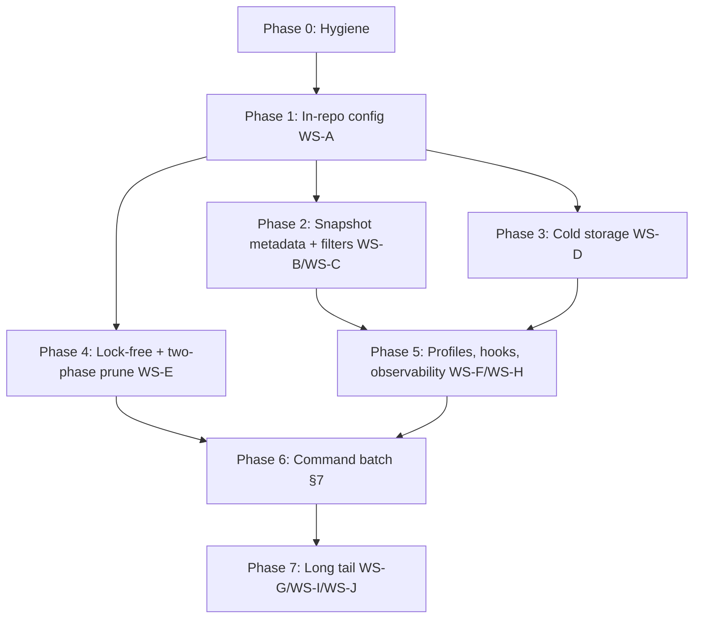

# Phased Roadmap

[← Back to rustic-parity index](00-overview.md)

## 8. Phased roadmap

### Phase 0 — Hygiene & interop harness (prereq, S–M) — ✅ done (branch `rustic-parity`, 2026-08-26)

- ~~Complete the vaultic rename~~ — **done**: module path
  `github.com/otuschhoff/vaultic`, binary `vaultic`, `cmd/vaultic`,
  `internal/vaultic`, docs, docker, release helpers. Environment variables
  are read as `VAULTIC_*` with transparent `RESTIC_*` fallback
  (see [internal/env](../../../internal/env)).
- ~~Stand up an **interop test harness**~~ — **done**:
  [helpers/interop](../../../helpers/interop/interop.sh) runs a 3×3 writer×reader
  matrix (vaultic × restic 0.19.1 × rustic 0.11.4) covering
  init/backup/snapshots/ls/restore/check/forget/prune; 107/107 steps pass.
  CI: `.github/workflows/interop.yml` (workflow_dispatch, continue-on-error
  until Phase 1 lands).
- Exit criteria met: `go build ./...`, `go vet ./...` clean; unit tests green
  except pre-existing, environment-dependent failures also present on
  upstream master (mount needs FUSE, rclone needs a new-enough rclone,
  fs xattr quirks). Interop smoke test verified locally and runnable on
  demand in CI.

### Phase 1 — In-repo config (WS-A; F1–F7) — ⚠️ substantially complete (branch `rustic-parity`, 2026-08-26)

- Deliverables (all landed): extended flat `Config` in
  [internal/vaultic/config_ext.go](../../../internal/vaultic/config_ext.go) +
  [config.go](../../../internal/vaultic/config.go), new `config` and `show-config`
  commands ([cmd_config.go](../../../cmd/vaultic/cmd_config.go),
  [cmd_show_config.go](../../../cmd/vaultic/cmd_show_config.go)), `init --set-*`,
  per-type pack sizing with 4 GiB cap
  ([internal/repository/repository.go](../../../internal/repository/repository.go)),
  append-only enforcement via [internal/backend/appendonly](../../../internal/backend/appendonly),
  extra_verify persistence, master-key open (`--key/--key-file/--key-command`,
  `repository.UseMasterKey`).
- Precedence implemented: CLI flag > env (`VAULTIC_*`/`RESTIC_*`) > repo
  config > default (see `applyRepoConfig` in
  [internal/global/global.go](../../../internal/global/global.go)).
- **Interop findings (validated against restic 0.19.1 / rustic 0.11.4):**
  - rustic's `ConfigFile` has **no `deny_unknown_fields`** → unknown keys are
    ignored, so flat additive fields are safe.
  - The config **must** use rustic's exact *flat* layout: `chunker` is a
    plain string with serde variant names `Rabin`/`FixedSize` (NOT an object,
    NOT lowercase `fixed_size`), and pack/chunk settings are top-level keys
    (`chunk_size`, `treepack_size`, …). An early draft nested them and rustic
    failed to deserialize. Both tools verified reading a configured repo.
  - ⚠️ Caveat: restic/rustic `cat config` (or a config rewrite by those
    tools) re-serializes and **drops** vaultic's extension keys. Extensions
    survive normal reads, but a foreign client rewriting the config would
    strip them. This is an accepted Phase-1 limitation; revisit if/when
    restic merges a shared in-repo config spec.
- Exit criteria met: config-driven repo behaves like flag-driven operation;
  interop verified both directions; integration tests added
  ([cmd_config_integration_test.go](../../../cmd/vaultic/cmd_config_integration_test.go)).
  Per-type pack sizing is runtime-applied, including rustic-compatible
  square-root growth from indexed packed bytes and explicit size limits.

### Phase 2 — Snapshot metadata & filtering (WS-B, WS-C; F8–F13) — ⚠️ substantially complete (branch `rustic-parity`, 2026-08-26)

- Deliverables (all landed): label/description/delete-protection end-to-end
  (backup flags → archiver `SnapshotOptions` → snapshot JSON; `snapshots`
  Label column + `--group-by label`; `tag --set-label/-set-description/-set-delete`;
  `forget` respects protection + `--override-delete-protection`), shared
  `--filter-*` flags on every snapshot-selecting command via
  `initExtendedSnapshotFilter` ([filter_flags.go](../../../cmd/vaultic/filter_flags.go)),
  and `latest~N` resolution in
  [internal/data/snapshot_find.go](../../../internal/data/snapshot_find.go).
- **Interop findings (validated against rustic 0.11.4 / restic 0.19.1):**
  - Snapshot `label` is a plain string, `description` optional; both read
    cross-tool.
  - `delete` is a serde **externally-tagged enum**: `"Never"` (bare string) or
    `{"After": "<jiff Zoned>"}`. The After timestamp **requires** the
    `[IANA/Zone]` suffix (jiff Zoned) — plain RFC3339 is rejected by rustic.
    [internal/data/delete_option.go](../../../internal/data/delete_option.go) writes
    the jiff format and reads both. Verified: rustic reads vaultic-written
    `Never` and `After` snapshots; restic ignores the unknown keys.
- Exit criteria met: `forget` keeps delete-protected snapshots (integration
  test), filters behave identically across commands (single shared flag set),
  and rustic-compatible jq expressions are evaluated against snapshot JSON.
  Remaining parity gap: `snap:path/file` resolution for restore/diff (dump tree
  paths already work).

### Phase 3 — Cold storage completion (WS-D; F14–F17) — ✅ done (branch `rustic-parity`, 2026-08-26)

- Deliverables (all landed):
  - **Warm-up command runner** ([internal/warmup](../../../internal/warmup)): user-supplied
    program with `%id/%path/%ids/%paths` substitution, `--warm-up-batch N`
    (batch or parallel), the JSON-lines `{"type":"pack-progress","warm":n}`
    protocol, and `--warm-up-wait`/`--warm-up-wait-command`. Global options
    `--repo-hot` + `--warm-up-*` (env `VAULTIC_REPO_HOT`/`VAULTIC_WARM_UP_*`).
    Routed via [internal/backend/warmupcmd](../../../internal/backend/warmupcmd) and run
    from restore/check/repack (new `warmup-command` feature flag, Beta).
  - **Hot/cold split repository** ([internal/backend/hotcold](../../../internal/backend/hotcold)):
    metadata (config/keys/snapshots/indexes) + tree packs live on the hot part
    (mirrored to cold); data packs only on cold; locks on cold; hot reads fall
    back to cold for pre-split files. Opened via `--repo-hot`
    ([internal/global](../../../internal/global/global.go)).
  - **`init --hot-only`**: creates the hot part sharing the cold repo's identity
    AND master key (`repository.InitWithConfigAndKey`), marks config `is_hot`,
    mirrors keys (both directions)/snapshots/indexes/tree packs
    (`repository.CopyMetadata`).
  - **Check hot/cold integrity**: `check --check-hot-cold` via
    `checker.CheckHotCold` (metadata present on both, identical content).
- **Interop verified (restic 0.19.1 / rustic 0.11.4):** the **cold** part is a
  complete standalone repo both tools read; the **hot** part (config `is_hot`)
  is correctly *refused* by rustic ("hot repository! use --repo-hot") and
  tolerated by restic.
- Deferred: `prune --keep-pack <duration>` (cold minimum-holding period) needs
  pack mtimes, i.e. a `FileInfo`/backend interface change — retained in the
  deferred backend-compatibility backlog.

### Phase 4 — Lock-free & two-phase prune (WS-E; F18–F20) — ⚠️ substantially complete, external gates pending (branch `rustic-parity`, 2026-08-27)

- Deliverables: `LockPolicy` per command, additive index discipline,
  two-phase prune with `--keep-delete`/`--instant-delete`, prune extras.
- Exit criteria: chaos test — concurrent backup + prune + forget on one repo,
  `check` clean afterwards; graduation plan for `lock-free` flag.

**Implemented (commits `WS-E/F18`, `WS-E/F19`, `WS-E/F20`):**

- **F18 lock-free reads** — new `lock-free` feature flag
  ([internal/feature/registry.go](../../../internal/feature/registry.go)). When
  enabled, read-only commands skip lock files
  ([cmd/vaultic/lock.go](../../../cmd/vaultic/lock.go)); append writers retain their
  non-exclusive lock and destructive commands always lock exclusively. This is
  intentionally conservative: an unlocked append backup racing a prune can
  lose packs selected before the backup completed. **It is opt-in Alpha**;
  explicit ``--no-lock`` remains an operator override. Verified with a
  lock-free read no-lock-file regression, writable append/no-lock regressions,
  an append-lock-presence regression, and a race-enabled backup ∥ prune ∥
  dry-run forget soak.
  Fresh focused and race-enabled local tests pass; S3/MinIO eventual
  consistency and mixed rustic/vaultic destructive-client tests remain open.
- **F19 minimal-lock deferred-delete prune** — `PrunePlan.Execute` splits storage lifecycle
  into phase 1 (repack +
  write new index) and phase 2 (delete superseded packs + old index files)
  behind the `two-phase-prune` Alpha flag. `--keep-delete` runs only phase 1
  and defers deletion (leftover files are unreferenced; a later default prune
  removes them); `--instant-delete` (default) keeps today's single-phase
  behavior. A short exclusive claim precedes phase A, which then runs under a
  shared append lock; phase B reacquires exclusive only to revalidate and
  delete exact marker candidates. New
  `MasterIndexRewriteOpts.SkipObsoleteDelete`/`ObsoleteIndexFunc`
  defers superseded-index deletion to the caller
  ([internal/repository/index/master_index.go](../../../internal/repository/index/master_index.go),
  [internal/repository/repair_index.go](../../../internal/repository/repair_index.go)).
  The phase-1 intermediate state intentionally leaves duplicate index entries
  (non-critical per `check`), resolved by phase 2.
  Phase 3 adds a durable encrypted ``prune_plan`` config marker and exact
  index/pack revalidation before deletion; plan persistence requires atomic
  config replacement and refuses unsupported backends rather than weakening
  crash safety.
- **F20 prune extras** ([cmd/vaultic/cmd_prune.go](../../../cmd/vaultic/cmd_prune.go),
  [internal/repository/prune.go](../../../internal/repository/prune.go)):
  `--max-repack` accepts an absolute size, a percentage of the repo size
  (resolved against `stats.Size.Total` in `PlanPrune`) or `unlimited`;
  `--repack-all` repacks every pack; `--fast-repack` is accepted (vaultic
  already plans purely from the index, so it documents index-trusted intent);
  `--early-delete-index` deletes superseded index files right after the new
  index is written, before pack removal, to free index space earlier.
  `--keep-pack` remains deferred: the generic backend ``FileInfo`` contract
  carries only name/size, not modification time.
- **Concurrency soak** — `TestPruneConcurrencySoak`
  ([cmd/vaultic/cmd_prune_integration_test.go](../../../cmd/vaultic/cmd_prune_integration_test.go))
  runs append backup concurrently with destructive prune and dry-run forget
  under `-race`, then requires a clean `check`. Repeated race runs cover
  lock-free reads, writable append/no-lock behavior, and append/prune safety.
  The detailed remaining stages are specified in
  [WS-E's locking parity roadmap](#locking-parity-roadmap-remaining-work).

### Phase 5 — Profiles, hooks, observability (WS-F, WS-H; F21–F25) — ⚠️ substantially complete; F23/F25 gaps remain (branch `rustic-parity`, 2026-08-27)

- **F21 profiles** — new [internal/configfile](../../../internal/configfile) parses
  TOML with repeatable ``-P/--use-profile``, recursive ``use-profiles``
  includes with cycle detection, requested search paths, and deterministic
  precedence. ``[global]``, ``[repository]``, and command sections apply to
  unchanged flags. ``[[backup.snapshots]]`` supports named no-argument backup
  jobs; ``backup --name`` selects jobs and ``backup --init`` initializes a
  missing repository. Rustic deployment aliases are accepted: ``repository``,
  ``set-compression``, ``packsize-default``, ``packsize-tree``, global
  ``group-by``, and backup/job ``globs`` (``!`` exclusions). The provided NAS
  profile schema is covered by an automated parser test and a CLI smoke run.
  Core behavior is implemented; exhaustive rustic schema and cross-client
  profile interop coverage remains open.
- **F22 hooks** — [internal/hooks](../../../internal/hooks) implements
  ``run-before``, ``run-after``, ``run-failed``, and ``run-finally`` across
  global, repository, command, and per-snapshot-job scopes. Hooks run without
  an implicit shell, honor ``error|warn|ignore``, and export VAULTIC_ plus
  RUSTIC_ context variables. Core scopes and failure policies are covered by
  tests; exhaustive rustic cross-client hook interop remains open.
- **F23/F24 controls** — ``--log-file``, validated (but not yet filtering)
  ``--log-level``,
  ``--no-progress``, and ``--progress-interval`` are global, environment-aware,
  and profile-settable. The progress override is shared by every existing
  progress reporter.
- **F25 telemetry** — successful backups publish Pushgateway metrics via
  ``--prometheus``/credentials or InfluxDB v2-compatible line protocol via
  ``--influxdb-url``, token, org, and bucket. Telemetry failures warn but do
  not invalidate durable snapshots. ``--opentelemetry`` currently emits
  command spans only through the configured global provider; backend/index/
  pack spans remain deferred. InfluxDB support uses direct HTTP to avoid a
  version-bound client SDK.
- **Tests/verification** — profile include/precedence/cycle tests, hook
  context/failure-policy tests, a real-backup Influx v2 HTTP test, auto-init
  coverage, and a CLI smoke test for a profile job, hook, label, no-progress,
  and log file. See [052_profiles_automation.rst](../../052_profiles_automation.rst).

### Phase 6 — Command parity batch (§7; F30–F32 + enhancements) — ⚠️ selected high-value work complete; cross-client output parity remains open (branch `rustic-parity`, 2026-08-27)

- **F30 merge** — `merge` recursively unions snapshot trees, resolving
  conflicts in favor of the newest source node. It creates one new snapshot,
  records source IDs in additive ``merged_snapshots`` metadata, and uses an
  append lock only: it never rewrites or deletes source repository objects.
  Local integration coverage passes; exhaustive rustic merge metadata and
  mixed-client interop coverage remains open.
- **F32 repoinfo** — `repoinfo` is a read-only, lock-free-feature-compatible
  aggregate of data/key/snapshot/index object counts and stored sizes, with
  JSON and text output. Local command coverage passes; exhaustive rustic
  cross-client output parity remains open.
- **Enhancements delivered** — `backup --ls`/`--init`, minutely,
  quarterly-yearly, half-yearly and matching ``keep-within-*`` retention,
  ``--keep-none``, dump ``tar.gz`` plus target-extension ``auto``, diff
  ``latest``/``latest~N``, and the `completions` alias.
- **WebDAV removed from scope** — per project direction, no WebDAV server was
  implemented. The remaining large §7 work remains explicitly deferred to a
  later command batch rather than receiving partial or unsafe implementations.

### Phase 7 — Long tail (WS-G, WS-I, WS-J; F26–F29) — ⏳ deferred

- F26 interactive TUI, F27 additional built-in cloud backends, F28 remote
  backup sources, and F29 built-in opendal-style SFTP remain deferred.
  Vaultic currently uses existing backends, rclone where supported, and its
  SSH/SFTP path instead of claiming rustic-native implementations.
- Exit criteria: parity matrix re-issued with remaining deltas documented as
  intentional (e.g. features covered via rclone).

