# Vaultic Code Quality Review

Date: 2026-09-03
Scope: Go modules under `cmd/`, `internal/`, and `helpers/` (440 non-test files, ~96.9k non-test LOC, 299 test files) and the Rust crate `vaulticdb/` (13 files, ~15.2k LOC incl. inline tests).
Method: AST-based metrics for Go (function length, cyclomatic complexity, parameter counts), text scans for error-handling idioms in both languages, and manual reading of the hotspots and of `cmd/vaultic`, `internal/index/*`, `internal/repository/*`, `internal/global`, `internal/archiver`, and all Rust sources.

Severity legend: **H** = should be fixed before the next major release or when the file is next touched; **M** = plan into the next 2–3 iterations; **L** = opportunistic.

---

## 1. Executive summary

The codebase is in reasonable shape for its size and age. Strengths that stand out:

- Consistent `%w` wrapping in the majority of Go error paths (617 `%w` wraps; only 40 lossy `%v` wraps remain).
- A proper classification layer exists where it matters most (`staging.Reject / Retryable / HealingRequired`), and gRPC status codes in Rust are chosen deliberately (`failed_precondition` 27, `invalid_argument` 18, `internal` only 8).
- Production Rust code is almost free of `unwrap()/expect()` (≤7 per file, most guarded by prior validation); `Zeroizing` is used for secrets, core dumps are disabled, socket/file permissions are enforced.
- Strong test culture: 299 Go test files, 85 Rust tests, adversarial tests for tampering/replay/rollback.
- Layering is enforced by `depguard` rules in `.golangci.yml`, and `errcheck`, `revive`, `staticcheck` already run in CI.

The main maintainability risks are concentration, not correctness:

| Metric | Value | Comment |
|---|---|---|
| Go functions > 100 lines | 74 of 3,764 | 23 are > 150 lines |
| Go functions with cyclomatic complexity > 40 | 26 | Top: `ParseKey` 184, `CheckConsistency` 157, `runBackup` 126, `publishReconciledRevisionOnce` 100 |
| Go non-test files > 800 lines | 20 | Top: `analytics/engine.go` 3,240, `daemon/schema_store.go` 3,211, `repository.go` 1,868 |
| Go functions with ≥ 8 parameters | 24 | Three with 10 parameters |
| Go lines > 200 chars (non-test) | 334 | Mostly one-line `cobra.Command` and struct literals |
| Discarded errors `_ = f()` (non-test Go) | 274 | 45 are `observability.Emit`; ~150 are `Close()`/`Remove()` |
| Exported Go funcs without doc comment | ~1,005 of 1,994 | `ST1000`/`ST1020` are disabled in golangci |
| `panic(` in non-test Go | 103 | 5 in `internal/repository/repository.go` alone |
| Rust files > 2,000 lines | 4 | Tests inline account for 200–700 lines each |
| Rust `unreachable!()` in production paths | 6 (`storage.rs`) | All after `Database::Writer` matches |

Five packages hold ~45% of all non-test Go code: `cmd/vaultic` (18.5k), `internal/repository` (8.9k), `internal/index/schema` (5.9k), `internal/index/daemon` (5.5k), `internal/index/analytics` (5.4k). Almost every high-severity finding below lives in these five.

---

## 2. Error handling

### 2.1 Go

**H — Panics in library code.** `internal/repository/repository.go` has five `panic` calls (lines 316, 746, 765, 815, 1021), including `panic(err)` inside `sync.Once` zstd encoder/decoder initialisation. A failing encoder construction crashes every caller, including long-running daemons and `vaultic mount`. 103 `panic(` sites exist in non-test code overall; a subset are legitimate programmer-error guards, but they are not distinguished from recoverable conditions.

*Recommendation:* Return errors from `getZstdEncoder/Decoder` (cache the error alongside the encoder), validate the engine kind once in `New*Repository` and return `ErrLegacyEngineRequired`, and reserve `panic` for invariant violations documented with a `// invariant:` comment. Add a `forbidigo` rule for `panic(` outside `internal/errors` and test files with an explicit `//nolint` for the surviving cases.

**H — Silent error suppression in consistency checks.** `internal/index/analytics/consistency.go` `CheckConsistency` ignores unmarshal errors at lines ~69 and ~74 and uses `_, _, _ = store.Get(...)` patterns, so a corrupt record can produce “no findings” instead of a finding.

*Recommendation:* Treat every decode/get failure as a `ConsistencyFinding{Kind: "unreadable"}`; never swallow inside a checker.

**M — Lossy wraps and inconsistent wrap order.** 40 `fmt.Errorf("... %v", err)` sites still break `errors.Is/As` (e.g. `cmd/vaultic/cmd_stats.go:154,193,242`, `cmd_list.go:104`, `cmd_copy.go:302`). In `internal/index/daemon/client.go` the same file alternates between `fmt.Errorf("%w: %v", ErrUnavailable, err)` and `fmt.Errorf("context: %w", err)`, so callers cannot rely on either sentinel or cause being reachable.

*Recommendation:* Enable `errorlint` in `.golangci.yml`. Standardise on `fmt.Errorf("context: %w", err)`; when both a sentinel and a cause are needed use `errors.Join(ErrUnavailable, fmt.Errorf("context: %w", err))` or a typed error, never `%w: %v`.

**M — 274 discarded errors without intent.** Concentrated in `cmd/vaultic/cmd_index_keys.go` (33), `internal/index/daemon/client.go` (30), `internal/global/global.go` (26). Most are `_ = x.Close()` or `_ = os.Remove(path)` in cleanup paths. `errcheck` is enabled, so these are deliberate, but nothing tells the reader whether the failure is benign or merely unhandled. 45 are `_ = observability.Emit(...)`, i.e. audit events can be dropped silently.

*Recommendation:* Introduce two tiny helpers in `internal/errors`: `CloseQuietly(io.Closer, *error)` (joins into the named return) and `LogClose(io.Closer)` (via `debug.Log`). Make `observability.Emit` either return nothing (log internally) or make callers propagate; for security-audit events (heal/activate/rollback) the drop should at minimum be logged.

**M — Error classification is package-local.** `staging` has `Reject/Retryable/HealingRequired`; `daemon.Client` exposes only `ErrUnavailable`; `repository`, `maintenance`, `reconcile` mostly return unclassified strings. The CLI therefore falls back to `errors.Fatal` string prefixes to decide exit codes.

*Recommendation:* Define a small cross-cutting taxonomy in `internal/errors` (`Transient`, `Rejected`, `Integrity`, `Unauthorized`, `Unavailable`) as wrapper types with `Is` support, and have each package wrap at its boundary. Exit-code mapping in `cmd/vaultic/main.go` then becomes a single `switch`.

**L — Message style.** Mixed casing (`"Detected data corruption..."` in `repository.go:803,908` vs. lowercase elsewhere), mixed subject order (`"%s file is not a regular file"` vs. `"unsafe vaulticdb socket permissions at %s"`), and multi-sentence messages with URLs embedded in the error string (`repository.go:803`). Move user guidance to the CLI presentation layer; keep error strings lowercase, single-clause, no trailing punctuation (revive `error-strings` will enforce this once enabled).

**L — Context propagation.** 10 `context.Background()` uses in non-main `internal` code (e.g. `repository.go:501` in `currentBlobSize`, `limiter/static_limiter.go:142,147`, `global.go:389`) lose caller deadlines. 68 `context.TODO()` markers remain. Thread `ctx` through and remove the TODOs incrementally; add `contextcheck` to the linter.

### 2.2 Rust

**H — Domain errors flattened at the gRPC boundary.** `main.rs:92 generation_error`, `key_management_error`, and `role_error` map any `anyhow::Error` to a single `Status` code with `format!("{error:#}")`. Go callers (`internal/index/daemon/client.go`) then cannot distinguish “writer fence stale” from “generation changed” from “object store unavailable” without string matching (two `strings.Contains(err.Error())` sites already exist in Go).

*Recommendation:* Introduce `enum VaulticDbError` with `thiserror` (already a dependency) covering the ~12 recurring conditions, implement `From<VaulticDbError> for Status` that selects the code per variant and attaches a machine-readable detail (`tonic_types::ErrorDetails` or a small proto message), and keep `anyhow` only for I/O contexts inside `storage.rs`. Mirror the variants as sentinels in the Go client. This also removes the reason for `#![allow(clippy::result_large_err)]` in `main.rs:1` and `vaultic-key-broker.rs:1`.

**M — `unreachable!()` after enum matches.** `storage.rs:381,415,468,502,541,867` and `.expect("writer was validated")` at `storage.rs:277,919` assume a `Database::Writer` state that is validated in a different lock scope. The role can legitimately change between validation and use (demotion, cancellation).

*Recommendation:* Replace with `let Database::Writer(db) = &*guard else { return Err(VaulticDbError::WriterDemoted) };`. Consider a helper `fn writer(&self) -> Result<&Db>`.

**L — `main.rs:1502,1510` `expect(...)` on defaults** are acceptable but should be `const` durations instead of parsed-at-startup values.

---

## 3. Structure of files

### 3.1 Go

**H — `cmd/vaultic` is a single 66-file, 18.5k-LOC package.** Every command shares one namespace; helper functions such as daemon connection, artifact directory resolution, and JSON printing are re-implemented per `cmd_index_*.go` file (`connect`, `printHealResult`, `withHealing`, `stagingStore`, etc.). `cmd_index_keys.go` is 1,549 lines and `cmd_index.go` 772.

*Recommendation:* Move the `index` command tree into `cmd/vaultic/indexcmd/` (or `internal/cli/index/`) with one file per subcommand group (`keys/`, `staging/`, `heal/`, `analytics/`, `introspect/`). Provide a shared `indexcmd.Session` (open repo, resolve daemon options, connect client, derive artifact store, close all) so each subcommand body is only the business action. The same session helper removes the `_ = client.Close()` boilerplate.

**H — Files above 3,000 lines.** `internal/index/analytics/engine.go` (3,240) and `internal/index/daemon/schema_store.go` (3,211) each combine several concerns:

- `schema_store.go`: read API, batch/transaction publication, pack import, reconciliation publication, GDPR forget, generation authority, export checkpoints.
- `engine.go`: rebuild orchestration, candidate view generation, delta publication, subtraction, snapshot bookkeeping.

*Recommendation:* Split by concern into files of the same package (no API change): `schema_store_read.go`, `schema_store_publish.go`, `schema_store_import.go`, `schema_store_reconcile.go`, `schema_store_generation.go`; `engine_rebuild.go`, `engine_views.go`, `engine_delta.go`. Files of 300–800 lines are a good target for this codebase.

**M — `internal/repository/repository.go` (1,868 lines)** mixes blob I/O, pack streaming, encryption helpers, engine dispatch, uploader lifecycle, and config. Extract `repository_blobs.go`, `repository_packs.go`, `repository_engine.go`.

**M — `internal/global/global.go` (1,405 lines)** holds option parsing, backend factory, bootstrap topology resolution, key-vault access, and repository opening. `OpenRepository` (189 lines, complexity 57) and `resolveBootstrapRepository` (137 lines, complexity 42) should move to `internal/global/open.go` and `internal/global/bootstrap.go`, with option structs in `options.go`.

**M — Generated protobuf checked in next to hand-written code.** `internal/index/proto/vaulticdb/v1/*.pb.go` (~6k lines) inflates package metrics and diffs. Keep it, but exclude it from lint and coverage (`exclude-files` in golangci; `//go:build !codeanalysis` is not needed) and document the regeneration command in `Makefile` (`vaulticdb-proto` target exists; reference it in `CONTRIBUTING.md`).

**L — Package naming and stutter.** `internal/vaultic` vs. module name `vaultic`; `enginepkg "github.com/.../internal/index"` alias in `cmd_index_heal.go` shows the package name `index` is too generic once it is imported next to `repository/index`. Consider renaming `internal/index` → `internal/metadata` (large but mechanical rename) or at least fixing the alias convention via `importas`.

### 3.2 Rust

**H — Inline test modules make four files exceed 2,000 lines.** `storage.rs` tests start at line 1,450 (620 lines of tests), `main.rs` at 1,838, `recovery_capsule.rs` at 1,582, `broker.rs` places `#[cfg(test)]` at line 17 with tests spread through the file.

*Recommendation:* Move each `mod tests` into a sibling file `storage/tests.rs` (declared via `#[cfg(test)] mod tests;`) so private items remain testable while production files shrink by 25–35%. Cross-binary integration tests (`broker` ↔ `daemon`) belong in `vaulticdb/tests/`.

**M — `main.rs` is entrypoint + service impl + business logic (2,055 lines, 46 top-level items).** The `impl VaulticDb for Service` block alone is ~850 lines; `main()` is ~146 lines parsing environment variables, acquiring locks, opening storage, and configuring tonic.

*Recommendation:* Split into `config.rs` (all `VAULTICDB_*` env parsing into one `Config` struct with documented defaults), `transport.rs` (Unix/TCP listener + auth descriptor), `service/` (one file per RPC family: `kv.rs`, `transactions.rs`, `writer_role.rs`, `generation.rs`, `encryption.rs`), and a `main.rs` that only wires them. Environment reads are currently spread across `main.rs:1405–1438`, `storage.rs:131–154`, `storage.rs:1550–1680`.

**M — Duplication between `src/broker.rs` and `src/bin/vaultic-key-broker.rs`.** The binary carries a 359-line `handle_request` that re-implements request routing and validation that partially exists in the library. Move protocol handling into `broker::protocol` and let the binary own only I/O and the socket loop.

---

## 4. Structure of functions and objects

### 4.1 Go — oversized functions (top offenders, verified)

| Function | File | Lines | Cyclo | Params |
|---|---|---|---|---|
| `runBackup` | `cmd/vaultic/cmd_backup.go:650` | 517 | 126 | 5 |
| `CheckConsistency` | `internal/index/analytics/consistency.go:21` | 450 | 157 | 2 |
| `ParseKey` | `internal/index/schema/keys.go:865` | 325 | 184 | 1 |
| `SchemaStore.publishReconciledRevisionOnce` | `internal/index/daemon/schema_store.go:2668` | 322 | 100 | 2 |
| `SchemaStore.executeGDPRForget` | `internal/index/daemon/gdpr.go` | 256 | 65 | 2 |
| `runCheck` | `cmd/vaultic/cmd_check.go` | 231 | 48 | 5 |
| `SchemaStore.importPackOnce` | `internal/index/daemon/schema_store.go` | 226 | 57 | 3 |
| `writeCandidateViews` | `internal/index/analytics/engine.go` | 210 | 48 | 5 |
| `runForgetLegacy` | `cmd/vaultic/cmd_forget.go` | 206 | 49 | 6 |
| `MasterIndex.Rewrite` | `internal/repository/index/master_index.go` | 204 | 40 | 6 |
| `decidePackAction` | `internal/repository/prune.go` | 201 | 45 | 6 |
| `OpenRepository` | `internal/global/global.go` | 189 | 57 | 3 |
| `ValidateValue` | `internal/index/schema/metadata.go:491` | 169 | 85 | 2 |
| `Client.Ensure` | `internal/index/daemon/client.go` | 161 | 53 | 2 |

*Specific recommendations:*

- **`runBackup`** — split into `prepareBackupTargets`, `openBackupSources`, `configureArchiver` (returns the archiver with all six callbacks attached), `executeBackup`, `reportBackup`. Move the callback wiring (`ReuseSubtree`, `Error`, `BeforeSnapshot`, `ReconcileNode`, `DeferredUploader`, progress) into a named `backupHooks` struct with methods so each hook is unit-testable and the deferred-capture attachment added in Phase 22 has a natural home. `BackupOptions.Check` (lines 424–481) should be decomposed into `validateDeferred`, `validateStdin`, `validateParent`.
- **`ParseKey` / `ValidateValue`** — replace the linear `switch` over ~50 key prefixes with a dispatch table `map[byte]keyParser` (or a sorted slice for multi-byte prefixes). Complexity drops from 184 to <10 per parser, and each key kind becomes independently testable. The same table can drive `ValidateValue`, eliminating the second switch.
- **`CheckConsistency`** — convert to a `consistencyChecker` struct holding `findings` and `store`, with one method per invariant (`checkWatermark`, `checkManifestChain`, `checkSegments`, `checkMaterializations`). Removes the three mutating closures.
- **`publishReconciledRevisionOnce`, `importPackOnce`, `executeGDPRForget`** — each is a linear pipeline; extract phases into private methods returning intermediate structs (`reconcilePlan`, `packImportPlan`) so the transaction body is ~40 lines.
- **`OpenRepository`** — separate “resolve where the repository is” (bootstrap/topology) from “open and authenticate” from “attach engine”; each is already a distinct block.

**M — Parameter lists ≥ 8.** `classifyPacksWithPlacement` (10, `internal/repository/gc.go:280`), `failPlacementRequest` (10, `internal/index/maintenance/scheduler.go`), `filterAndReplaceSnapshot` (10, `cmd/vaultic/cmd_rewrite.go`), `writeDebt` (9), `fileSaver.saveFile` (9), `createOrOpenBackend` (9), `newFileRestorer` (9). Group into request structs (`gcClassificationInput`, `placementFailure`, `rewriteRequest`); this also makes the boolean flags self-documenting.

**M — God objects.** `daemon.Client` exposes 80+ methods across transport, process lifecycle, authentication, encryption audit, KV, transactions, writer role, generation authority. `SchemaStore` wraps it with another ~90 methods. `analytics.Engine` is similar.

*Recommendation:* Keep the concrete types but define narrow consumer interfaces at the use sites (`reconcile.Store`, `staging.Authority`, `gc.GCStore` already do this — extend the pattern to `maintenance`, `healing`, `cmd`). Internally, group `Client` methods into embedded sub-clients (`client.KV`, `client.Txn`, `client.Role`, `client.Generation`) to make the surface navigable.

**L — Package-level mutable state.** `analyticsPublishMu` (`engine.go:25`) is a global mutex guarding per-engine work; `backupFSTestHook` (`cmd_backup.go:298`), `forgetPhaseATestHook` (`cmd_forget.go:75`), `testKeyNewPassword` (`cmd_key_add.go:98`) are test seams in production code and prevent `t.Parallel()`. Move the mutex onto `Engine`; replace hooks with injectable fields on the options struct or an unexported constructor parameter.

**L — 339 lines over 200 characters**, dominated by one-line `cobra.Command{...}` and `observability.Event{...}` literals (`cmd_index_keys.go` 34, `daemon/client.go` 31, `cmd_index_heal.go` 13). Add `lll` (limit 160) to golangci with `gofumpt`; the code becomes diff-friendly and the `RunE` closures visibly separate from metadata.

### 4.2 Rust

**M — Long functions.** `handle_request` 359 lines (`bin/vaultic-key-broker.rs`), `acquire_metadata_lease` 146 (`broker.rs`), `main` 146 (`main.rs`), `validate` 130 (`recovery_capsule.rs`), `Storage::open` 113, `prepare_capsule_migration` 106. `handle_request` should become a `match` over a request enum dispatching to one function per variant; `Storage::open` should delegate to `open_object_store`, `resolve_encryption`, `open_database`, `claim_writer_epoch`.

**M — `impl KeyBroker` (~540 lines) and `impl VaulticDb for Service` (~850 lines)** are flat lists. Either split into `impl` blocks per concern in separate files (`broker/session.rs`, `broker/lease.rs`, `broker/policy.rs`) or introduce traits (`SessionManager`, `LeaseManager`) implemented by `KeyBroker`.

**L — String-typed identifiers.** `repository_id`, `session_id`, `member_id`, `namespace` are all `String`/`&str`. Newtypes (`RepositoryId(String)`, `SessionId(String)`) cost little and would have caught the suspect/candidate namespace mix-up class of bugs that Phase 22 had to guard against manually.

**L — Cancellation discipline.** `transition_to_reader` and `prepare_policy_mutation` hold state across awaits without a “transition started” checkpoint. Phase 22 already fixed one instance for demotion; apply the same pattern (record intent → drop lock → do work → re-acquire → finalise) to the remaining transitions and document it in a module comment.

---

## 5. Naming

- **Go options structs**: mixed `BackupOptions`/`RestoreOptions` (exported) with `indexDaemonOptions`/`indexHealOptions`/`generateOptions` (unexported) in the same package. Pick unexported for all `cmd/vaultic` option types (they are never imported) — or exported if a subpackage split happens.
- **Role suffixes**: `Store`, `Engine`, `Client`, `Authority`, `Broker`, `Custodian` are used without a written convention. Document in `CONTRIBUTING.md`: `Client` = remote transport, `Store` = typed persistence façade, `Engine` = orchestrates a workflow over stores, `Authority` = owns a decision/CAS.
- **Sentinel error names**: `ErrOK` (`main.go:38`), `errCapsulePackProofComplete` created with `fmt.Errorf` instead of `errors.New` (`cmd_index_keys.go:971`), `errSentinelEndIteration`, `errFindDone`, `errAllPacksFound` — four different “stop iteration” sentinels. Provide one `errors.ErrStopIteration` in `internal/errors`.
- **Abbreviations**: `gopts`, `opts`, `rd`, `sc`, `fn` alongside spelled-out `globalOptions`, `command`, `filesystem`. Newer code (staging, healing, reconcile) uses full words; align older `cmd_*.go` files when touched.
- **Doc comments**: ~50% of exported Go identifiers lack them because `ST1000/ST1020` are disabled. Re-enable for `internal/index/...`, `internal/repository/staging`, `internal/index/healing` (new code, small surface) first, then widen.
- **Rust visibility**: `pub` is used where `pub(crate)` is intended (e.g. many structs in `broker.rs:67–185`). Since `lib.rs` re-exports only four modules, mark internals `pub(crate)` and add `//!` module docs stating the public surface.

---

## 6. Tests

- Go test files mirror production size: `archiver_test.go` 2,916 lines, `client_test.go` 1,908, `restorer_test.go` 1,521. Split by feature the same way as production files.
- Bespoke tests dominate; table-driven tests would shrink `planner_test.go`, `cmd_index_test.go`, and the schema key tests significantly, and would make the new `ParseKey` dispatch table trivially exhaustive.
- `TestRetireLegacyQuorumBypassesResumesAfterPartialFailure` (`cmd/vaultic/cmd_index_test.go:525`) depends on `mem.Backend` iteration order and is intermittently failing — sort handles in `retireLegacyQuorumBypasses` or make the fake deterministic.
- Environment-dependent tests (`rclone --stdio`, OSXFUSE, `python`, macOS `com.apple.provenance` xattrs) fail on a stock macOS dev box. Gate them with `t.Skip` on missing binaries / unsupported xattr namespaces so `go test ./...` is green locally.
- Rust: move inline tests out (see §3.2) and add `cargo clippy -- -D warnings` plus `cargo fmt --check` to `vaulticdb.yml` if not already enforced.

---

## 7. Tooling recommendations

Add to `.golangci.yml` (all supported by golangci-lint v2):

```yaml
enable:
  - errorlint      # %w discipline, errors.Is/As
  - forbidigo      # forbid panic( outside allowlist, context.Background in internal/
  - funlen         # lines: 120, statements: 80 (warn first, fail later)
  - gocyclo        # min-complexity: 30, ratchet down
  - gocognit
  - lll            # line-length: 160
  - nestif
  - contextcheck
  - exhaustive     # for the schema key/kind switches
exclusions:
  paths:
    - internal/index/proto/.*\.pb\.go
```

Introduce these with a baseline (`--new-from-rev=HEAD`) so existing debt is tracked but does not block, then ratchet thresholds down per release.

For Rust, add to `Cargo.toml`:

```toml
[lints.clippy]
too_many_lines = "warn"        # default 100
cognitive_complexity = "warn"
unwrap_used = "warn"
expect_used = "warn"
```

and remove `#![allow(clippy::result_large_err)]` after the error-enum refactor.

---

## 8. Prioritised roadmap

| # | Item | Sev | Effort | Payoff |
|---|---|---|---|---|
| 1 | `VaulticDbError` enum + typed `Status` mapping + Go sentinels | H | M | Programmatic error handling across the daemon boundary; removes string matching |
| 2 | Remove panics from `internal/repository`; `forbidigo` rule | H | S | No crash paths in mount/daemon |
| 3 | `ParseKey`/`ValidateValue` dispatch table | H | M | Complexity 184 → <10; exhaustive tests |
| 4 | Split `runBackup`, `CheckConsistency`, `publishReconciledRevisionOnce` | H | M | Testable phases; safer future changes |
| 5 | File splits: `schema_store.go`, `engine.go`, `repository.go`, `global.go` | H | S (mechanical) | Navigability, smaller diffs |
| 6 | Move Rust inline tests to `*/tests.rs`; split `main.rs` into `config`/`transport`/`service` | H | M | Files < 1,000 lines; testable config |
| 7 | `cmd/vaultic/indexcmd` subpackage with shared `Session` | M | M | Removes duplicated connect/close/print boilerplate |
| 8 | Cross-package error taxonomy in `internal/errors`; exit-code mapping | M | M | Consistent operator semantics |
| 9 | Parameter structs for ≥8-param functions; `CloseQuietly` helper; `_ =` intent | M | S | Readability, fewer silent failures |
| 10 | Linter ratchet (`funlen`, `gocyclo`, `lll`, `errorlint`, clippy lints) | M | S | Prevents regression of 1–9 |
| 11 | Naming conventions in `CONTRIBUTING.md`; re-enable doc-comment checks for new packages | L | S | Onboarding |
| 12 | Newtypes for Rust identifiers; `pub(crate)` audit; test flakiness/skips | L | S | Type safety, green local runs |

Effort: S = ≤1 day, M = 2–5 days per item.

---

## 9. Phased implementation plan

The roadmap items above are sequenced into six phases. Ordering follows dependencies (guardrails before refactors, error types before boundary splits, mechanical splits before behavioural changes) and keeps every phase independently shippable. Each phase should land as a small series of commits, each of which passes the full Go and Rust suites; no phase changes on-disk formats, wire protocols, or CLI flags.

### Ground rules for every phase

- One concern per commit: a file split, a function extraction, or an error-type change — never mixed.
- Behaviour-preserving refactors are verified by the existing tests only; new tests are added in the same commit only when a previously untestable unit becomes testable.
- Lint thresholds are ratcheted, never loosened: each phase ends by lowering the baseline (`--new-from-rev`) to the phase's final commit.
- Metrics from §1 are re-measured at the end of each phase and appended to this document as a progress table.

### Phase 0 — Guardrails and baseline (roadmap #10, part of #12)

Goal: make regressions visible before any refactoring begins.

- Add `errorlint`, `forbidigo`, `funlen`, `gocyclo`, `gocognit`, `lll`, `nestif`, `contextcheck`, `exhaustive` to `.golangci.yml` in **warn-only** mode with `--new-from-rev=<phase-0 commit>`; exclude `internal/index/proto/**/*.pb.go`.
- Add the `[lints.clippy]` block to `vaulticdb/Cargo.toml` at `warn`; add `cargo clippy --all-targets -- -D warnings` and `cargo fmt --check` to `vaulticdb.yml` if not already present.
- Commit the metrics script used for this review under `helpers/codemetrics/` so `make metrics` reproduces the §1 table.
- Gate environment-dependent tests: `t.Skip` when `rclone` lacks `--stdio`, when OSXFUSE/`python` are absent, and when the platform injects `com.apple.provenance` xattrs. Sort handles in `retireLegacyQuorumBypasses` to remove the order-dependent flake.

Exit criteria: `go test ./...` and `cargo test --all-targets` are green on a stock macOS and Linux dev box; CI lint job reports zero *new* findings.

**Implementation status (2026-09-04): complete.**

- `.golangci.yml` now enables all nine debt linters at the thresholds above. PR CI checks only code changed from the pull request base SHA (`fetch-depth: 0` + `--new-from-rev`), while the exact golangci-lint v2.12 configuration validates cleanly. A local run over every changed Phase 0 package reported zero new issues; 676 legacy issues remain behind the baseline.
- Rust CI now runs `cargo fmt --check`, a strict default Clippy pass, an informational debt pass, and `cargo test --all-targets`. The strict pass allows eight recorded legacy categories (`too_many_lines`, `cognitive_complexity`, `unwrap_used`, `expect_used`, `too_many_arguments`, `type_complexity`, `chunks_exact_to_as_chunks`, and `large_enum_variant`); all other warnings are fatal. The informational pass currently reports 43 warnings.
- `make metrics` runs `helpers/codemetrics` and reports the review metrics reproducibly. Its first baseline is 440 production Go files, 96,903 non-generated production Go LOC, 3,773 functions, 74 functions over 100 lines, 23 over 150 lines, 20 files over 800 lines, 334 lines over 200 bytes, and 15,207 Rust LOC.
- Environment-sensitive tests now select `python3`/`python`, capability-probe the exact `rclone serve vaultic --stdio` interface, skip FUSE tests when macFUSE/OSXFUSE is absent, and ignore only the OS-managed `com.apple.provenance` xattr in assertions. Legacy quorum bypass deletion is sorted, removing its iteration-order flake.
- Validation: full Go suite passes on macOS, all 85 Rust tests pass, strict Clippy passes, `cargo fmt --check` passes, both edited GitHub Actions workflows pass `actionlint`, and `git diff --check` is clean. Linux execution remains delegated to the existing Ubuntu CI jobs; all affected Go code also compiles under the existing cross-compilation matrix.

### Phase 1 — Error handling foundations (#1, #2, #8, part of #9)

Goal: make errors classifiable across the daemon boundary and remove crash paths. Everything later builds on these types.

1. **Rust** — introduce `vaulticdb/src/error.rs` with `enum VaulticDbError` (`thiserror`), covering writer-fence, generation, namespace, encryption, idempotency, storage-unavailable, and invalid-request conditions. Implement `From<VaulticDbError> for Status` selecting the gRPC code per variant and attaching a structured detail message (proto `ErrorDetail { code, field, generation }` in `daemon.proto`). Replace `generation_error`, `key_management_error`, `role_error` call sites with `?` on the new type; keep `anyhow` inside `storage.rs` I/O only. Remove `#![allow(clippy::result_large_err)]`. Replace the six `unreachable!()` and two `expect("writer was validated")` sites with `Err(VaulticDbError::WriterDemoted)`.
2. **Go client** — add sentinels in `internal/index/daemon/errors.go` mirroring the variants; decode the `ErrorDetail` in `client.go` so `errors.Is(err, daemon.ErrWriterFenced)` works. Delete the two `strings.Contains(err.Error())` checks.
3. **Cross-package taxonomy** — add `Transient`, `Rejected`, `Integrity`, `Unauthorized`, `Unavailable` wrapper types to `internal/errors`; adapt `staging.Reject/Retryable/HealingRequired` to embed them. Map to exit codes in one `switch` in `cmd/vaultic/main.go`.
4. **Panics** — return errors from `getZstdEncoder/Decoder`, replace the engine-kind panic with `ErrLegacyEngineRequired`, and add the `forbidigo` rule for `panic(` with `//nolint` on the remaining documented invariants.
5. **Discards** — add `errors.CloseQuietly` / `errors.LogClose`; convert the `_ = x.Close()` sites in `cmd_index_keys.go`, `daemon/client.go`, `global.go`. Make `observability.Emit` log its own failures so callers stop discarding it.
6. Fix the 40 `%v` wraps flagged by `errorlint`.

Exit criteria: `errorlint` and `forbidigo` promoted from warn to error; zero `strings.Contains(err.Error())` in non-test code; Go tests assert on sentinels rather than message text for daemon-boundary errors.

### Phase 2 — Mechanical file splits (#5, part of #6)

Goal: shrink the largest files without changing any function body. Pure moves, reviewed by `git diff --color-moved`.

- `internal/index/daemon/schema_store.go` → `schema_store.go` (types, constructor, reads), `schema_store_publish.go`, `schema_store_import.go`, `schema_store_reconcile.go`, `schema_store_generation.go`, `schema_store_gdpr.go` (absorbs `gdpr.go`).
- `internal/index/analytics/engine.go` → `engine.go`, `engine_rebuild.go`, `engine_views.go`, `engine_delta.go`.
- `internal/repository/repository.go` → `repository.go`, `repository_blobs.go`, `repository_packs.go`, `repository_engine.go`.
- `internal/global/global.go` → `options.go`, `open.go`, `bootstrap.go`, `backend.go`.
- Rust: move each `#[cfg(test)] mod tests` into sibling `*/tests.rs` files (`storage/tests.rs`, `main` tests → `service/tests.rs`, `broker/tests.rs`, `encryption/recovery_capsule/tests.rs`); move cross-process tests to `vaulticdb/tests/`.
- Split the mirrored test files (`archiver_test.go`, `client_test.go`, `restorer_test.go`) along the same seams.

Exit criteria: no non-generated Go file > 1,200 lines; no Rust file > 1,200 lines; `funlen`/`gocyclo` counts unchanged (this phase does not touch bodies).

### Phase 3 — Hotspot decomposition (#3, #4, part of #9)

Goal: bring the top-complexity functions under the lint thresholds. One function per commit, each with tests for the newly extracted units.

1. `schema.ParseKey` / `schema.ValidateValue` → prefix dispatch table (`map[byte]keyCodec` with `parse`/`validate` methods). Add an exhaustive table-driven test that round-trips every key kind; enable `exhaustive` on the kind enum.
2. `analytics.CheckConsistency` → `consistencyChecker` struct with one method per invariant; decode/get failures become `unreadable` findings.
3. `cmd_backup.runBackup` → `prepareBackupTargets`, `openBackupSources`, `configureArchiver` (returns a `backupHooks` value owning the six archiver callbacks incl. deferred capture), `executeBackup`, `reportBackup`. `BackupOptions.Check` → `validateDeferred`, `validateStdin`, `validateParent`. Replace `backupFSTestHook` with an unexported field on `BackupOptions`.
4. `SchemaStore.publishReconciledRevisionOnce`, `importPackOnce`, `executeGDPRForget` → phase methods returning intermediate plan structs; transaction body ≤ 40 lines.
5. `global.OpenRepository` → `resolveRepositoryLocation`, `openAndAuthenticate`, `attachEngine`.
6. Parameter structs for the seven functions with ≥ 8 parameters (`classifyPacksWithPlacement`, `failPlacementRequest`, `filterAndReplaceSnapshot`, `writeDebt`, `fileSaver.saveFile`, `createOrOpenBackend`, `newFileRestorer`).
7. Remaining > 150-line functions (`runCheck`, `runForgetLegacy`, `MasterIndex.Rewrite`, `decidePackAction`, `Client.Ensure`) as time allows, same pattern.

Exit criteria: `funlen` (120/80) and `gocyclo` (30) promoted to error with ≤ 10 explicitly annotated exceptions; no function with cyclomatic complexity > 60.

### Phase 4 — Package and module restructuring (#6, #7)

Goal: fix the two structural concentrations — the flat CLI package and the Rust entrypoint — now that the code inside them is smaller.

- **Go CLI** — create `cmd/vaultic/indexcmd/` with `Session` (open repo → daemon options → connect → artifact store → close-all) and move `cmd_index*.go` into `indexcmd/{keys,staging,heal,analytics,introspect,unlock}/`. Delete the per-file `connect`, `printX`, `withX`, `stagingStore` copies. Move option finalisation from `RunE` closures into `PreRunE` methods so option validation is unit-testable. Reformat one-line `cobra.Command` literals during the move (`lll` becomes enforceable afterwards).
- **Rust daemon** — `config.rs` (single `Config::from_env()` with documented defaults for every `VAULTICDB_*` variable), `transport.rs` (Unix/TCP listener, allowlist, auth descriptor), `service/{kv,transactions,writer_role,generation,encryption}.rs` each holding one `impl` block; `main.rs` reduced to wiring.
- **Rust broker** — move `handle_request` routing into `broker::protocol` as a `match` over a request enum; `bin/vaultic-key-broker.rs` keeps only socket I/O.
- Group `daemon.Client` methods into embedded sub-clients (`KV`, `Txn`, `Role`, `Generation`) and define narrow consumer interfaces in `maintenance`, `healing`, and `indexcmd`.

Exit criteria: no package with > 40 non-test files; `cmd/vaultic` ≤ 8k LOC; `main.rs` ≤ 300 lines; all `VAULTICDB_*` variables documented in one place; `lll` promoted to error.

### Phase 5 — Conventions and type safety (#11, remainder of #12)

Goal: lock in the conventions the previous phases established.

- `CONTRIBUTING.md`: naming rules for `Client`/`Store`/`Engine`/`Authority`, option-struct casing, error-message style, function/file size limits, the checkpoint-then-await cancellation pattern, and the "inject callbacks at the command layer" rule for cross-package dependencies.
- Re-enable `ST1000`/`ST1020` for `internal/index/...`, `internal/repository/staging`, `internal/index/healing`; widen per package as comments are added.
- Unify the four "stop iteration" sentinels into `errors.ErrStopIteration`; make all `cmd/vaultic` option types unexported; rename `gopts`/`opts`/`rd`/`sc` in touched files.
- Rust newtypes `RepositoryId`, `SessionId`, `MemberId`, `Namespace`; `pub` → `pub(crate)` audit with `//!` module docs; move the remaining package-level mutable state (`analyticsPublishMu`, `testKeyNewPassword`, `forgetPhaseATestHook`) onto structs or constructor parameters.
- Consider `internal/index` → `internal/metadata` rename once the `indexcmd` split has reduced the number of import sites.

Exit criteria: all Phase 0 linters at error level with no baseline file; §1 metrics table shows zero functions > 150 lines, zero non-generated files > 1,200 lines, zero `_ =` discards without a helper or comment.

### Sequencing and risk controls

```mermaid
gantt
    dateFormat  X
    axisFormat  %s
    section Foundations
    Phase 0 Guardrails            :p0, 0, 1
    Phase 1 Error handling        :p1, after p0, 3
    section Structure
    Phase 2 File splits           :p2, after p1, 1
    Phase 3 Hotspots              :p3, after p2, 4
    Phase 4 Packages and modules  :p4, after p3, 3
    section Consolidation
    Phase 5 Conventions           :p5, after p4, 1
```



Units on the axis are approximate working weeks for one engineer; Phases 2 and 3 parallelise well across the Go and Rust halves.

- **Wire and format stability**: only Phase 1 touches `daemon.proto`, and only additively (`ErrorDetail`). Run the interop workflow (`interop.yml`) after every Phase 1 and Phase 4 commit.
- **Rollback**: each phase is a linear commit series on its own branch; a phase can be reverted wholesale without affecting earlier phases.
- **Review load**: mechanical phases (0, 2) are reviewed with `git diff --color-moved=dimmed-zebra`; behavioural phases (1, 3, 4) require the focused suites listed in §6 plus the Phase 22 adversarial tests (`TestIndexHeal*`, `TestReplayDeferred*`, Rust `storage::tests::metadata_generation_lifecycle_*`).
- **Stop conditions**: if a Phase 3 extraction changes any test's observable output, stop and split the change into a behaviour-preserving move followed by a separately reviewed behaviour change.

---

## 10. What to keep doing

- Fail-closed validation with strict JSON decoding (`DisallowUnknownFields` + trailing-data check) — used consistently in staging, healing, reconcile.
- Typed dispositions in `staging.Reconcile*` and explicit approval flags for irreversible operations.
- Callback/adapter injection at the command layer (as done for `ReplayObservations`) instead of cross-package imports — this is what keeps `depguard` layers intact.
- Adversarial tests (tampering, replay, rollback, stale fence) alongside happy-path tests.
- Deliberate gRPC status codes and `anyhow::Context` chains in Rust storage code.
